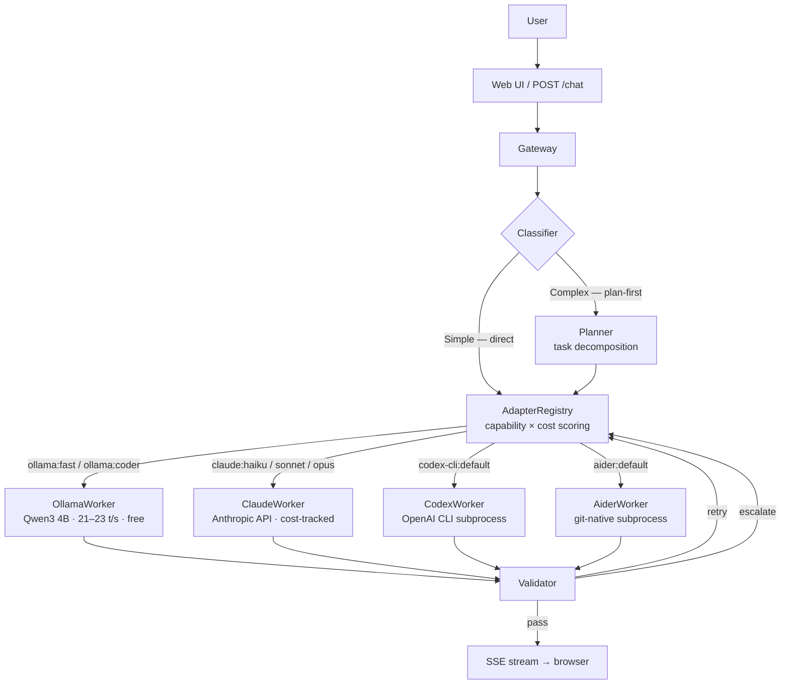

# Mahoraga

> Agent-agnostic LLM orchestrator that routes tasks across local Ollama workers, Claude API, Codex CLI, and Aider using capability-scored routing, quality validation, and cost-aware escalation — with real-time visual feedback.

*Named after the adaptive deity from Buddhist mythology — Mahoraga analyzes, adapts, and overcomes.*

<!-- Demo GIF: record after fixes are done and replace this comment
     To capture: Cmd+Shift+5 → record localhost:8000, submit a task, stop.
     Convert: ffmpeg -i recording.mov -vf "fps=10,scale=800:-1" demo.gif
-->

## What It Does

Mahoraga is not an agent. It orchestrates agents.

When you give Mahoraga a task, it:

1. **Classifies complexity** — short, direct tasks route immediately; longer or architectural tasks decompose through a planner first
2. **Selects the best available agent** using capability scoring: `capability_confidence × (1 / (1 + cost_usd))`
3. **Streams the response** in real time with markdown rendering and code block highlighting
4. **Evaluates output quality** — heuristic checks for local workers, LLM-based evaluation for cloud workers
5. **Retries with feedback context or escalates** to the next-best adapter on failure

Any agent plugs in through the `AgentAdapter` interface: local models (Ollama), cloud APIs (Claude), CLI tools (Codex CLI, Aider), or any future backend.

## Architecture



```
mahoraga/
├── backend/orchestrator/
│   ├── adapters/
│   │   ├── base.py              # AgentAdapter ABC
│   │   ├── registry.py          # Capability scoring + routing
│   │   ├── ollama_adapter.py
│   │   ├── claude_adapter.py
│   │   ├── codex_adapter.py
│   │   └── aider_adapter.py
│   ├── workers/
│   │   ├── base.py              # WorkerAdapter ABC (async generator)
│   │   ├── ollama.py            # 4 variants: planner, fast, coder, general
│   │   ├── claude.py            # Stateful conversation history per task
│   │   ├── codex.py
│   │   ├── aider.py
│   │   ├── validator.py         # Output quality evaluation
│   │   └── router.py            # Keyword-based fallback routing
│   ├── planning/classifier.py   # Simple vs. complex classification
│   ├── domain/models.py         # Mission → Plan → Run → Task → TaskAttempt
│   ├── gateway.py               # Main request pipeline
│   ├── tracking/ledger.py       # Per-agent, per-session cost ledger
│   └── service/app.py           # FastAPI endpoints + lifespan
└── static/                      # Vanilla HTML/CSS/JS
    ├── app.js                   # Chat UI + SSE streaming + markdown render
    └── sidebar.js               # Vine chart + agent status + cost bar
```

## Benchmarks

**Hardware:** MacBook Pro (Nov 2024), M-series, 16 GB unified memory

| Model | Throughput | Easy | Medium | Hard |
|-------|-----------|------|--------|------|
| Qwen2.5 7B Q4 (baseline) | 12–14 t/s | 23s | 39s | 40s |
| **Qwen3 4B Q4_K_M** | **21–23 t/s** | **12s** | **36s** | **48s** |
| Qwen3 8B Q4 | 12–13 t/s | 27s | 58s | — |

Qwen3 4B in nothink mode is the default local model — 80% faster throughput than the 7B baseline with comparable quality for most tasks.

## Supported Agents

| Agent | Type | Cost | Status |
|-------|------|------|--------|
| Ollama (Qwen3 4B) | Local inference | Free | ✅ Active |
| Claude (Haiku/Sonnet/Opus) | Anthropic API | Per-token | ✅ Active |
| Codex CLI | OpenAI CLI subprocess | Free tier / API | ✅ Active |
| Aider | Git-native subprocess | Free + LLM cost | ✅ Active |

## Quick Start

### Prerequisites

- Python 3.10+
- [Ollama](https://ollama.ai) installed and running
- Model: `ollama pull qwen3:4b`

### Setup

```bash
git clone https://github.com/pockanoodles/Mahoraga.git
cd Mahoraga
python3 -m venv .venv && source .venv/bin/activate
pip install -r requirements.txt
python -m backend.orchestrator.service.app
```

Open [http://localhost:8000](http://localhost:8000).

### Cloud backends

Set environment variables or add them to a `.env` file in the project root:

```bash
ANTHROPIC_API_KEY=sk-ant-...   # enables Claude adapter
OPENAI_API_KEY=sk-...          # enables Codex adapter
```

The active backend can be toggled from the UI header or by editing `ENABLED_BACKENDS` in `backend/orchestrator/config.py`.

## Adapter Interface

New agents plug in by implementing `AgentAdapter`:

```python
from backend.orchestrator.adapters.base import AgentAdapter, AgentCapability, CostEstimate, AgentStatus

class MyAdapter(AgentAdapter):
    @property
    def name(self) -> str:
        return "my-agent"

    @property
    def worker_id(self) -> str:
        return "my-agent:default"   # maps to a WorkerRegistry entry

    @property
    def capabilities(self) -> list[AgentCapability]:
        return [AgentCapability("code", confidence=0.9)]

    def estimate_cost(self, task) -> CostEstimate:
        return CostEstimate(estimated_cost_usd=0.0, model="local")

    async def health_check(self) -> AgentStatus:
        return AgentStatus(name=self.name, available=True)
```

The `AdapterRegistry` scores all registered adapters by `capability_confidence × (1 / (1 + cost_usd))` and routes to the highest scorer. See `backend/orchestrator/adapters/` for full implementations.

## How It Works

### Task Classification

Tasks under 60 words with no complexity indicators route directly to a single worker call. Tasks over 60 words or containing keywords like `architect`, `security audit`, `refactor`, `migrate`, or `optimize` go through the planner first — it decomposes the goal into a sequence of subtasks before routing each one individually.

### Routing

The `AdapterRegistry` ranks all available adapters against the required capability using a composite score. The `OllamaAdapter` covers four capability areas through four worker variants: planner, fast, coder, and general. Cloud adapters (Claude, Codex) register with higher confidence on specialized tasks but higher cost, so they only win the routing decision when the local worker's confidence is low or a prior attempt failed.

### Quality Evaluation

After every execution, the validator checks:

- **Code outputs:** code block presence, import/def/class patterns, syntax closure
- **General outputs:** substance check — length and content, not just padding
- **Ollama workers:** Python heuristic (fast, zero API cost)
- **Claude workers:** LLM-based verifier when `ANTHROPIC_API_KEY` is set

Outcomes: **pass** → stream response; **retry** → same worker with injected feedback context; **escalate** → next-best adapter from the registry; **block** → manual approval required.

---

## Adaptive Routing

Most orchestrators pick agents with a static lookup table — if the task contains the word "code", send it to the code agent. Mahoraga treats routing as a **contextual multi-armed bandit problem** and learns from every decision it makes.

Each agent (ollama, codex-cli, aider, gemini-cli, goose, opencode) is an arm. Each task is characterized by an 8-dimensional context vector: word count, code keyword density, question flag, complexity tier, error keyword presence, creation keyword presence, prompt length, and a bias term. The router uses **LinUCB Disjoint** — per agent, it maintains a covariance matrix **A** (8×8) and a reward vector **b** (8×1), from which it estimates a weight vector **θ = A⁻¹b**. At selection time, the UCB score for each agent is:

```
UCB_a = x'θ_a + α√(x' A_a⁻¹ x)
```

The first term is the estimated expected reward given the task context. The second is an exploration bonus — proportional to uncertainty, scaled by α. Agents with high uncertainty on a given context type get a boost, ensuring they are tried rather than systematically avoided. After every call, A and b are updated with the observed reward so the estimate sharpens.

Every routing decision writes to a SQLite decision log at `~/.mahoraga/routing_decisions.db`: the task context vector, per-agent UCB scores, the selected agent, and the observed outcome (success, latency, cost, quality score). This log is the basis for offline analysis and future policy replay. Cold-start priors seed A and b with identity matrices so no agent starts at zero and the first few decisions are reasonably exploratory.

The practical upshot is visible in the regret curves below: LinUCB is the only strategy whose per-task mistake rate decreases over time. Static routing is rigid — it can't adapt when a task looks like chat but is actually a complex refactor. Non-contextual bandits (UCB1, Thompson) learn global agent quality but ignore task features, so they never specialize. LinUCB does both. This is the differentiator vs. CrewAI, LangGraph, and AutoGen, which all use hand-written routing logic that requires human intervention to update.

---

## Benchmark Results

Routing strategies evaluated on a 200-task simulated replay with a ground-truth compatibility matrix encoding asymmetric agent strengths (ollama dominates chat, aider dominates refactoring and debugging, codex-cli dominates file operations, gemini-cli dominates research and reasoning). Static routing uses an 18% misclassification rate to reflect the real-world keyword router's failure modes.

| Strategy | Success Rate | Mean Reward | Total Regret | β | Sublinear? |
|----------|-------------|-------------|-------------|---|------------|
| Static (baseline) | 96.0% | 0.8649 | 6.88 | 1.569 | No |
| UCB1 | 83.5% | 0.7524 | 28.69 | 0.950 | No |
| Thompson Sampling | 92.5% | 0.8070 | 17.73 | 1.175 | No |
| **LinUCB** | **90.0%** | **0.8049** | **18.38** | **0.659** | **Yes** |

β is the regret growth exponent, estimated by fitting cumulative regret to a power law `R(t) ~ t^β` in log-log space. β < 1.0 means sublinear regret growth — the algorithm is learning and making fewer mistakes over time. β ≈ 0.5 is theoretically optimal (√t growth, matching bandit lower bounds). **LinUCB is the only strategy that converges.**

Static routing appears competitive in absolute reward because the hand-coded routing table is accurate for common cases — but its β=1.569 means regret accelerates over time. Every misclassification is repeated indefinitely. LinUCB's per-step regret halves from the first 20% of tasks (0.143) to the last 20% (0.089) as it builds up agent-specific weight estimates.

> Simulated 200-task replay with ground-truth compatibility matrix. Real routing data collection is ongoing via the SQLite decision log.


---

## Ablation Study

**Exploration parameter (α).** The sweep over α ∈ {0.1, 0.25, 0.5, 1.0, 2.0, 5.0} shows a clear U-shaped curve with the optimum at α=1.0 (reward=0.811, β=0.615). At α=0.1, the bandit over-exploits: it latches onto ollama early — ollama handles the first few simple chat tasks well — and never recovers, collapsing to 36.5% success. At α≥2.0, the exploration bonus swamps the reward estimate and β goes linear (>1.0). The range 0.5–1.0 is the stable region; α=1.0 is the production default.

**Context dimension (d=8 vs d=14).** The extended 14-feature Tier-2 vector adds research keywords, planning keywords, a code-category flag, log-length, squared word count, and a code-complexity interaction term. The result: reward gap of 0.006, identical β=0.848, neither setting sublinear. The extra features are largely redundant with what Tier-1 already encodes — the code keyword flag already captures code/non-code; log-length and word-count-squared are monotonic transforms of existing features. **Tier-1 (8 features) is sufficient.** Keeping the model simple reduces parameter count and makes the weight vector more interpretable.

**Reward weights.** The `quality_first` preset (success=0.30, quality=0.40, speed=0.15, cost=0.15) is the most honest sublinear result (β=0.756), because it rewards the bandit for getting the *right answer* rather than just picking a fast or cheap agent. The `cost_first` preset wins on mean reward numerically but this is circular — downweighting success routes more tasks to ollama (free and fast), inflating the cost score. The current production weights (success=0.50, quality=0.25, speed=0.15, cost=0.10) were chosen to surface agent quality differences while keeping latency and cost as real but secondary constraints.

Full ablation data: [`benchmark/results/ablation_table.md`](benchmark/results/ablation_table.md)

---

## Run the Benchmark

```bash
# Run the full benchmark (generates charts + tables in benchmark/results/)
python -m backend.orchestrator.routing.benchmark.harness

# Custom parameters: larger task set, specific alpha, extended context
python -m backend.orchestrator.routing.benchmark.harness --tasks 500 --alpha 1.0 --dim 8

# Skip ablation sweep (faster run, strategy comparison only)
python -m backend.orchestrator.routing.benchmark.harness --no-ablation
```

Outputs written to `backend/orchestrator/routing/benchmark/results/`:

| File | Contents |
|------|---------|
| `regret_curve.png` | Dual-panel: cumulative regret + per-step learning curve |
| `per_agent_breakdown.png` | Agent selection distribution per strategy |
| `summary_table.md` | Strategy comparison table (this README's numbers) |
| `strategy_results.json` | Full per-strategy metrics |
| `regret_data.json` | Raw per-step regret for custom analysis |
| `ablation_table.md` | Hyperparameter sweep results |
| `ablation_data.json` | Raw ablation data |

---

## Roadmap

- [x] Ollama local inference with quality scoring
- [x] Claude API (Haiku → Sonnet → Opus chain)
- [x] `AgentAdapter` interface with capability-based routing
- [x] Codex CLI adapter
- [x] Aider adapter
- [x] Real-time web UI with vine chart task visualization
- [x] Per-agent, per-session cost tracking
- [x] LinUCB contextual bandit router with regret tracking and ablation suite
- [ ] MCP server — expose orchestration as MCP tools
- [ ] Native macOS dashboard ([Noctis](https://github.com/pockanoodles/noctis))
- [ ] Multi-user session isolation
- [ ] Skill marketplace

## License

MIT
