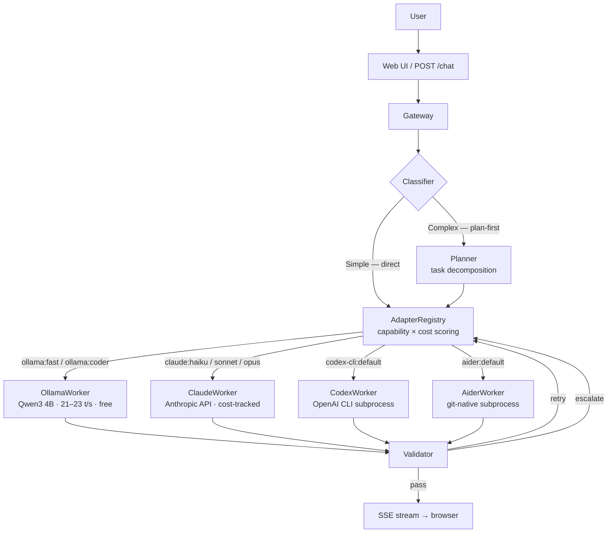

# Mahoraga

> Agent-agnostic LLM orchestrator that routes tasks across local Ollama workers, Claude API, Codex CLI, and Aider using capability-scored routing, quality validation, and cost-aware escalation — with real-time visual feedback.

*Named after the adaptive deity from Buddhist mythology — Mahoraga analyzes, adapts, and overcomes.*

<!-- Demo GIF: record after fixes are done and replace this comment
     To capture: Cmd+Shift+5 → record localhost:8000, submit a task, stop.
     Convert: ffmpeg -i recording.mov -vf "fps=10,scale=800:-1" demo.gif
-->

## What It Does

Mahoraga is not an agent. It orchestrates agents.

When you give Mahoraga a task, it:

1. **Classifies complexity** — short, direct tasks route immediately; longer or architectural tasks decompose through a planner first
2. **Selects the best available agent** using capability scoring: `capability_confidence × (1 / (1 + cost_usd))`
3. **Streams the response** in real time with markdown rendering and code block highlighting
4. **Evaluates output quality** — heuristic checks for local workers, LLM-based evaluation for cloud workers
5. **Retries with feedback context or escalates** to the next-best adapter on failure

Any agent plugs in through the `AgentAdapter` interface: local models (Ollama), cloud APIs (Claude), CLI tools (Codex CLI, Aider), or any future backend.

## Architecture



```
mahoraga/
├── backend/orchestrator/
│   ├── adapters/
│   │   ├── base.py              # AgentAdapter ABC
│   │   ├── registry.py          # Capability scoring + routing
│   │   ├── ollama_adapter.py
│   │   ├── claude_adapter.py
│   │   ├── codex_adapter.py
│   │   └── aider_adapter.py
│   ├── workers/
│   │   ├── base.py              # WorkerAdapter ABC (async generator)
│   │   ├── ollama.py            # 4 variants: planner, fast, coder, general
│   │   ├── claude.py            # Stateful conversation history per task
│   │   ├── codex.py
│   │   ├── aider.py
│   │   ├── validator.py         # Output quality evaluation
│   │   └── router.py            # Keyword-based fallback routing
│   ├── planning/classifier.py   # Simple vs. complex classification
│   ├── domain/models.py         # Mission → Plan → Run → Task → TaskAttempt
│   ├── gateway.py               # Main request pipeline
│   ├── tracking/ledger.py       # Per-agent, per-session cost ledger
│   └── service/app.py           # FastAPI endpoints + lifespan
└── static/                      # Vanilla HTML/CSS/JS
    ├── app.js                   # Chat UI + SSE streaming + markdown render
    └── sidebar.js               # Vine chart + agent status + cost bar
```

## Benchmarks

**Hardware:** MacBook Pro (Nov 2024), M-series, 16 GB unified memory

| Model | Throughput | Easy | Medium | Hard |
|-------|-----------|------|--------|------|
| Qwen2.5 7B Q4 (baseline) | 12–14 t/s | 23s | 39s | 40s |
| **Qwen3 4B Q4_K_M** | **21–23 t/s** | **12s** | **36s** | **48s** |
| Qwen3 8B Q4 | 12–13 t/s | 27s | 58s | — |

Qwen3 4B in nothink mode is the default local model — 80% faster throughput than the 7B baseline with comparable quality for most tasks.

## Supported Agents

| Agent | Type | Cost | Status |
|-------|------|------|--------|
| Ollama (Qwen3 4B) | Local inference | Free | ✅ Active |
| Claude (Haiku/Sonnet/Opus) | Anthropic API | Per-token | ✅ Active |
| Codex CLI | OpenAI CLI subprocess | Free tier / API | ✅ Active |
| Aider | Git-native subprocess | Free + LLM cost | ✅ Active |

## Quick Start

### Prerequisites

- Python 3.10+
- [Ollama](https://ollama.ai) installed and running
- Model: `ollama pull qwen3:4b`

### Setup

```bash
git clone https://github.com/pockanoodles/Mahoraga.git
cd Mahoraga
python3 -m venv .venv && source .venv/bin/activate
pip install -r requirements.txt
python -m backend.orchestrator.service.app
```

Open [http://localhost:8000](http://localhost:8000).

### Cloud backends

Set environment variables or add them to a `.env` file in the project root:

```bash
ANTHROPIC_API_KEY=sk-ant-...   # enables Claude adapter
OPENAI_API_KEY=sk-...          # enables Codex adapter
```

The active backend can be toggled from the UI header or by editing `ENABLED_BACKENDS` in `backend/orchestrator/config.py`.

## Adapter Interface

New agents plug in by implementing `AgentAdapter`:

```python
from backend.orchestrator.adapters.base import AgentAdapter, AgentCapability, CostEstimate, AgentStatus

class MyAdapter(AgentAdapter):
    @property
    def name(self) -> str:
        return "my-agent"

    @property
    def worker_id(self) -> str:
        return "my-agent:default"   # maps to a WorkerRegistry entry

    @property
    def capabilities(self) -> list[AgentCapability]:
        return [AgentCapability("code", confidence=0.9)]

    def estimate_cost(self, task) -> CostEstimate:
        return CostEstimate(estimated_cost_usd=0.0, model="local")

    async def health_check(self) -> AgentStatus:
        return AgentStatus(name=self.name, available=True)
```

The `AdapterRegistry` scores all registered adapters by `capability_confidence × (1 / (1 + cost_usd))` and routes to the highest scorer. See `backend/orchestrator/adapters/` for full implementations.

## How It Works

### Task Classification

Tasks under 60 words with no complexity indicators route directly to a single worker call. Tasks over 60 words or containing keywords like `architect`, `security audit`, `refactor`, `migrate`, or `optimize` go through the planner first — it decomposes the goal into a sequence of subtasks before routing each one individually.

### Routing

The `AdapterRegistry` ranks all available adapters against the required capability using a composite score. The `OllamaAdapter` covers four capability areas through four worker variants: planner, fast, coder, and general. Cloud adapters (Claude, Codex) register with higher confidence on specialized tasks but higher cost, so they only win the routing decision when the local worker's confidence is low or a prior attempt failed.

### Quality Evaluation

After every execution, the validator checks:

- **Code outputs:** code block presence, import/def/class patterns, syntax closure
- **General outputs:** substance check — length and content, not just padding
- **Ollama workers:** Python heuristic (fast, zero API cost)
- **Claude workers:** LLM-based verifier when `ANTHROPIC_API_KEY` is set

Outcomes: **pass** → stream response; **retry** → same worker with injected feedback context; **escalate** → next-best adapter from the registry; **block** → manual approval required.

## Roadmap

- [x] Ollama local inference with quality scoring
- [x] Claude API (Haiku → Sonnet → Opus chain)
- [x] `AgentAdapter` interface with capability-based routing
- [x] Codex CLI adapter
- [x] Aider adapter
- [x] Real-time web UI with vine chart task visualization
- [x] Per-agent, per-session cost tracking
- [ ] MCP server — expose orchestration as MCP tools
- [ ] Native macOS dashboard ([Noctis](https://github.com/pockanoodles/noctis))
- [ ] Multi-user session isolation
- [ ] Skill marketplace

## License

MIT
