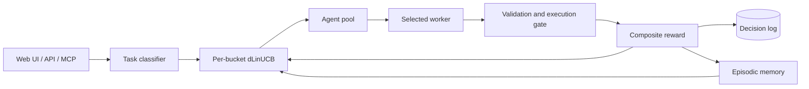

# Mahoraga

Mahoraga is a local-first LLM orchestrator that learns which agent to use for
each task. It classifies the task, selects an agent with a contextual bandit,
executes the work, scores the result, and uses the outcome to improve later
routing decisions.


Mahoraga currently runs three local Ollama arms:

| Arm | Model | Role |
| --- | --- | --- |
| `ollama:qwen3.5` | `qwen3.5:latest` | Code, planning, and general work |
| `ollama:granite4.1-8b` | `granite4.1:8b` | Tests, reviews, and structured output |
| `ollama:qwen3-14b` | `qwen3:14b` | Diagnostic larger-model arm |

The roster is controlled by [`agents.yaml`](agents.yaml). Cloud and CLI
adapters remain available but are disabled in the committed configuration.

## How it works

1. A keyword classifier assigns the task to a capability bucket such as
   `code`, `debug`, `plan`, `research`, or `review`.
2. A per-bucket discounted LinUCB policy selects from the healthy agents.
3. The selected worker executes the task.
4. Mahoraga computes a reward from success, quality, speed, and cost.
5. The policy and episodic memory are updated for the next decision.



The default strategy is `linucb_per_bucket`, with a nine-dimensional context
vector and discounted updates for non-stationary agent performance. Semantic
episodic memory uses `all-MiniLM-L6-v2` when its optional dependency is
installed, and falls back to handcrafted context retrieval otherwise.

For code-like buckets, the execution gate is enabled by default. It rejects
outputs that do not execute before they can receive a successful reward. This
is a conservative runnable-code check, not a proof that the answer is
functionally correct.

## Quick start

Requirements:

- Python 3.12+
- Ollama
- A C++ toolchain for `hnswlib`

```bash
git clone https://github.com/pockanoodles/Mahoraga.git
cd Mahoraga

python3 -m venv .venv
source .venv/bin/activate
pip install -r requirements.txt
pip install -e .

ollama pull qwen3.5:latest
ollama pull granite4.1:8b
ollama pull qwen3:14b

orch serve
```

The API starts at `http://127.0.0.1:8000`. Check it with:

```bash
curl http://127.0.0.1:8000/api/health
```

The React UI is served at `/` after it has been built:

```bash
cd frontend
npm ci
npm run build
cd ..
```

Restart `orch serve`, then open `http://127.0.0.1:8000`.

For semantic episodic memory:

```bash
pip install -r requirements-semantic.txt
```

See the [getting-started guide](docs/getting-started.md) for development mode,
health checks, and troubleshooting.

## Interfaces

- **FastAPI and web UI:** `orch serve`
- **MCP stdio bridge:** `python -m backend.mcp.server`
- **CLI operations:** `orch --help`
- **macOS background service:** `orch service --help`

The MCP bridge provides nine tools for task execution, route previews, health,
agent status, routing statistics, and runtime policy changes. See the
[MCP guide](docs/mcp.md).

## Routing and rewards

The context vector captures task length, code density, question shape,
complexity, mentioned files, error/creation/research keywords, and live queue
depth. Each capability bucket keeps independent LinUCB matrices so an agent can
be preferred for one kind of task without dominating unrelated work.

The reward is:

```text
reward = w_success·success + w_quality·quality + w_speed·speed + w_cost·cost
```

Weights are bucket-specific and can be learned from observed outcomes. A budget
pacer, drift detector, and quarantine state protect the live policy. All
routing state is local under `~/.mahoraga-v2/`.

Mahoraga also supports execution-based offline evaluation:

```bash
orch bench report verify --input results.jsonl --bank prompts_verifiable.jsonl
```

This extracts Python from captured model outputs, runs hidden tests, and reports
pass@1 alongside heuristic quality. Only run trusted evaluation data: both the
live execution gate and offline verifier execute generated code locally.

## Monitoring

The metrics commands read the decision database directly; the server does not
need to be running.

```bash
orch metrics live
orch metrics live --watch 30
orch metrics snapshot
orch quarantine list
orch budget status
```

The default decision log is
`~/.mahoraga-v2/routing_decisions.db`.

## Documentation

- [Documentation index](docs/README.md)
- [Getting started](docs/getting-started.md)
- [Configuration](docs/configuration.md)
- [CLI reference](docs/cli-reference.md)
- [MCP integration](docs/mcp.md)
- [Experiments and evaluation](docs/experimentation.md)
- [Design specifications](docs/specs/)
- [Current research state](brain/state/current_state.md)

The files under `docs/specs/` describe designs and research plans. Their status
headers may refer to the point at which they were written; use the operator
guides and running CLI help for current behavior.

## Development

```bash
pytest -m "not slow"
```

The project uses `main` as its single trunk. Changes are made on short-lived
branches, validated in CI, and merged through pull requests.

## Limitations

- The committed roster expects local Ollama models and is tuned for a single
  16 GB development machine.
- State is global to one local user; there is no multi-tenant isolation.
- Quality scoring is useful for routing but remains heuristic outside the
  execution-verified code/debug paths.
- The CLI has a legacy port split: `orch serve`, MCP, and live bench commands
  default to port 8000, while mission/run/task and several older HTTP clients
  currently target port 8001. The [CLI reference](docs/cli-reference.md)
  identifies the affected commands.
- Running generated code is not sandboxed strongly enough for untrusted input.

## License

MIT
