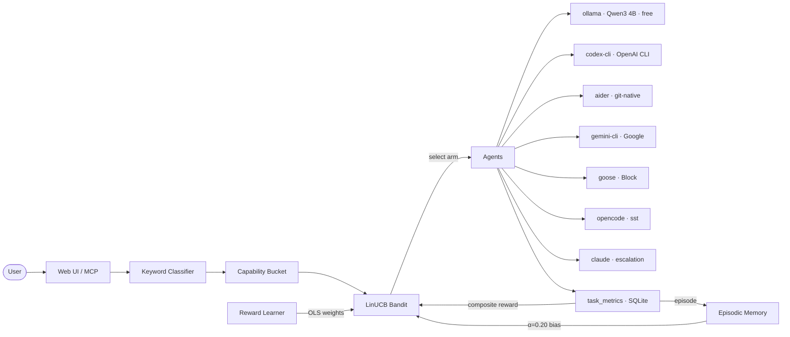

# Mahoraga

An online bandit routing engine for heterogeneous AI agents. Local-first, research-capable, learns from every task.

*Named after the adaptive deity from Buddhist mythology — Mahoraga analyzes, adapts, and overcomes.*


<!-- TODO: record demo GIF after collecting 50+ real routing decisions -->


---

## What It Does

Mahoraga is not an agent. It orchestrates agents. When you give it a task, it:

1. Classifies complexity via keyword gate into a capability bucket (code, debug, plan, research, general…)
2. Routes to the best agent using a LinUCB contextual bandit that learns from every task
3. Streams the response in real time with markdown rendering
4. Evaluates output quality via heuristic scoring + embedding similarity
5. Records metrics, updates the bandit, and stores the episode in episodic memory
6. Retries with feedback context or escalates to cloud on failure

---

## Research Engine

Mahoraga routes research tasks to agents built for retrieval and synthesis — Gemini CLI for broad search and summarization, Qwen for reasoning-heavy questions, and escalation to Claude only when the task genuinely requires it. The bandit learns which agent performs best per task bucket from real routing decisions, not offline training data. No configuration needed — it improves with use.

---

## How It Works

### Task Classification

Tasks are classified by keyword gate into capability buckets (code, debug, plan, research, general, security, test, review, refactor). Short direct tasks route immediately. Complex tasks decompose through the planner first.

### Adaptive Routing

Within each bucket, a **LinUCB contextual bandit** selects the agent.

**The 9-dimensional context vector** — each feature is normalised to [0, 1]:

| # | Feature | Captures |
|---|---------|---------|
| 1 | `word_count_norm` | Task length — longer tasks favour agents with larger context windows |
| 2 | `code_keyword_density` | Fraction of tokens that are code keywords — routes code-heavy tasks to coding agents |
| 3 | `is_question` | 1.0 if phrased as a question — research/explain agents tend to score higher |
| 4 | `complexity_tier` | 0.33 / 0.67 / 1.0 for simple / moderate / complex — complex tasks favour cloud agents |
| 5 | `file_count` | Number of file paths mentioned — multi-file tasks suit git-native agents like aider |
| 6 | `has_error_keywords` | Error/exception/traceback presence — debug-capable agents get an edge |
| 7 | `has_creation_keywords` | Create/build/scaffold language — generative agents favoured |
| 8 | `has_research_keywords` | Explain/compare/summarise language — Gemini and Goose favoured |
| 9 | `queue_depth_norm` | Agent queue fraction — congestion-aware routing avoids overloaded agents |

Per agent, the bandit maintains **A** (9×9 covariance) and **b** (9×1 reward accumulator). At selection time:

```
UCB_a = x'θ_a + α√(x' A_a⁻¹ x)    where θ_a = A_a⁻¹ b_a
```

Three learning layers run in parallel:

- **dLinUCB (γ=0.97)** — discounted updates handle non-stationarity as agents improve or degrade over time
- **Reward Learner** — OLS fits per-bucket reward weights after 100 observations; well-calibrated priors before convergence; simplex projection prevents weight collapse
- **Episodic Memory** — HNSW index (hnswlib) over past context vectors; k=10 nearest-neighbour rewards bias selection at α=0.20; FIFO cap at 10k episodes

The composite reward: `r = w₁·success + w₂·quality + w₃·speed + w₄·cost` where weights are per-bucket and learnable. Swap cost penalty adjusts reward when the bandit switches between Ollama models (3–8s latency hit on 16 GB unified memory).

### Quality Evaluation

After every execution, the validator checks:

- **Code outputs:** compilation check, code block presence, import/def/class patterns, syntax closure
- **General outputs:** substance check — length and content, not padding
- **Embedding similarity:** cosine between prompt and output embeddings via nomic-embed-text (catches off-topic or degenerate outputs)

Outcomes: pass → stream response; retry → same worker with feedback context; escalate → next-best adapter.

**Implicit quality signals** require no explicit feedback: a retry within 5 minutes signals failure (reward 0.0) and accepting an agent's output without change signals success (+0.6 bonus).

### Warm Start

On first startup, if `~/.mahoraga/compatibility_matrix.json` exists (from `orch benchmark simulate --save-matrix`), the bandit injects pseudo-observations instead of cold-starting from zero. Based on PILOT (Panda et al., EMNLP 2025) — reduces early exploration waste. New agents added at runtime are average-initialised from existing arm matrices, ensuring moderate exploration without a regret spike.

---

## Architecture



---

## Where It Sits

| | Mahoraga | RouteLLM | LLMRouter | BaRP (ICLR '26) | CrewAI | LiteLLM |
|---|---|---|---|---|---|---|
| **Routes to** | Agents (local + cloud) | 2 models | N models | N models | Defines agents | API proxy |
| **Learns online** | ✅ LinUCB bandit | ❌ Static | ❌ Static | ✅ Bandit | — | — |
| **Local inference** | ✅ Ollama ($0/task) | ❌ | ❌ | ❌ | ❌ | ❌ |
| **Two-stage routing** | ✅ Keyword → bandit | ❌ Flat | ❌ Flat | ❌ Flat | — | — |
| **Self-hosted** | ✅ | ✅ | ✅ | Paper only | ✅ | ✅ |
| **Persistent learning** | ✅ Cross-session state | — | — | No runtime | — | — |

**BaRP** (Anonymous, ICLR 2026 submission) is the closest academic analog — it also frames LLM routing as a contextual bandit problem and argues against static offline training. Mahoraga implements the same core insight with a deployed runtime, local inference support, and heterogeneous agent coverage.

---

## Benchmark Results

### Model Throughput

**Hardware:** MacBook Pro (Nov 2024), M-series, 16 GB unified memory

| Model | Throughput | Easy | Medium | Hard |
|-------|-----------|------|--------|------|
| Qwen2.5 7B Q4 (baseline) | 12–14 t/s | 23s | 39s | 40s |
| **Qwen3 4B Q4_K_M** | **21–23 t/s** | **12s** | **36s** | **48s** |
| Qwen3 8B Q4 | 12–13 t/s | 27s | 58s | — |

Qwen3 4B in nothink mode is the default — 80% faster than the 7B baseline with comparable quality on short-to-medium tasks.

### Routing Strategy Comparison

Strategy comparison over 200 simulated tasks with a ground-truth compatibility matrix:

| Strategy | Mean Reward | Total Regret | β | Sublinear? |
|----------|------------|-------------|---|------------|
| Static (baseline) | 0.8649 | 6.88 | 1.569 | No |
| UCB1 | 0.7524 | 28.69 | 0.950 | No |
| Thompson Sampling | 0.8070 | 17.73 | 1.175 | No |
| **LinUCB** | **0.8049** | **18.38** | **0.659** | **Yes** |

β < 1.0 means sublinear regret — the algorithm converges. LinUCB is the only strategy where per-step regret decreases over time. Early regret: 0.1431/task → Late regret: 0.0887/task.

Naive model alternation between Ollama models costs ~0.10 reward points per task. Hardware-aware routing (swap penalty + warm/cold detection) eliminates this.

<!-- TODO: embed regret_curve.png once ablation runs clean -->

### Oracle Compatibility Matrix (Ground Truth)

```
simple_chat        → ollama       (0.92)
code_generation    → opencode     (0.85)
code_refactoring   → aider        (0.92)
debugging          → aider        (0.88)
file_operations    → codex-cli    (0.93)
research           → gemini-cli   (0.88)
planning           → gemini-cli   (0.80)
complex_reasoning  → gemini-cli   (0.82)
```

---

## Quick Start

```bash
git clone https://github.com/pockanoodles/Mahoraga.git && cd Mahoraga
python3 -m venv .venv && source .venv/bin/activate
pip install -r requirements.txt
ollama pull qwen3:4b
orch serve        # starts at localhost:8000
```

Open http://localhost:8000.

Optional cloud keys (set in `.env` or shell):

```bash
ANTHROPIC_API_KEY=sk-ant-...   # Claude escalation
OPENAI_API_KEY=sk-...          # Codex CLI
GEMINI_API_KEY=...             # Gemini CLI
```

---

## Adapter Interface

Any agent that implements `AgentAdapter` is automatically registered and routed to:

```python
class MyAdapter(AgentAdapter):
    @property
    def name(self) -> str:
        return "my-agent"

    @property
    def worker_id(self) -> str:
        return "my-agent:default"

    @property
    def capabilities(self) -> list[AgentCapability]:
        return [AgentCapability(task_type="code", confidence=0.8, cost_usd=0.0)]

    async def health_check(self) -> AgentStatus:
        return AgentStatus(name=self.name, available=True)
```

The `AdapterRegistry` scores all registered adapters by `capability_confidence × (1 / (1 + cost_usd))` and routes to the highest scorer. See `backend/orchestrator/adapters/base.py` for the full interface.

---

## Agent Roster

| Agent | What It Is | Capability Buckets | Cost |
|-------|-----------|-------------------|------|
| ollama | Local Qwen3 4B via Ollama | general, plan, explain | Free |
| codex-cli | OpenAI Codex CLI subprocess | code, refactor, test, explain | API cost |
| aider | git-native multi-file editor | refactor, code, test, explain | API cost |
| gemini-cli | Google Gemini CLI | code, explain, research, general | Free tier (Flash) |
| goose | Block's open-source agent | research, general, explain | Free/API (provider-dependent) |
| opencode | sst/opencode, multi-provider | code, refactor, test, explain, general | Free/API |
| claude | Anthropic API (escalation) | all buckets | Per-token |

---

## Run the Benchmark

```bash
orch benchmark simulate          # strategy comparison, 200 synthetic tasks
orch benchmark simulate --warm-start --save-matrix  # with warm-start + export matrix
orch benchmark ablation          # full ablation study (5 experiments, 5 charts)
orch benchmark pareto-sweep      # sweep (α, γ, β) grid, write tuned_hyperparams.json
orch benchmark live-report       # analyse real routing decisions from SQLite
orch benchmark report --json     # machine-readable last-run summary
```

Run `orch benchmark` with no arguments to see all subcommands.

---

## Motivation

The LLM tooling ecosystem has three established layers, each solving a different part of the problem:

**Gateways** (LiteLLM, Bifrost, OpenRouter) normalize provider APIs — unified interface, failover, load balancing across OpenAI/Anthropic/etc. Their routing is rule-based and doesn't adapt.

**Trained routers** (RouteLLM, LLMRouter) learn to route between models, typically a strong/weak pair, using classifiers trained offline on Chatbot Arena preference data. RouteLLM achieves up to 85% cost savings on cloud-to-cloud routing. But the policy is frozen at training time, routes between two model endpoints, and assumes cloud inference throughout.

**Orchestration frameworks** (CrewAI, LangGraph, Microsoft Agent Framework) coordinate multi-agent workflows — they define what agents *do*, not which agent to dispatch for a given task.

The gap: no existing system learns *online* which heterogeneous agent to route to, across a pool that spans local models at zero marginal cost alongside cloud APIs.

Mahoraga extends the trained-router category in three ways: online feedback rather than offline training, N heterogeneous agents (CLI tools, local models, cloud APIs) rather than two model endpoints, and local inference as the default cost tier rather than cloud escalation. The bandit accumulates experience from every routing decision and gets incrementally better — no retraining step, no deployment cycle.

---

## Related Work

**Foundational:**
- **LinUCB** (Li et al., WWW 2010) — the contextual bandit algorithm Mahoraga uses for routing. Originally applied to news article recommendation; the per-arm A/b update rule and UCB exploration bonus are directly adopted here.
- **RouteLLM** (Ong et al., 2024) — the paper that established learned LLM routing as a problem worth solving. Trains 4 routers (matrix factorization, weighted Elo, BERT, causal LLM) on Chatbot Arena preference data. Binary strong/weak routing, offline, cloud-only. Mahoraga extends it to N heterogeneous agents with online learning.

**Online / bandit routing:**
- **BaRP** (Anonymous, ICLR 2026 submission) — multi-objective contextual bandit for LLM routing with REINFORCE policy gradient. Validates the bandit framing; paper only, no runtime. Mahoraga's two-stage bucketing (keyword classifier → per-bucket bandit) should accelerate convergence by narrowing the action space before the bandit runs — analogous to a hierarchical bandit.
- **LLM Bandit** (Li, arXiv 2025) — multi-armed bandit with preference conditioning. Partial online learning; offline pretraining requires full-information labels.
- **MAR** (Zhang et al., 2025) — multi-armed router that avoids full-information supervision.
- **C2MAB-V** (Dai et al., 2024) — combinatorial contextual volatile MAB; online feedback, no preference tuning.

**Cost-aware cascading:**
- **FrugalGPT** (Chen et al., 2023) — LLM cascade: try cheap first, escalate on failure. Sequential rather than learned. Mahoraga's escalation path (Ollama → cloud) implements the same intuition with a bandit replacing the fixed threshold.
- **AutoMix** (2024) — routes to larger LMs based on approximate correctness of smaller LM output. Complementary; Mahoraga could use AutoMix-style correctness detection as a reward signal.

**Warm start and non-stationarity:**
- **PILOT** (Panda et al., EMNLP 2025) — warm-starting LinUCB from preference priors reduces regret by Ω(‖θ*−θ_prior‖²). Mahoraga applies this via the benchmark compatibility matrix (`orch benchmark simulate --save-matrix`).
- **ParetoBandit** (Taberner-Miller et al., March 2026) — geometric forgetting for non-stationary LLM routing. Mahoraga's dLinUCB discount factor (γ=0.97) applies the same mechanism.

**Context:**
- **Bouneffouf & Feraud — "Bandits, LLMs, and Agentic AI"** (AAAI 2026 Tutorial, IBM Research) — survey of how bandit algorithms support adaptive decision-making in agentic systems. Validates the research direction.

What no existing paper addresses: local hardware state as a routing context feature, HNSW episodic memory for prompt-level priors, and OLS-learned reward weights from implicit user signals.

**In progress:** ablation comparing two-stage bucketed routing against flat routing on the same 200-task benchmark (expected: faster convergence due to smaller per-bucket action space). Cost savings estimate versus all-cloud baseline is pending real routing data.

---

## Roadmap

- [x] Ollama local inference with quality scoring
- [x] Claude API (Haiku → Sonnet → Opus escalation chain)
- [x] `AgentAdapter` interface with capability-based routing
- [x] Codex CLI, Aider, OpenCode, Gemini CLI, Goose adapters
- [x] Real-time web UI with vine chart task visualization
- [x] Per-agent, per-session cost tracking
- [x] LinUCB bandit routing with dLinUCB, episodic memory, reward learner
- [x] Benchmark suite (strategy comparison, ablation, pareto sweep, live report)
- [x] Warm-start from compatibility matrix
- [x] Implicit quality signals (retry detection → reward signal)
- [x] MCP server — expose orchestration as MCP tools (`run_task`, `run_batch`, `routing_stats`, `recent_decisions`)
- [ ] Native macOS dashboard ([Noctis](https://github.com/pockanoodles/noctis))
- [ ] Multi-user session isolation
- [ ] Skill marketplace

---

## References

```
Li, L., Chu, W., Langford, J., & Schapire, R. E. (2010).
  A Contextual-Bandit Approach to Personalized News Article Recommendation.
  WWW 2010. [The LinUCB paper]

Ong, I., Almahairi, A., Wu, V., et al. (2024).
  RouteLLM: Learning to Route LLMs with Preference Data.
  arXiv:2406.18665. https://github.com/lm-sys/RouteLLM

Anonymous (2025/2026).
  Learning to Route LLMs from Bandit Feedback: One Policy, Many Trade-offs.
  ICLR 2026 submission. [BaRP]

Li, Z. (2025).
  LLM Bandit: Cost-Efficient LLM Generation via Preference-Conditioned Dynamic Routing.
  arXiv:2502.02743.

Chen, L., Zaharia, M., & Zou, J. (2023).
  FrugalGPT: How to Use Large Language Models While Reducing Cost and Improving Performance.
  arXiv:2305.05176.

Panda, A., et al. (2025).
  PILOT: Preference-Informed LinUCB with Transfer for Online Routing.
  EMNLP 2025.

Taberner-Miller, E., et al. (2026).
  ParetoBandit: Multi-Objective Non-Stationary Routing for Language Models.
  March 2026.

Bouneffouf, D., & Feraud, R. (2026).
  Bandits, LLMs, and Agentic AI.
  AAAI 2026 Tutorial. IBM Research.
```

---

## License

MIT
