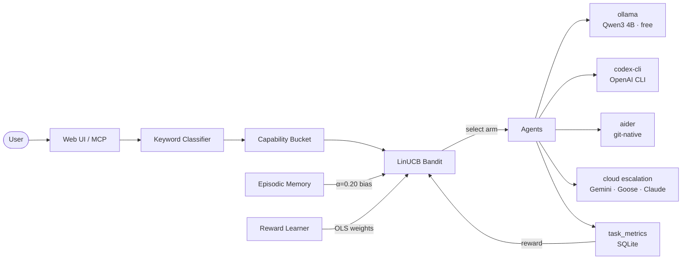

# Mahoraga

Self-hosted multi-agent orchestrator with online bandit routing. Learns from your traffic, adapts to your hardware, zero cloud cost for 70%+ of tasks.


<!-- TODO: record demo GIF after initial traffic data is collected -->


---

## Architecture



---

## Why This Exists

Cloud coding agents burn credits on tasks a 4B local model handles fine. Mahoraga routes each task to the right agent — local for the easy stuff, cloud when it matters. The bandit learns your patterns and gets smarter over time.

---

## Benchmark Results

Strategy comparison over 200 simulated tasks with a ground-truth compatibility matrix:

| Strategy | Mean Reward | Total Regret | β | Sublinear? |
|----------|------------|-------------|---|------------|
| Static (baseline) | 0.8649 | 6.88 | 1.569 | No |
| UCB1 | 0.7524 | 28.69 | 0.950 | No |
| Thompson Sampling | 0.8070 | 17.73 | 1.175 | No |
| **LinUCB** | **0.8049** | **18.38** | **0.659** | **Yes** |

β < 1.0 means sublinear regret — the algorithm is learning and making fewer mistakes over time. LinUCB is the only strategy that converges. Its per-step regret halves from the first 20% of tasks to the last 20%.

Naive model alternation between Ollama models costs ~0.10 reward points per task. Hardware-aware routing (swap penalty + warm/cold detection) eliminates this.

<!-- TODO: embed benchmark_results/ablation/strategy_comparison.png after first ablation run -->

---

## Quick Start

```bash
git clone https://github.com/pockanoodles/Mahoraga.git && cd Mahoraga
pip install -e .
ollama pull qwen3:4b
orch serve        # starts at localhost:8000
```

Optional cloud keys (set in `.env` or shell):

```bash
ANTHROPIC_API_KEY=sk-ant-...   # enables Claude escalation
OPENAI_API_KEY=sk-...          # enables Codex CLI
GEMINI_API_KEY=...             # enables Gemini CLI
```

---

## Adaptive Routing

Tasks are classified by keyword gate into a capability bucket (code, debug, plan, research, general…). Within each bucket, a **LinUCB contextual bandit** selects the agent. The 9-dimensional context vector captures: word count, code keyword density, question flag, complexity tier, file references, error/creation/research keyword presence, and queue depth.

Per agent, the bandit maintains **A** (9×9 covariance) and **b** (9×1 reward accumulator). At selection time:

```
UCB_a = x'θ_a + α√(x' A_a⁻¹ x)    where θ_a = A_a⁻¹ b_a
```

Three learning layers run in parallel:

1. **dLinUCB (γ=0.97)** — discounted updates handle non-stationarity as agents improve or degrade
2. **Reward Learner** — OLS fits per-bucket reward weights after 100 observations; priors used before that
3. **Episodic Memory** — HNSW index over past context vectors; nearest-neighbour rewards bias selection at α=0.20

On first startup, if `~/.mahoraga/compatibility_matrix.json` exists (from `orch benchmark simulate --save-matrix`), the bandit is warm-started with pseudo-observations — skipping the cold-start exploration phase.

For full technical depth: [`docs/MAHORAGA_METRICS_AND_RESEARCH.md`](docs/MAHORAGA_METRICS_AND_RESEARCH.md)

---

## Run the Benchmark

```bash
orch benchmark simulate          # strategy comparison, 50 synthetic tasks
orch benchmark simulate --warm-start --save-matrix  # with warm-start
orch benchmark ablation          # full ablation study (5 experiments, 5 charts)
orch benchmark pareto-sweep      # sweep (α, γ, β) grid, write tuned_hyperparams.json
orch benchmark live-report       # analyse real routing decisions from SQLite
orch benchmark report --json     # machine-readable last-run summary
```

Run `orch benchmark` with no arguments to see all subcommands.

---

## Agent Roster

| Agent | What It Is | Capability Buckets | Cost |
|-------|-----------|-------------------|------|
| ollama | Local Qwen3 4B via Ollama | general, plan, research | Free |
| codex-cli | OpenAI Codex CLI subprocess | code, refactor, test | API cost |
| aider | git-native multi-file editor | code, debug, refactor | API cost |
| gemini-cli | Google Gemini CLI | research, plan, general | Free tier |
| goose | Block's open-source agent | code, general | API cost |
| opencode | sst/opencode, Ollama-backed | code, debug | Free/API |

New agents implement the `AgentAdapter` interface (`backend/orchestrator/adapters/base.py`) and register with the `AdapterRegistry`. The bandit adds new arms on registration; average-init ensures the new agent gets moderate exploration without a regret spike.

---

## Related Work

Mahoraga builds on ideas from **RouteLLM** (Chen et al., 2024) — learned routing between strong and weak models — but extends it to 6+ heterogeneous local/cloud agents with online learning. **PILOT** (Panda et al., EMNLP 2025) demonstrated that warm-starting bandits from prior observations reduces regret by Ω(‖θ*−θ_prior‖²); Mahoraga uses this for both startup and new-agent onboarding. **BaRP** showed that reward shaping with swap-cost awareness stabilizes routing under hardware constraints; the β_swap term in Mahoraga's reward function is a direct application. **ParetoBandit** (March 2026) motivated the joint sweep over (α, γ, β_swap) to find Pareto-optimal hyperparameter configurations rather than tuning one at a time.

Mahoraga's distinguishing contributions: local hardware state as a routing context feature, HNSW episodic memory for prompt-level priors, and OLS-learned reward weights from implicit user signals.

---

## Roadmap

- [x] Ollama local inference with quality scoring
- [x] Claude API (Haiku → Sonnet → Opus chain)
- [x] `AgentAdapter` interface with capability-based routing
- [x] Codex CLI adapter
- [x] Aider adapter
- [x] OpenCode adapter
- [x] Gemini CLI adapter
- [x] Goose adapter
- [x] Real-time web UI with vine chart task visualization
- [x] Per-agent, per-session cost tracking
- [x] LinUCB bandit routing with episodic memory + reward learner
- [x] Benchmark suite (pareto-sweep, ablation, live-report)
- [ ] MCP server — expose orchestration as MCP tools
- [ ] Native macOS dashboard ([Noctis](https://github.com/pockanoodles/noctis))
- [ ] Multi-user session isolation
- [ ] Skill marketplace

## License

MIT
