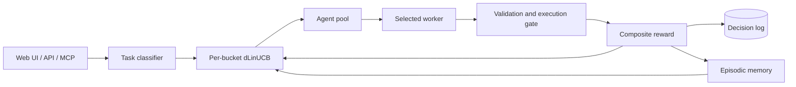

# Mahoraga

Mahoraga is a local-first LLM orchestrator that learns which agent to use for
each task. It classifies the task, selects an agent with a contextual bandit,
executes the work, scores the result, and uses the outcome to improve later
routing decisions.

[](https://github.com/pockanoodles/Mahoraga/actions/workflows/ci.yml)


On the 164-task HumanEval+ benchmark, run live end to end, Mahoraga's
local → judge → cloud escalation cascade reached a verified pass@1 of 0.921 at
23.5% of an always-cloud policy's cost — $8.47 vs $35.97 per 1,000 tasks, a
76.5% cost cut — with a free local model serving as the escalation judge.
Reproduce it with one command: [`orch bench repro`](#reproduce-the-benchmark).

My Mahoraga currently runs two local Ollama arms:

| Arm | Model | Role |
| --- | --- | --- |
| `ollama:qwen3.5` | `qwen3.5:latest` | Code, planning, general work, and judge duty |
| `ollama:granite4.1-8b` | `granite4.1:8b` | Tests, reviews, and structured output |

The roster is controlled by [`agents.yaml`](agents.yaml). Cloud and CLI
adapters — including a `claude-cli` arm that captures real per-task cost for
benchmarks — remain available but are disabled in the committed
configuration.

## How it works

1. A keyword classifier assigns the task to a capability bucket such as
   `code`, `debug`, `plan`, `research`, or `review`.
2. A per-bucket discounted LinUCB policy selects from the healthy agents.
3. The selected worker executes the task.
4. Mahoraga computes a reward from success, quality, speed, and cost.
5. The policy and episodic memory are updated for the next decision.



The default strategy is `linucb_per_bucket`, with a nine-dimensional context
vector and discounted updates for non-stationary agent performance. Semantic
episodic memory uses `all-MiniLM-L6-v2` when its optional dependency is
installed, and falls back to handcrafted context retrieval otherwise.

For code-like buckets, the execution gate is enabled by default. It rejects
outputs that do not execute before they can receive a successful reward. This
is a conservative runnable-code check, not a proof that the answer is
functionally correct.

## Quick start

Requirements:

- Python 3.12+
- Ollama
- A C++ toolchain for `hnswlib`

```bash
git clone https://github.com/pockanoodles/Mahoraga.git
cd Mahoraga

python3 -m venv .venv
source .venv/bin/activate
pip install -r requirements.txt
pip install -e .

ollama pull qwen3.5:latest
ollama pull granite4.1:8b

orch serve
```

The API starts at `http://127.0.0.1:8000`. Check it with:

```bash
curl http://127.0.0.1:8000/api/health
```

The React UI is served at `/` after it has been built:

```bash
cd frontend
npm ci
npm run build
cd ..
```

Restart `orch serve`, then open `http://127.0.0.1:8000`.

For semantic episodic memory:

```bash
pip install -r requirements-semantic.txt
```

See the [getting-started guide](docs/getting-started.md) for development mode,
health checks, and troubleshooting.

## Interfaces

- **FastAPI and web UI:** `orch serve`
- **MCP stdio bridge:** `python -m backend.mcp.server`
- **CLI operations:** `orch --help`
- **macOS background service:** `orch service --help`

The MCP bridge provides nine tools for task execution, route previews, health,
agent status, routing statistics, and runtime policy changes. See the
[MCP guide](docs/mcp.md).

## Routing and rewards

The context vector captures task length, code density, question shape,
complexity, mentioned files, error/creation/research keywords, and live queue
depth. Each capability bucket keeps independent LinUCB matrices so an agent can
be preferred for one kind of task without dominating unrelated work.

The reward is:

```text
reward = w_success·success + w_quality·quality + w_speed·speed + w_cost·cost
```

Weights are bucket-specific and can be learned from observed outcomes. A budget
pacer, drift detector, and quarantine state protect the live policy. All
routing state is local under `~/.mahoraga-v2/`.

Cost is real, not estimated: the `claude-cli` worker records the CLI's
authoritative per-task dollar figure, local workers record token counts, and
`orch bench report cost` computes the dollars avoided by local routing against
a cloud reference model — offline, with zero new inference.

## Evaluation and the escalation cascade

Three committed prompt banks ground the benchmarks:

- [`experiments/prompts_humaneval_plus.jsonl`](experiments/prompts_humaneval_plus.jsonl)
  — the 164-task HumanEval+ suite converted to the verifiable-bank schema:
  hidden tests with expected outputs precomputed from the canonical solutions.
  Regenerable from the EvalPlus release with
  [`experiments/build_humaneval_bank.py`](experiments/build_humaneval_bank.py);
  a CI test guards the committed bank against rot.
- [`experiments/prompts_verifiable.jsonl`](experiments/prompts_verifiable.jsonl)
  — 50 code/debug tasks with hidden tests. A CI guard executes every reference
  solution and every labeled mutant on each run, so the bank cannot rot
  silently.
- [`experiments/prompts_nonverifiable.jsonl`](experiments/prompts_nonverifiable.jsonl)
  — 30 prose tasks (explain, factual, reason, summarize, instruct) with no
  oracle. Ground truth is built in: each row pairs a hand-authored correct
  reference with a subtly flawed, length-matched mutant carrying one labeled
  defect.

On top of the banks sits an escalation cascade: a free local arm answers
first, a local LLM judge — seeing only the prompt and the output, never the
hidden tests — votes on the answer, and only judged failures escalate to the
cloud arm. The headline result is the full HumanEval+ bank, run live end to
end (per-case results committed at
[`experiments/live_route_humaneval_164.jsonl`](experiments/live_route_humaneval_164.jsonl)):

| Policy | pass@1 | $/1k tasks |
| --- | --- | --- |
| Always cloud (`claude-cli`, Sonnet) | 0.976 | $35.97 |
| Always local (`granite4.1-8b`) | 0.805 | $0.00 |
| Routed: local → judge → cloud | **0.921** | **$8.47** |

The routed cascade recovers about two-thirds of the quality gap between the
free local arm and the cloud arm at a 76.5% cost cut. The judge's fail-recall
is 0.688: it catches roughly seven in ten true local failures and escalates
them; the rest are served wrong — the quality price of the cost cut.

An earlier 50-task run on the smaller homemade verifiable bank was friendlier
to the judge — it caught all six true local failures (accuracy 0.920), so the
cascade matched cloud quality outright:

| Policy (50-task homemade bank) | pass@1 | $/1k tasks |
| --- | --- | --- |
| Always cloud (`claude-cli`) | 1.000 | $47.66 |
| Always local (`granite4.1-8b`) | 0.880 | $0.00 |
| Routed: local → judge → cloud | **1.000** | **$10.54** |

On the non-verifiable bank the same judge scores 0.867 accuracy while
accepting every correct reference. A tool-augmented mode has the judge write
and execute a sandboxed Python solver for computable claims, manufacturing
the hidden test the task lacks; it is recall-only (it can flip an accept to a
reject, never the reverse) and raises accuracy to 0.900 without rejecting a
single correct answer.

```bash
orch bench repro                               # reproduce the headline HumanEval+ run
orch bench live-route --bank experiments/prompts_verifiable.jsonl  # live cascade, any bank
orch bench report route-sim -i results.jsonl   # counterfactual policies, zero new inference
orch bench report judge-gate                   # judge accuracy against the oracle
orch bench report judge-bank --tool            # judge on the non-verifiable bank
orch bench report cost                         # dollars avoided vs a cloud reference
orch bench report verify --input results.jsonl --bank experiments/prompts_verifiable.jsonl
```

Only run trusted evaluation data: the live execution gate, the offline
verifier, and the tool-augmented judge all execute generated code locally.

## Reproduce the benchmark

The headline HumanEval+ table above reproduces with one command on a fresh
clone. Prerequisites:

- A 16 GB Apple Silicon Mac (the hardware behind the published numbers), or
  comparable.
- Ollama running, with both models pulled:

  ```bash
  ollama pull granite4.1:8b    # local arm
  ollama pull qwen3.5:latest   # escalation judge
  ```

- The `claude` CLI installed (`npm install -g @anthropic-ai/claude-code`) and
  authenticated — the cloud arm bills through that auth and records real
  per-task cost.
- The repo installed per the quick start (`pip install -e .`). The API server
  does not need to be running; the benchmark drives the workers directly.

```bash
orch bench repro --preflight-only   # check the environment; no inference, no spend
orch bench repro --smoke            # first 5 tasks end to end, ~5 minutes
orch bench repro                    # full 164 tasks, ~3.5 hours
```

`orch bench repro` first preflights the environment (Ollama daemon, both
models, `claude` binary, bank file) and fails in seconds with the fix if
anything is missing. It then runs the exact published configuration through
`orch bench live-route`: granite4.1-8b answers, qwen3.5 judges, judged
failures escalate to `claude-cli`. Per-case results land in
`experiments/repro_<date>.jsonl`, and the policy comparison table prints at
the end (`--json` for machine-readable output). By default the cloud arm also
runs on kept-local tasks to measure the always-cloud baseline; `--local-only`
skips that spend and drops the baseline row.

Expect small run-to-run variance in pass@1: local decoding is not
seed-pinned, and the judge is itself an LLM. The bank is committed, and
regenerable from the EvalPlus v0.1.10 release:

```bash
python experiments/build_humaneval_bank.py fetch
python experiments/build_humaneval_bank.py build
```

## Monitoring

The metrics commands read the decision database directly; the server does not
need to be running.

```bash
orch metrics live
orch metrics live --watch 30
orch metrics snapshot
orch quarantine list
orch budget status
```

The default decision log is
`~/.mahoraga-v2/routing_decisions.db`.

## Documentation

- [Documentation index](docs/README.md)
- [Getting started](docs/getting-started.md)
- [Configuration](docs/configuration.md)
- [CLI reference](docs/cli-reference.md)
- [MCP integration](docs/mcp.md)
- [Experiments and evaluation](docs/experimentation.md)
- [Design specifications](docs/specs/)
- [Current research state](brain/state/current_state.md)

The files under `docs/specs/` describe designs and research plans. Their status
headers may refer to the point at which they were written; use the operator
guides and running CLI help for current behavior.

## Development

```bash
pytest -m "not slow"
```

The project uses `main` as its single trunk. Changes are made on short-lived
branches, validated in CI, and merged through pull requests.

## Limitations

- The committed roster expects local Ollama models and is tuned for a single
  16 GB development machine.
- State is global to one local user; there is no multi-tenant isolation.
- Quality scoring is useful for routing but remains heuristic outside the
  execution-verified code/debug paths.
- The judge-gated escalation cascade currently runs through
  `orch bench live-route`; it is not yet wired into the live `/api/task`
  routing path.
- The judge has a structural blind spot on prose tasks: it reliably catches
  stated falsehoods but misses omissions and most wrong quantities unless the
  tool-augmented solver can compute the answer.
- The CLI has a legacy port split: `orch serve`, MCP, and live bench commands
  default to port 8000, while mission/run/task and several older HTTP clients
  currently target port 8001. The [CLI reference](docs/cli-reference.md)
  identifies the affected commands.
- Running generated code is not sandboxed strongly enough for untrusted input.

## Motivation

The LLM tooling ecosystem has three established layers, each solving a different part of the problem:

**Gateways** (LiteLLM, Bifrost, OpenRouter) normalize provider APIs — unified interface, failover, load balancing across OpenAI/Anthropic/etc. Their routing is rule-based and doesn't adapt.

**Trained routers** (RouteLLM, LLMRouter) learn to route between models, typically a strong/weak pair, using classifiers trained offline on Chatbot Arena preference data. RouteLLM achieves up to 85% cost savings on cloud-to-cloud routing. But the policy is frozen at training time, routes between two model endpoints, and assumes cloud inference throughout.

**Orchestration frameworks** (CrewAI, LangGraph, Microsoft Agent Framework) coordinate multi-agent workflows — they define what agents *do*, not which agent to dispatch for a given task.

The gap: no existing system learns *online* which heterogeneous agent to route to, across a pool that spans local models at zero marginal cost alongside cloud APIs.

Mahoraga extends the trained-router category in three ways: online feedback rather than offline training, N heterogeneous agents (CLI tools, local models, cloud APIs) rather than two model endpoints, and local inference as the default cost tier rather than cloud escalation. The bandit accumulates experience from every routing decision and gets incrementally better — no retraining step, no deployment cycle.

## Related work

**Foundational:**
- **LinUCB** (Li et al., WWW 2010) — the contextual bandit algorithm Mahoraga uses for routing. Originally applied to news article recommendation; the per-arm A/b update rule and UCB exploration bonus are directly adopted here.
- **RouteLLM** (Ong et al., 2024) — the paper that established learned LLM routing as a problem worth solving. Trains 4 routers (matrix factorization, weighted Elo, BERT, causal LLM) on Chatbot Arena preference data. Binary strong/weak routing, offline, cloud-only. Mahoraga extends it to N heterogeneous agents with online learning.

**Online / bandit routing:**
- **BaRP** (Anonymous, ICLR 2026 submission) — multi-objective contextual bandit for LLM routing with REINFORCE policy gradient. Validates the bandit framing; paper only, no runtime. Mahoraga's two-stage bucketing (keyword classifier → per-bucket bandit) should accelerate convergence by narrowing the action space before the bandit runs — analogous to a hierarchical bandit.
- **LLM Bandit** (Li, arXiv 2025) — multi-armed bandit with preference conditioning. Partial online learning; offline pretraining requires full-information labels.
- **MAR** (Zhang et al., 2025) — multi-armed router that avoids full-information supervision.
- **C2MAB-V** (Dai et al., 2024) — combinatorial contextual volatile MAB; online feedback, no preference tuning.

**Cost-aware cascading:**
- **FrugalGPT** (Chen et al., 2023) — LLM cascade: try cheap first, escalate on failure. Sequential rather than learned. Mahoraga's escalation path (local → judge → cloud) implements the same intuition with a free local LLM judge replacing the fixed threshold.
- **AutoMix** (2024) — routes to larger LMs based on approximate correctness of smaller LM output. Complementary; Mahoraga could use AutoMix-style correctness detection as a reward signal.

**Warm start and non-stationarity:**
- **PILOT** (Panda et al., EMNLP 2025) — warm-starting LinUCB from preference priors reduces regret by Ω(‖θ*−θ_prior‖²). Mahoraga applies this via the benchmark compatibility matrix (`orch benchmark simulate --save-matrix`).
- **ParetoBandit** (Taberner-Miller et al., March 2026) — geometric forgetting for non-stationary LLM routing. Mahoraga's dLinUCB discount factor (γ=0.98) applies the same mechanism.

**Context:**
- **Bouneffouf & Feraud — "Bandits, LLMs, and Agentic AI"** (AAAI 2026 Tutorial, IBM Research) — survey of how bandit algorithms support adaptive decision-making in agentic systems. Validates the research direction.

What no existing paper addresses: local hardware state as a routing context feature, HNSW episodic memory for prompt-level priors, and OLS-learned reward weights from implicit user signals.

## References

```
Li, L., Chu, W., Langford, J., & Schapire, R. E. (2010).
  A Contextual-Bandit Approach to Personalized News Article Recommendation.
  WWW 2010. [The LinUCB paper]

Ong, I., Almahairi, A., Wu, V., et al. (2024).
  RouteLLM: Learning to Route LLMs with Preference Data.
  arXiv:2406.18665. https://github.com/lm-sys/RouteLLM

Anonymous (2025/2026).
  Learning to Route LLMs from Bandit Feedback: One Policy, Many Trade-offs.
  ICLR 2026 submission. [BaRP]

Li, Z. (2025).
  LLM Bandit: Cost-Efficient LLM Generation via Preference-Conditioned Dynamic Routing.
  arXiv:2502.02743.

Chen, L., Zaharia, M., & Zou, J. (2023).
  FrugalGPT: How to Use Large Language Models While Reducing Cost and Improving Performance.
  arXiv:2305.05176.

Panda, A., et al. (2025).
  PILOT: Preference-Informed LinUCB with Transfer for Online Routing.
  EMNLP 2025.

Taberner-Miller, E., et al. (2026).
  ParetoBandit: Multi-Objective Non-Stationary Routing for Language Models.
  March 2026.

Bouneffouf, D., & Feraud, R. (2026).
  Bandits, LLMs, and Agentic AI.
  AAAI 2026 Tutorial. IBM Research.
```

## License

MIT
