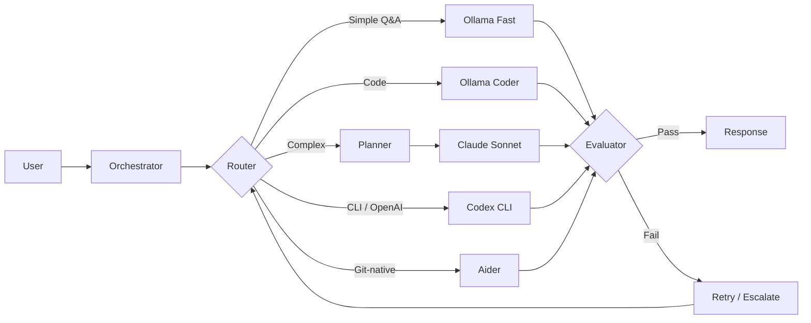

# Mahoraga

> Agent-agnostic LLM orchestration framework. Unifies any AI coding agent — local or cloud — into an intelligent workflow with quality evaluation, cost-aware routing, and real-time visual feedback.

*Named after the adaptive deity from Buddhist mythology — Mahoraga analyzes, adapts, and overcomes.*

<!-- Demo GIF: record after fixes are done and replace this comment -->

## What It Does

Mahoraga is not an agent. It orchestrates agents.

When you give Mahoraga a task, it:
1. Classifies complexity (simple → complex)
2. Routes to the best available agent based on capability and cost
3. Streams the response in real time
4. Evaluates output quality
5. Retries or escalates to a more capable agent on failure

Any agent plugs in through the `AgentAdapter` interface: local models (Ollama), cloud APIs (Claude), CLI tools (Codex CLI, Aider), or autonomous platforms.

## Architecture



## Supported Agents

| Agent | Type | Cost | Status |
|-------|------|------|--------|
| Ollama (Qwen3 4B) | Local inference | Free | ✅ Active |
| Claude (Haiku/Sonnet/Opus) | Cloud API | Per-token | ✅ Active |
| Codex CLI | CLI (OpenAI) | Free tier / ChatGPT Plus | 🔧 Planned |
| Aider | CLI (model-agnostic) | Free + LLM cost | 🔧 Planned |

## Benchmarks

Tested on MacBook Pro M-series (16 GB), Ollama backend:

| Model | Easy Task | Medium Task | Hard Task |
|-------|-----------|-------------|-----------|
| Qwen2.5 7B Q4 (baseline) | 14.3 t/s · 23s | 12.0 t/s · 39s | 13.0 t/s · 40s |
| **Qwen3 4B Q4 (current)** | **23.6 t/s · 12s** | **21.8 t/s · 36s** | **18.8 t/s · 48s** |
| Qwen3 8B Q4 | 12.7 t/s · 27s | 12.1 t/s · 58s | — |

## Quick Start

### Prerequisites

- Python 3.10+
- [Ollama](https://ollama.ai) installed and running
- Model pulled: `ollama pull qwen3:4b`

### Setup

```bash
git clone https://github.com/pockanoodles/Mahoraga.git
cd Mahoraga
cp .env.example .env
pip install -r requirements.txt
python -m backend.orchestrator.service.app
```

Open [http://localhost:8000](http://localhost:8000).

### Optional: Claude Backend

Add your Anthropic API key to `.env`:

```
ANTHROPIC_API_KEY=sk-ant-...
```

Toggle between Ollama and Claude from the UI header chip.

## Adapter Interface

New agents plug in by implementing `AgentAdapter`:

```python
from backend.orchestrator.adapters.base import AgentAdapter, AgentCapability, CostEstimate, AgentStatus

class MyAdapter(AgentAdapter):
    @property
    def name(self) -> str:
        return "my-agent"

    @property
    def worker_id(self) -> str:
        return "my-agent:default"   # matches a WorkerRegistry entry

    @property
    def capabilities(self) -> list[AgentCapability]:
        return [AgentCapability("code", confidence=0.9)]

    def estimate_cost(self, task) -> CostEstimate:
        return CostEstimate(estimated_cost_usd=0.0, model="local")

    async def health_check(self) -> AgentStatus:
        return AgentStatus(name=self.name, available=True)
```

See `backend/orchestrator/adapters/` for full implementations.

## Roadmap

- [x] Ollama local inference with quality scoring
- [x] Claude API escalation chain
- [x] Real-time web UI with worktree visualization
- [x] Cost tracking per agent
- [x] Response assembler bug fixed
- [ ] `AgentAdapter` interface (in progress)
- [ ] Codex CLI adapter
- [ ] Aider adapter
- [ ] Capability-based routing
- [ ] MCP server
- [ ] Native macOS dashboard ([Noctis](https://github.com/pockanoodles/Noctis))

## License

MIT
