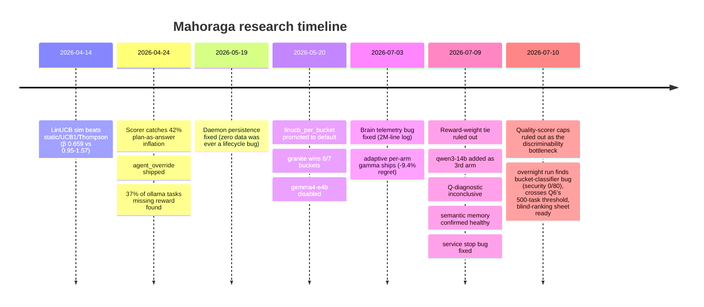

# Mahoraga — Findings Ledger

A consolidated, chronological record of every empirical finding, experiment, and
verified bug across the project's life, pulled from `brain/journal/`,
`brain/decisions/`, `current_state.md`, and `docs/specs/research-protocol.md`.
Grouped by era. Each finding also exists as a fuller narrative in its source
journal/decision file — this is the scannable index, not a replacement.

## Era 1 — Simulation only (2026-04-14)

| Question | Method | Result | Verdict |
|---|---|---|---|
| Does LinUCB beat Thompson/UCB1/static on simulated routing? | `orch benchmark simulate/swap-test`, 200 synthetic tasks | LinUCB β=0.659 vs static 1.569, UCB1 0.950, Thompson 1.175. Swap penalty ≈0.10 reward/task. | Confirmed (synthetic only, flagged as needing real-task validation) |
| How much real data before OLS weight learning is trustworthy? | Simulation-derived heuristic | ~100 obs/bucket; fall back to priors before that | Design rule, untested at the time |
| Which free models are best per bucket, cold vs warm latency? | — | No data yet | Open at time of writing |

## Era 2 — Scorer + 9-agent roster audit (2026-04-24)

| Question | Method | Result | Verdict |
|---|---|---|---|
| Was historical "quality" scoring discriminative, or rewarding plan-as-answer? | Offline backtest, 132 historical prompt/output pairs | 42% (56/132) were plan restatements, previously ~0.90, now 0.56-0.68 | Confirmed — scorer recalibrated |
| Does gemini-cli actually answer prompts? | Direct output inspection | Returns numbered plans, never executes; old validator scored 1.0 | Confirmed bug — decayed via γ, not backfilled |
| Is aider a chat agent or file-editor? | Direct behavior inspection | Writes files to disk, wrong language, quant-suffix warning | Confirmed — deprioritized for chat routing |
| Is codex-cli's 0.97 reward real? | DB audit | 56 decisions routed, only 3 have recorded rewards | Confirmed pipeline bug — reward loop silently drops rows |
| Did the bandit "lock onto" CLI agents? | Routing-distribution re-audit | Balanced; earlier read was a naming-migration display bug | Ruled out (false alarm) |
| Is LFM2 (claimed 2x CPU speed) actually faster on Apple Silicon? | Seed batch, 90 tasks across 3 Ollama agents | LFM2 31.9 t/s — slowest of the four, despite the claim | Confirmed negative result — no custom MoE kernel in the Ollama port |
| Does `agent_override` work for forced round-robin? | Direct code read | Implemented, logged, excluded from bandit updates | Fixed/shipped |
| Does quality score reach the reward path? | Direct code read | Already wired independently of the verifier | Ruled out as a gap — no fix needed |
| Stale legacy `selected_agent` naming in the DB? | DB audit | Already clean | Ruled out — no migration needed |

## Era 3 — Real 3-arm deployment (2026-05-19 – 2026-05-23)

| Question | Method | Result | Verdict |
|---|---|---|---|
| Why has zero routing data accumulated across sessions? | Daemon lifecycle investigation | `orch serve` was never running persistently | Fixed — `orch service install` (launchd) |
| Is `linucb_per_bucket` actually the strategy running in production? | Direct code read | Service booted v1 `"linucb"` every restart | Fixed — default-strategy switch |
| Does the full routing loop work end-to-end on the new roster? | Live single-task MCP probe | Classified, scored, ran, reward 0.8001, episode #251 logged | Confirmed/shipped |
| Which of qwen3.5 / gemma4-e4b / granite4.1-8b performs best per bucket? | `orch benchmark lab` | granite wins 6/7 buckets (plan 0.874, research 0.833); qwen3.5 wins code only (0.782 vs 0.776); gemma4-e4b worst everywhere | Confirmed — gemma4-e4b disabled 2026-05-23 |
| Should adaptive per-arm gamma ship now? | Reasoning, no data yet | N/A | Deferred until real per-bucket signal existed |

## Era 4 — Brain hygiene + adaptive gamma (2026-07-03)

| Question | Method | Result | Verdict |
|---|---|---|---|
| Is the repo brain being misused as a runtime telemetry sink? | Direct file inspection | `log.md` had grown to 2,029,674 lines (24MB), content-free "Routed to X" entries; test runs leaked fake sessions into the real journal | Fixed — auto-append removed, file deleted+gitignored, regression tests added |
| Sufficient real traffic to unblock adaptive gamma? | DB count + test-suite run | 207 real decisions (111 qwen3.5, 96 granite), both past 20-50 pull warmup | Confirmed unblocked |
| Does the first adaptive-gamma implementation have defects invisible to unit tests? | 27-agent adversarial review | 6 defects, 3 high-severity: cold-start death spiral, variance collapse, noise-floor inversion (stable arms forgetting *faster* than baseline) | Confirmed, all fixed with regression tests; 6 documented spec deviations |
| Does adaptive per-arm gamma beat global γ=0.98 under drift? | Drift-injection ablation, 10-seed τ sweep | Global: 12.85 final regret. Adaptive+recovery: **11.64** (best), only variant that re-adopts a recovered arm | Confirmed — shipped as default (-9.4% regret) |
| Is the spec's recovery-nudge mechanism implementable as written? | Direct code read | Inert — γ recomputed from EMA every pull, nudge never read; codebase's premise (idle-arm uncertainty growth) doesn't hold | Ruled out as specified; reimplemented via error-EMA decay |

## Era 5 — Reward-tie investigation (2026-07-09 – 2026-07-10)

| Question | Method | Result | Verdict |
|---|---|---|---|
| Do qwen3.5 / granite4.1-8b tie because of the reward-*weight* formula? | Offline reweight replay, zero new inference (337 decisions) | Pushing quality weight 0.20→0.55 only widened gap 1.3-2x in most buckets; `review` shrank | Ruled out — not a weight artifact |
| Does adding a 3rd, structurally different arm (qwen3-14b) break the tie? | Live registration + traffic accumulation | Live as of 2026-07-09 | Inconclusive — needs 15-20 samples/bucket, not yet re-checked |
| Does the inter-agent quality gap widen on harder tasks? | Forced-explore batch, 12 prompts easy/hard × 3 buckets, n=2/cell | Gap did not widen (if anything, narrower); qwen3-14b showed no edge despite legitimately longer/deeper answers (67-330 vs 5-23 tokens) | Inconclusive/directional — underpowered, but consistent across 3 buckets |
| Is semantic episodic memory actually working? | Live query, `query_semantic_with_confidence` | Sensible, differentiated bias/confidence/count; 596 episodes, 100% embedded | Confirmed healthy. Also corrected a doc error: embedding model is `all-MiniLM-L6-v2`, not `nomic-embed-text` |
| Are the quality scorer's caps/plateaus suppressing a real quality-gap signal? | Quality replay — real captured text re-scored under generous variants (higher length plateau, uncapped keyword bonuses, continuous not-plan), zero new inference | Every variant produced an equal or *smaller* gap than baseline; security keyword hits never reached the original cap; not-plan detector never triggered on any of the 34 rows | Ruled out — caps aren't hiding a real difference in this data |
| Does `orch service stop` actually stop the daemon? | Direct start/stop/health-check cycle | `KeepAlive: true` made stop cosmetic — relaunched within ~1s | Fixed — `KeepAlive: {SuccessfulExit: false}`, verified both ways |
| Is `--mode force-explore` safe for seeding the bandit? | Observed during the Era 3 bench run | Trains some arms, leaves others cold — UCB inflation asymmetry | Ruled out as a seeding method — use `inject_pseudo_obs` or bandit mode instead |

## Era 6 — Overnight autonomous run (2026-07-10, ~1:30am–3:00am)

While the user slept, ran the fully-automatable half of the backlog below. Everything logged to `bench_runs` (#7–#9) and re-verified, not assumed.

| Question | Method | Result | Verdict |
|---|---|---|---|
| **Is the bucket classifier actually routing real (unhinted) traffic correctly?** | Ran `_classify_bucket(text, hint=None)` directly against 80 unique real organic (non-bench) prompts | **0/80 classified as `security`, despite 14 explicit security-intent prompts** ("identify all security vulnerabilities...", "audit ... for bypass vulnerabilities...") in the sample. Root cause is two compounding bugs: (1) the `security` keyword list checks singular `"vulnerability"`, which is not a substring of the much more common plural `"vulnerabilities"`; (2) even where keywords would otherwise match, `_BUCKET_KEYWORDS` is checked in a fixed dict order with `code` first, and code's keywords (`"implement"`, `"def "`, `"return"`, `"function"`) match almost any prompt that includes a real code snippet as context — which nearly all security/review/refactor/debug prompts do. `code` absorbed 50/80 (62.5%) of all real traffic in the sample; `review` got 1/80, `refactor` 2/80. | **Confirmed and fixed 2026-07-10.** Reordered `_BUCKET_KEYWORDS` so `code` is checked last (only wins if no more specific intent-bucket matches), fixed the singular/plural keyword gap (`"vulnerab"` stem, added `"secret"`), and removed `"check"` from `review` (it collided with ordinary code-task phrasing like "write a function that checks if..." once review moved ahead of code in priority). Re-verified against the same 80-prompt real sample: **14/14** security-intent prompts now route correctly; `code`'s share of real traffic dropped from 62.5% to 8.75%; `test` picked up 19 prompts (up from 5) that were previously swallowed by `code`'s "write"/"function" keywords. 9 new regression tests (`tests/orchestrator_v2/test_classify_bucket.py`), full suite 1231 passed. Applied to `backend/orchestrator/store/metrics.py`. |
| Does the inter-agent quality gap widen on harder tasks, at better statistical power? | Round 2 of the difficulty-tier diagnostic (`prompts_difficulty_round2.jsonl`, 24 prompts covering the 6 buckets round 1 didn't reach: debug/plan/review/refactor/test/general; force-explore, 72/72 succeeded, bench_run_id=8) | Round 2 alone showed a small widening (easy gap 0.041, hard gap 0.059) — opposite direction from round 1. Combined across both rounds (all 9 buckets, n=18/agent/tier): easy gap 0.059, hard gap 0.053 — **flat, hard not wider**, matching round 1's original read at much better power (n=18 vs n=2). | Confirmed, upgraded from directional-only to a reasonably-powered null result — no evidence hard tasks widen the inter-agent quality gap. |
| Does `qwen3-14b` reaching real sample-size (14-29/bucket vs 4-12 before) change the reward-tie or leader-stability picture? | Re-ran `compat-matrix` (all cells now N≥12 except debug/general/test) + first-half-vs-second-half leader-stability check across all 9 buckets | granite4.1-8b leads every bucket in the first half of history (likely an artifact of being registered earliest); by the second half, leadership flips in 5/9 buckets (debug, general, refactor, review, test) to qwen3.5 or qwen3-14b. Aggregate: granite 0.76 avg quality, qwen3.5 0.73, qwen3-14b 0.71 — closer than the flip-rate suggests. | Confirmed — adding qwen3-14b did **not** resolve the tie/instability; consistent with the "genuinely similar models" reading over "arm-diversity" reading. |
| Is the 2026-04-24 "37% of ollama tasks missing reward" bug still present on the current 3-arm local roster? | Direct query: `NULL` reward / `NULL` success count for `qwen3.5`/`granite4.1-8b`/`qwen3-14b`, 660 rows | **0 NULL rewards, 0 NULL success values** across all three active arms. 5 genuine failures exist, all logged with `reward=0.0`, `success=0` (not `NULL`) — correctly attributable, not silently dropped. | Confirmed fixed/moot on the current roster — the Era-2 pipeline gap does not reproduce here. Backlog item closed. |
| Does real un-forced traffic now clear Q6's 500-task threshold? | Ran a 168-task bandit-mode batch (`prompts_v1.jsonl`, repeats=4, bench_run_id=9); 161/168 succeeded, 7 failed with client-side read timeouts (`asyncio.CancelledError` mid-stream — slow/cold local model calls exceeding the 180s per-task timeout, not a scorer/routing bug) | Unforced real traffic (organic-MCP + bandit-mode) went from ~352 to **517** decisions. | Threshold crossed — the data-volume blocker on Q6 (retrieval-augmented-bandit A/B) is resolved; the actual A/B test itself still hasn't been run. |
| Prep for the recommended next step (blind human ranking vs. the heuristic scorer) | Selected 7 real (prompt, tier, bucket) triples where all 3 agents succeeded, spanning code/security/debug/plan × easy/hard; wrote `experiments/blind_ranking_sheet.md` (labels shuffled per-prompt, so no letter maps to the same agent twice) + `blind_ranking_key.json` (kept separate to stay blind) + `experiments/score_blind_ranking.py` (fills in agreement/disagreement against the heuristic scorer once ranked) | 21 outputs ready to rank; scoring script verified to run end-to-end on a synthetic test ranking. | Ready — no analysis run yet, this is prep for the user to do the actual ranking. |

### Bucket-classifier fix — applied 2026-07-10

Note this diverges slightly from the "score by hit-count" approach originally proposed (see prior revision of this file): hit-counting alone still let `code` win ties against single-keyword intent signals (e.g. "write a unit test for X" has 2 code hits — "write","function" — vs 1 test hit — "test"). Testing against the real 80-prompt sample and the hand-labeled prompt banks empirically, simple reordering (specific-intent buckets checked before `code`, `code` checked last) outperformed hit-counting and was simpler. Validated both against the 14-prompt real regression set (14/14 fixed) and a 78-prompt hand-labeled prompt-bank sweep (48.7% → 60.3% agreement — the residual gap is mostly research/general/plan ambiguity, out of scope for this fix). Not chased further — the classifier's overall quality (given zero test coverage before today) is a separate, larger finding worth its own future pass, potentially replacing keyword matching with the same embedding model already used for episodic memory.

## Research-question scorecard (`docs/specs/research-protocol.md` Q1–Q6)

| # | Question | Status |
|---|---|---|
| Q1 | Does the quality scorer change the bandit's learned routing policy? | **Unanswered as scoped** — roster changed underneath it before/after comparison was possible |
| Q2 | Which agent performs best on each capability bucket? | **Partially answered, methodology diverged** — Era 3 bench answers this for the current 3-arm roster, not the original 9-agent design or the prescribed 10-rep forced round-robin |
| Q3 | Does LinUCB converge on real traffic with the corrected scorer? | **Unanswered** — no convergence analysis (trailing reward, exploration-rate curve, regret estimate) has been run |
| Q4 | Actual t/s and swap latencies on Apple Silicon? | **Only partially seeded** — one seed batch exists; full quant-level + swap-latency protocol never run |
| Q5 | Is Mahoraga faster/slower than raw Claude Code? | **Unanswered — never run.** Note: `current_state.md`'s 2026-07-09 difficulty-tier finding is informally labeled "Q5" but answers a different question (does the inter-agent gap widen on hard tasks) — don't conflate the two |
| Q6 | Does retrieval-augmented (episodic-memory) routing outperform vanilla dLinUCB? | **First real A/B run 2026-07-10 (n≈42/condition): null result** — memory changes 14.6% of routing decisions but no detectable reward difference (diff/SE≈0.54). Not conclusive at this N; see Era 8 |

## Never executed (backlog, still open)

| Item | Why it matters | Blocked by |
|---|---|---|
| Q6 A/B: retrieval-augmented bandit vs vanilla dLinUCB | Data threshold now cleared (517 unforced decisions) | Needs the actual A/B test designed and run |
| Classifier's remaining research/general/plan ambiguity (60.3% agreement with hand-labeled prompt banks, up from 48.7%) | The `security`/`code` fix closed the worst offender; broader classification quality is still weak and untested until today | New — consider replacing keyword matching with the embedding model already used for episodic memory |
| Phase 1 forced round-robin at full scale (~1,200 tasks) | Would replace the hand-tuned oracle with an empirical compat matrix | Time/compute — never scheduled at this scale |
| Phase 3 counterfactual re-runs (10-15 decisions via `agent_override`) | Empirical regret vs. the simulation's 0.0887 | Never scheduled |
| Phase 4 Mahoraga-vs-Claude-Code, 20 tasks | Answers Q5 directly | Methodology-freeze checklist never locked |
| Phase 5 algorithm ablation (dLinUCB vs vanilla, memory on/off, OLS vs flat weights, swap penalty on/off) | Answers Q3 indirectly, isolates which component actually helps | Never run (distinct from the adaptive-gamma drift ablation, which *was* run) |
| Phase 6 prompt-variant experiments | — | Explicitly deferred in the source doc |
| OLS live auto-reweighting (§5.3, recompute every 100 tasks/bucket) | Would close the loop the offline reweight-replay tool only analyzes | Never implemented as a live mechanism |
| Full gamma sweep grid + distance-weighted episodic α (ADR items 6-8) | Completes the adaptive-gamma work | Explicitly listed as remaining in the ADR |
| `MAHORAGA_MEMORY_MODE=keyword` vs semantic default comparison | Distinguishes keyword-fallback from semantic-specific effects | Not yet done — the semantic-vs-off comparison ran (Era 8), keyword-vs-off/semantic still open |
| **Fix `orch service stop`'s regression (Era 8)** | `launchctl stop` sends SIGTERM, process doesn't exit cleanly (code 0), so `KeepAlive` respawns it anyway — same symptom as the 2026-07-09 bug, different mechanism | Needs either graceful SIGTERM handling in `orch serve` or switching `stop` to `launchctl bootout` |
| Promote the 7-day cron trial job to permanent launchd | Removes session-scoped fragility from data collection | Explicitly flagged as a separate, unmade decision |
| Q6 A/B at larger N | n≈42/condition (Era 8) can't reliably detect an effect near the observed noise floor | Needs several hundred per condition — time, not a blocker |

Closed 2026-07-10: reward-pipeline NULL-reward check (clean on current roster), cross-bucket routing check (found + fixed the classifier bug above), compat-matrix + leader-stability recheck with qwen3-14b at full sample size, bucket-classifier security/code bug (fixed and tested), Q6's first real A/B run (null at n≈42, not conclusive).

**Roster decision (2026-07-10):** qwen3-14b stays in the roster despite being judged "too large for this machine" — it's still generating useful comparative data, and removing it would lose the 3rd-arm signal the reward-tie investigation depends on.

## Era 7 — Blind ranking result + a real methodology limit (2026-07-10 morning)

Kaito filled in `experiments/blind_ranking_sheet.md` (7 real prompts, 21 outputs, code/security/debug/plan × easy/hard). Result: **3/7 (43%) agreement between his ranking and the heuristic scorer's top pick — barely above the 33% chance rate for a 3-way ranking.** (One prompt, #1, was degenerate — two of the three outputs were byte-identical code — so treat this as n=6 substantive comparisons.)

The 4 disagreements share a mechanism, not noise: in every one, the heuristic scorer preferred the longer, more structurally elaborate answer (usually granite4.1-8b's), while Kaito's stated reasoning explicitly rejected that elaboration as not earning its keep — e.g. prompt #7 (Flask migration plan): granite's answer scored **0.9689, the highest heuristic score in the entire 21-output sample**, for adding blue-green deployment + rollback sections Kaito called "generic/boilerplate... not specifically earned by this one," and ranked it 2nd, not 1st. Aggregate: Kaito preferred qwen3.5 in 5/7 prompts, granite in 2/7 (both debug, where correctness/causal-explanation mattered), qwen3-14b in 0/7 — cutting against the compat-matrix's whole history of granite leading, suggesting granite's lead may be partly the scorer rewarding its more verbose style rather than granite answering better.

**Attempted a scoped fix, tested before applying (not applied):** added `prose_length_curve` (diminishing-returns via `1 - exp(-words/scale)` instead of the flat plateau) and `structure_bonus_weight` knobs to `quality_replay.py`, tested several parameterizations directly against the blind-ranking ground truth. **None improved agreement — one config made it worse (2/6).** Root cause of why softening the curve doesn't help: for the two decisive disagreements (#6, #7, both `plan` bucket), all three agents' answers already clear the length/structure thresholds; reshaping the curve just rescales all three scores proportionally without changing *who wins*, because the actual tie-breaker is the **flat +0.10 structure bonus**, which fires identically whether an answer has one extra list item or five, with no way to distinguish "additional relevant content" from "additional generic content."

**The real limitation, and why we're documenting rather than continuing to patch:** validating any specific curve/weight fix requires a ground-truth ranking to test against, and the only ground truth trusted enough to matter (Kaito's own judgment) doesn't scale — a 7-prompt blind ranking is genuinely difficult/slow to do carefully, and n=6 is not enough data to fit formula constants against without overfitting to noise (confirmed empirically: multiple plausible-sounding curve shapes gave different, inconsistent results on the same 6 points). Delegating the ranking task to someone else changes what's being validated (a different rater's taste, not Kaito's) — not necessarily invalid, but a different question, and raised as a concern rather than resolved.

**Status: known, real, mechanistically-understood defect (flat structure bonus rewards generic elaboration) — left unfixed, because no fix has been validated against real judgment, and further curve-shape guessing without more data would be tuning to vibes, not evidence.** This is the same discipline applied to the classifier fix (14 real cases + 78-prompt regression set before shipping) — the scorer fix doesn't get to skip that bar just because it's harder to clear here.

### LLM-judge sanity check (2026-07-10) — failed, and failed in a specific, informative way

Tried the agreed cheap-first step: `experiments/llm_judge.py` used `gemma4:e4b` (deliberately not one of the 3 roster arms, to avoid self-preference bias) to judge the same 7 blind-ranking prompts, explicitly instructed not to reward length/structure for its own sake. Sanity-checked against Kaito's 6 valid human rankings before trusting it for anything larger.

**Result: 1/6 agreement — worse than the heuristic scorer's own 3/6.** (1 of 7 prompts failed to parse and was excluded, not counted either way.) Read the judge's own stated reasoning on the misses: "most architecturally robust plan by incorporating advanced strategies like Blue-Green deployment, event-driven messaging queues" (praising exactly the granite answer Kaito called "generic/boilerplate... not specifically earned"); "most thorough and explicitly detailed"; "most technically precise and advanced instrumentation methods." **The judge exhibited the identical elaboration-as-quality bias as the heuristic scorer it was meant to validate against**, despite an explicit instruction not to.

This is a more interesting negative result than "gemma4-e4b is a bad judge": two independent systems (a keyword/length heuristic and a separate LLM) converged on the same bias. Read: this may not be a quirk specific to Mahoraga's formula — it could be a general property of how instruction-tuned models present thoroughness/sophistication, showing up regardless of which system is doing the judging. Worth remembering if this thread is revisited with a different/stronger judge — the bar a new judge needs to clear just went up, not down.

**Decision (2026-07-10): stop here.** Two negative results in a row (curve-fix attempt, judge sanity-check) on the same thread. The defect stays documented and unfixed; time redirected to backlog items with more certain payoff (Q6 A/B test, gamma sweep grid, Tailscale/multi-node scoping). Revisit only if a cheap way to get reliable volume ground truth turns up.

## Era 8 — Q6's first real A/B data point, and a service-stop regression (2026-07-10)

**Q6 (does semantic episodic memory improve routing over vanilla dLinUCB?) — first real answer: null at n≈42, but memory is not inert.**

Method: same 42-prompt bank (`prompts_v1.jsonl`), real bandit-mode traffic, run twice back-to-back — once with `MAHORAGA_MEMORY_MODE=off`, once with the default (`semantic`) — via a temporarily-manual `orch serve` instance (persistent daemon stopped for the test window, fully restored afterward). bench_run_id=11 (off, 42/42) and 12 (semantic, 40/42, 2 client timeouts unrelated to memory).

- **Memory measurably changes routing**: comparing the same 41 matched prompts across both runs, **6/41 (14.6%) got routed to a different agent** depending on memory mode. Not inert.
- **But no detectable reward difference**: memory_off mean reward 0.7963 (n=42, SE=0.0087) vs memory_semantic 0.7839 (n=41, SE=0.0214). Diff = 0.0124, pooled SE = 0.0231, **diff/SE ≈ 0.54** — nowhere near the ~2.0 needed for even a rough significance read. The two conditions are indistinguishable in outcome at this sample size, despite memory visibly changing ~15% of individual decisions.
- **Read**: this is Q6's first real data point (zero existed before today), and it's an honest null, not a confident "memory doesn't help" — n≈42/condition can't reliably detect an effect smaller than roughly the observed noise floor. If this matters enough to resolve properly, the next step is a much larger N (several hundred per condition), not a stronger claim from this run.

**Also found: `orch service stop` is broken again**, differently from the 2026-07-09 fix. `launchctl stop` sends SIGTERM; the `orch serve` process is killed BY the signal rather than catching it and exiting with code 0 (`LastExitStatus = 15` = signal number, confirmed via `launchctl print`). `KeepAlive.SuccessfulExit: false` respawns on any *unsuccessful* exit, and a signal-kill counts as unsuccessful — so launchd relaunches it anyway, just like the original bug, via a different mechanism than the one already fixed. Worked around for tonight with `launchctl bootout` (full unload, guaranteed no respawn) + `launchctl bootstrap` to restore. **Not fixed properly** — needs either graceful SIGTERM handling in `orch serve` itself (catch the signal, call `sys.exit(0)`) or changing `orch service stop`'s implementation to use bootout/bootstrap instead of `launchctl stop`. Flagged as a fresh, small, well-understood bug for next time.
