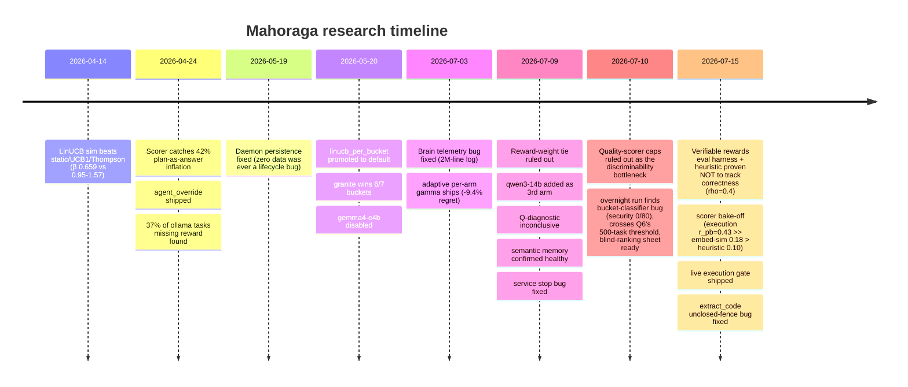

# Mahoraga — Findings Ledger

A consolidated, chronological record of every empirical finding, experiment, and
verified bug across the project's life, pulled from `brain/journal/`,
`brain/decisions/`, `current_state.md`, and `docs/specs/research-protocol.md`.
Grouped by era. Each finding also exists as a fuller narrative in its source
journal/decision file — this is the scannable index, not a replacement.



## Era 1 — Simulation only (2026-04-14)

| Question | Method | Result | Verdict |
|---|---|---|---|
| Does LinUCB beat Thompson/UCB1/static on simulated routing? | `orch benchmark simulate/swap-test`, 200 synthetic tasks | LinUCB β=0.659 vs static 1.569, UCB1 0.950, Thompson 1.175. Swap penalty ≈0.10 reward/task. | Confirmed (synthetic only, flagged as needing real-task validation) |
| How much real data before OLS weight learning is trustworthy? | Simulation-derived heuristic | ~100 obs/bucket; fall back to priors before that | Design rule, untested at the time |
| Which free models are best per bucket, cold vs warm latency? | — | No data yet | Open at time of writing |

## Era 2 — Scorer + 9-agent roster audit (2026-04-24)

| Question | Method | Result | Verdict |
|---|---|---|---|
| Was historical "quality" scoring discriminative, or rewarding plan-as-answer? | Offline backtest, 132 historical prompt/output pairs | 42% (56/132) were plan restatements, previously ~0.90, now 0.56-0.68 | Confirmed — scorer recalibrated |
| Does gemini-cli actually answer prompts? | Direct output inspection | Returns numbered plans, never executes; old validator scored 1.0 | Confirmed bug — decayed via γ, not backfilled |
| Is aider a chat agent or file-editor? | Direct behavior inspection | Writes files to disk, wrong language, quant-suffix warning | Confirmed — deprioritized for chat routing |
| Is codex-cli's 0.97 reward real? | DB audit | 56 decisions routed, only 3 have recorded rewards | Confirmed pipeline bug — reward loop silently drops rows |
| Did the bandit "lock onto" CLI agents? | Routing-distribution re-audit | Balanced; earlier read was a naming-migration display bug | Ruled out (false alarm) |
| Is LFM2 (claimed 2x CPU speed) actually faster on Apple Silicon? | Seed batch, 90 tasks across 3 Ollama agents | LFM2 31.9 t/s — slowest of the four, despite the claim | Confirmed negative result — no custom MoE kernel in the Ollama port |
| Does `agent_override` work for forced round-robin? | Direct code read | Implemented, logged, excluded from bandit updates | Fixed/shipped |
| Does quality score reach the reward path? | Direct code read | Already wired independently of the verifier | Ruled out as a gap — no fix needed |
| Stale legacy `selected_agent` naming in the DB? | DB audit | Already clean | Ruled out — no migration needed |

## Era 3 — Real 3-arm deployment (2026-05-19 – 2026-05-23)

| Question | Method | Result | Verdict |
|---|---|---|---|
| Why has zero routing data accumulated across sessions? | Daemon lifecycle investigation | `orch serve` was never running persistently | Fixed — `orch service install` (launchd) |
| Is `linucb_per_bucket` actually the strategy running in production? | Direct code read | Service booted v1 `"linucb"` every restart | Fixed — default-strategy switch |
| Does the full routing loop work end-to-end on the new roster? | Live single-task MCP probe | Classified, scored, ran, reward 0.8001, episode #251 logged | Confirmed/shipped |
| Which of qwen3.5 / gemma4-e4b / granite4.1-8b performs best per bucket? | `orch benchmark lab` | granite wins 6/7 buckets (plan 0.874, research 0.833); qwen3.5 wins code only (0.782 vs 0.776); gemma4-e4b worst everywhere | Confirmed — gemma4-e4b disabled 2026-05-23 |
| Should adaptive per-arm gamma ship now? | Reasoning, no data yet | N/A | Deferred until real per-bucket signal existed |

## Era 4 — Brain hygiene + adaptive gamma (2026-07-03)

| Question | Method | Result | Verdict |
|---|---|---|---|
| Is the repo brain being misused as a runtime telemetry sink? | Direct file inspection | `log.md` had grown to 2,029,674 lines (24MB), content-free "Routed to X" entries; test runs leaked fake sessions into the real journal | Fixed — auto-append removed, file deleted+gitignored, regression tests added |
| Sufficient real traffic to unblock adaptive gamma? | DB count + test-suite run | 207 real decisions (111 qwen3.5, 96 granite), both past 20-50 pull warmup | Confirmed unblocked |
| Does the first adaptive-gamma implementation have defects invisible to unit tests? | 27-agent adversarial review | 6 defects, 3 high-severity: cold-start death spiral, variance collapse, noise-floor inversion (stable arms forgetting *faster* than baseline) | Confirmed, all fixed with regression tests; 6 documented spec deviations |
| Does adaptive per-arm gamma beat global γ=0.98 under drift? | Drift-injection ablation, 10-seed τ sweep | Global: 12.85 final regret. Adaptive+recovery: **11.64** (best), only variant that re-adopts a recovered arm | Confirmed — shipped as default (-9.4% regret) |
| Is the spec's recovery-nudge mechanism implementable as written? | Direct code read | Inert — γ recomputed from EMA every pull, nudge never read; codebase's premise (idle-arm uncertainty growth) doesn't hold | Ruled out as specified; reimplemented via error-EMA decay |

## Era 5 — Reward-tie investigation (2026-07-09 – 2026-07-10)

| Question | Method | Result | Verdict |
|---|---|---|---|
| Do qwen3.5 / granite4.1-8b tie because of the reward-*weight* formula? | Offline reweight replay, zero new inference (337 decisions) | Pushing quality weight 0.20→0.55 only widened gap 1.3-2x in most buckets; `review` shrank | Ruled out — not a weight artifact |
| Does adding a 3rd, structurally different arm (qwen3-14b) break the tie? | Live registration + traffic accumulation | Live as of 2026-07-09 | Inconclusive — needs 15-20 samples/bucket, not yet re-checked |
| Does the inter-agent quality gap widen on harder tasks? | Forced-explore batch, 12 prompts easy/hard × 3 buckets, n=2/cell | Gap did not widen (if anything, narrower); qwen3-14b showed no edge despite legitimately longer/deeper answers (67-330 vs 5-23 tokens) | Inconclusive/directional — underpowered, but consistent across 3 buckets |
| Is semantic episodic memory actually working? | Live query, `query_semantic_with_confidence` | Sensible, differentiated bias/confidence/count; 596 episodes, 100% embedded | Confirmed healthy. Also corrected a doc error: embedding model is `all-MiniLM-L6-v2`, not `nomic-embed-text` |
| Are the quality scorer's caps/plateaus suppressing a real quality-gap signal? | Quality replay — real captured text re-scored under generous variants (higher length plateau, uncapped keyword bonuses, continuous not-plan), zero new inference | Every variant produced an equal or *smaller* gap than baseline; security keyword hits never reached the original cap; not-plan detector never triggered on any of the 34 rows | Ruled out — caps aren't hiding a real difference in this data |
| Does `orch service stop` actually stop the daemon? | Direct start/stop/health-check cycle | `KeepAlive: true` made stop cosmetic — relaunched within ~1s | Fixed — `KeepAlive: {SuccessfulExit: false}`, verified both ways |
| Is `--mode force-explore` safe for seeding the bandit? | Observed during the Era 3 bench run | Trains some arms, leaves others cold — UCB inflation asymmetry | Ruled out as a seeding method — use `inject_pseudo_obs` or bandit mode instead |

## Era 6 — Overnight autonomous run (2026-07-10, ~1:30am–3:00am)

While the user slept, ran the fully-automatable half of the backlog below. Everything logged to `bench_runs` (#7–#9) and re-verified, not assumed.

| Question | Method | Result | Verdict |
|---|---|---|---|
| **Is the bucket classifier actually routing real (unhinted) traffic correctly?** | Ran `_classify_bucket(text, hint=None)` directly against 80 unique real organic (non-bench) prompts | **0/80 classified as `security`, despite 14 explicit security-intent prompts** ("identify all security vulnerabilities...", "audit ... for bypass vulnerabilities...") in the sample. Root cause is two compounding bugs: (1) the `security` keyword list checks singular `"vulnerability"`, which is not a substring of the much more common plural `"vulnerabilities"`; (2) even where keywords would otherwise match, `_BUCKET_KEYWORDS` is checked in a fixed dict order with `code` first, and code's keywords (`"implement"`, `"def "`, `"return"`, `"function"`) match almost any prompt that includes a real code snippet as context — which nearly all security/review/refactor/debug prompts do. `code` absorbed 50/80 (62.5%) of all real traffic in the sample; `review` got 1/80, `refactor` 2/80. | **Confirmed and fixed 2026-07-10.** Reordered `_BUCKET_KEYWORDS` so `code` is checked last (only wins if no more specific intent-bucket matches), fixed the singular/plural keyword gap (`"vulnerab"` stem, added `"secret"`), and removed `"check"` from `review` (it collided with ordinary code-task phrasing like "write a function that checks if..." once review moved ahead of code in priority). Re-verified against the same 80-prompt real sample: **14/14** security-intent prompts now route correctly; `code`'s share of real traffic dropped from 62.5% to 8.75%; `test` picked up 19 prompts (up from 5) that were previously swallowed by `code`'s "write"/"function" keywords. 9 new regression tests (`tests/orchestrator_v2/test_classify_bucket.py`), full suite 1231 passed. Applied to `backend/orchestrator/store/metrics.py`. |
| Does the inter-agent quality gap widen on harder tasks, at better statistical power? | Round 2 of the difficulty-tier diagnostic (`prompts_difficulty_round2.jsonl`, 24 prompts covering the 6 buckets round 1 didn't reach: debug/plan/review/refactor/test/general; force-explore, 72/72 succeeded, bench_run_id=8) | Round 2 alone showed a small widening (easy gap 0.041, hard gap 0.059) — opposite direction from round 1. Combined across both rounds (all 9 buckets, n=18/agent/tier): easy gap 0.059, hard gap 0.053 — **flat, hard not wider**, matching round 1's original read at much better power (n=18 vs n=2). | Confirmed, upgraded from directional-only to a reasonably-powered null result — no evidence hard tasks widen the inter-agent quality gap. |
| Does `qwen3-14b` reaching real sample-size (14-29/bucket vs 4-12 before) change the reward-tie or leader-stability picture? | Re-ran `compat-matrix` (all cells now N≥12 except debug/general/test) + first-half-vs-second-half leader-stability check across all 9 buckets | granite4.1-8b leads every bucket in the first half of history (likely an artifact of being registered earliest); by the second half, leadership flips in 5/9 buckets (debug, general, refactor, review, test) to qwen3.5 or qwen3-14b. Aggregate: granite 0.76 avg quality, qwen3.5 0.73, qwen3-14b 0.71 — closer than the flip-rate suggests. | Confirmed — adding qwen3-14b did **not** resolve the tie/instability; consistent with the "genuinely similar models" reading over "arm-diversity" reading. |
| Is the 2026-04-24 "37% of ollama tasks missing reward" bug still present on the current 3-arm local roster? | Direct query: `NULL` reward / `NULL` success count for `qwen3.5`/`granite4.1-8b`/`qwen3-14b`, 660 rows | **0 NULL rewards, 0 NULL success values** across all three active arms. 5 genuine failures exist, all logged with `reward=0.0`, `success=0` (not `NULL`) — correctly attributable, not silently dropped. | Confirmed fixed/moot on the current roster — the Era-2 pipeline gap does not reproduce here. Backlog item closed. |
| Does real un-forced traffic now clear Q6's 500-task threshold? | Ran a 168-task bandit-mode batch (`prompts_v1.jsonl`, repeats=4, bench_run_id=9); 161/168 succeeded, 7 failed with client-side read timeouts (`asyncio.CancelledError` mid-stream — slow/cold local model calls exceeding the 180s per-task timeout, not a scorer/routing bug) | Unforced real traffic (organic-MCP + bandit-mode) went from ~352 to **517** decisions. | Threshold crossed — the data-volume blocker on Q6 (retrieval-augmented-bandit A/B) is resolved; the actual A/B test itself still hasn't been run. |
| Prep for the recommended next step (blind human ranking vs. the heuristic scorer) | Selected 7 real (prompt, tier, bucket) triples where all 3 agents succeeded, spanning code/security/debug/plan × easy/hard; wrote `experiments/blind_ranking_sheet.md` (labels shuffled per-prompt, so no letter maps to the same agent twice) + `blind_ranking_key.json` (kept separate to stay blind) + `experiments/score_blind_ranking.py` (fills in agreement/disagreement against the heuristic scorer once ranked) | 21 outputs ready to rank; scoring script verified to run end-to-end on a synthetic test ranking. | Ready — no analysis run yet, this is prep for the user to do the actual ranking. |

### Bucket-classifier fix — applied 2026-07-10

Note this diverges slightly from the "score by hit-count" approach originally proposed (see prior revision of this file): hit-counting alone still let `code` win ties against single-keyword intent signals (e.g. "write a unit test for X" has 2 code hits — "write","function" — vs 1 test hit — "test"). Testing against the real 80-prompt sample and the hand-labeled prompt banks empirically, simple reordering (specific-intent buckets checked before `code`, `code` checked last) outperformed hit-counting and was simpler. Validated both against the 14-prompt real regression set (14/14 fixed) and a 78-prompt hand-labeled prompt-bank sweep (48.7% → 60.3% agreement — the residual gap is mostly research/general/plan ambiguity, out of scope for this fix). Not chased further — the classifier's overall quality (given zero test coverage before today) is a separate, larger finding worth its own future pass, potentially replacing keyword matching with the same embedding model already used for episodic memory.

## Research-question scorecard (`docs/specs/research-protocol.md` Q1–Q6)

| # | Question | Status |
|---|---|---|
| Q1 | Does the quality scorer change the bandit's learned routing policy? | **Unanswered as scoped** — roster changed underneath it before/after comparison was possible |
| Q2 | Which agent performs best on each capability bucket? | **Partially answered, methodology diverged** — Era 3 bench answers this for the current 3-arm roster, not the original 9-agent design or the prescribed 10-rep forced round-robin |
| Q3 | Does LinUCB converge on real traffic with the corrected scorer? | **Unanswered** — no convergence analysis (trailing reward, exploration-rate curve, regret estimate) has been run |
| Q4 | Actual t/s and swap latencies on Apple Silicon? | **Only partially seeded** — one seed batch exists; full quant-level + swap-latency protocol never run |
| Q5 | Is Mahoraga faster/slower than raw Claude Code? | **Unanswered — never run.** Note: `current_state.md`'s 2026-07-09 difficulty-tier finding is informally labeled "Q5" but answers a different question (does the inter-agent gap widen on hard tasks) — don't conflate the two |
| Q6 | Does retrieval-augmented (episodic-memory) routing outperform vanilla dLinUCB? | **First real A/B run 2026-07-10 (n≈42/condition): null result** — memory changes 14.6% of routing decisions but no detectable reward difference (diff/SE≈0.54). Not conclusive at this N; see Era 8 |

## Never executed (backlog, still open)

| Item | Why it matters | Blocked by |
|---|---|---|
| Q6 A/B: retrieval-augmented bandit vs vanilla dLinUCB | Data threshold now cleared (517 unforced decisions) | Needs the actual A/B test designed and run |
| Classifier's remaining research/general/plan ambiguity (60.3% agreement with hand-labeled prompt banks, up from 48.7%) | The `security`/`code` fix closed the worst offender; broader classification quality is still weak and untested until today | New — consider replacing keyword matching with the embedding model already used for episodic memory |
| Phase 1 forced round-robin at full scale (~1,200 tasks) | Would replace the hand-tuned oracle with an empirical compat matrix | Time/compute — never scheduled at this scale |
| Phase 3 counterfactual re-runs (10-15 decisions via `agent_override`) | Empirical regret vs. the simulation's 0.0887 | Never scheduled |
| Phase 4 Mahoraga-vs-Claude-Code, 20 tasks | Answers Q5 directly | Methodology-freeze checklist never locked |
| Phase 5 algorithm ablation (dLinUCB vs vanilla, memory on/off, OLS vs flat weights, swap penalty on/off) | Answers Q3 indirectly, isolates which component actually helps | Never run (distinct from the adaptive-gamma drift ablation, which *was* run) |
| Phase 6 prompt-variant experiments | — | Explicitly deferred in the source doc |
| OLS live auto-reweighting (§5.3, recompute every 100 tasks/bucket) | Would close the loop the offline reweight-replay tool only analyzes | Never implemented as a live mechanism |
| Full gamma sweep grid + distance-weighted episodic α (ADR items 6-8) | Completes the adaptive-gamma work | Explicitly listed as remaining in the ADR |
| `MAHORAGA_MEMORY_MODE=keyword` vs semantic default comparison | Distinguishes keyword-fallback from semantic-specific effects | Not yet done — the semantic-vs-off comparison ran (Era 8), keyword-vs-off/semantic still open |
| **Fix `orch service stop`'s regression (Era 8)** | `launchctl stop` sends SIGTERM, process doesn't exit cleanly (code 0), so `KeepAlive` respawns it anyway — same symptom as the 2026-07-09 bug, different mechanism | Needs either graceful SIGTERM handling in `orch serve` or switching `stop` to `launchctl bootout` |
| Promote the 7-day cron trial job to permanent launchd | Removes session-scoped fragility from data collection | Explicitly flagged as a separate, unmade decision |
| Q6 A/B at larger N | n≈42/condition (Era 8) can't reliably detect an effect near the observed noise floor | Needs several hundred per condition — time, not a blocker |

Closed 2026-07-10: reward-pipeline NULL-reward check (clean on current roster), cross-bucket routing check (found + fixed the classifier bug above), compat-matrix + leader-stability recheck with qwen3-14b at full sample size, bucket-classifier security/code bug (fixed and tested), Q6's first real A/B run (null at n≈42, not conclusive).

**Roster decision (2026-07-10):** qwen3-14b stays in the roster despite being judged "too large for this machine" — it's still generating useful comparative data, and removing it would lose the 3rd-arm signal the reward-tie investigation depends on.

## Era 7 — Blind ranking result + a real methodology limit (2026-07-10 morning)

Kaito filled in `experiments/blind_ranking_sheet.md` (7 real prompts, 21 outputs, code/security/debug/plan × easy/hard). Result: **3/7 (43%) agreement between his ranking and the heuristic scorer's top pick — barely above the 33% chance rate for a 3-way ranking.** (One prompt, #1, was degenerate — two of the three outputs were byte-identical code — so treat this as n=6 substantive comparisons.)

The 4 disagreements share a mechanism, not noise: in every one, the heuristic scorer preferred the longer, more structurally elaborate answer (usually granite4.1-8b's), while Kaito's stated reasoning explicitly rejected that elaboration as not earning its keep — e.g. prompt #7 (Flask migration plan): granite's answer scored **0.9689, the highest heuristic score in the entire 21-output sample**, for adding blue-green deployment + rollback sections Kaito called "generic/boilerplate... not specifically earned by this one," and ranked it 2nd, not 1st. Aggregate: Kaito preferred qwen3.5 in 5/7 prompts, granite in 2/7 (both debug, where correctness/causal-explanation mattered), qwen3-14b in 0/7 — cutting against the compat-matrix's whole history of granite leading, suggesting granite's lead may be partly the scorer rewarding its more verbose style rather than granite answering better.

**Attempted a scoped fix, tested before applying (not applied):** added `prose_length_curve` (diminishing-returns via `1 - exp(-words/scale)` instead of the flat plateau) and `structure_bonus_weight` knobs to `quality_replay.py`, tested several parameterizations directly against the blind-ranking ground truth. **None improved agreement — one config made it worse (2/6).** Root cause of why softening the curve doesn't help: for the two decisive disagreements (#6, #7, both `plan` bucket), all three agents' answers already clear the length/structure thresholds; reshaping the curve just rescales all three scores proportionally without changing *who wins*, because the actual tie-breaker is the **flat +0.10 structure bonus**, which fires identically whether an answer has one extra list item or five, with no way to distinguish "additional relevant content" from "additional generic content."

**The real limitation, and why we're documenting rather than continuing to patch:** validating any specific curve/weight fix requires a ground-truth ranking to test against, and the only ground truth trusted enough to matter (Kaito's own judgment) doesn't scale — a 7-prompt blind ranking is genuinely difficult/slow to do carefully, and n=6 is not enough data to fit formula constants against without overfitting to noise (confirmed empirically: multiple plausible-sounding curve shapes gave different, inconsistent results on the same 6 points). Delegating the ranking task to someone else changes what's being validated (a different rater's taste, not Kaito's) — not necessarily invalid, but a different question, and raised as a concern rather than resolved.

**Status: known, real, mechanistically-understood defect (flat structure bonus rewards generic elaboration) — left unfixed, because no fix has been validated against real judgment, and further curve-shape guessing without more data would be tuning to vibes, not evidence.** This is the same discipline applied to the classifier fix (14 real cases + 78-prompt regression set before shipping) — the scorer fix doesn't get to skip that bar just because it's harder to clear here.

### LLM-judge sanity check (2026-07-10) — failed, and failed in a specific, informative way

Tried the agreed cheap-first step: `experiments/llm_judge.py` used `gemma4:e4b` (deliberately not one of the 3 roster arms, to avoid self-preference bias) to judge the same 7 blind-ranking prompts, explicitly instructed not to reward length/structure for its own sake. Sanity-checked against Kaito's 6 valid human rankings before trusting it for anything larger.

**Result: 1/6 agreement — worse than the heuristic scorer's own 3/6.** (1 of 7 prompts failed to parse and was excluded, not counted either way.) Read the judge's own stated reasoning on the misses: "most architecturally robust plan by incorporating advanced strategies like Blue-Green deployment, event-driven messaging queues" (praising exactly the granite answer Kaito called "generic/boilerplate... not specifically earned"); "most thorough and explicitly detailed"; "most technically precise and advanced instrumentation methods." **The judge exhibited the identical elaboration-as-quality bias as the heuristic scorer it was meant to validate against**, despite an explicit instruction not to.

This is a more interesting negative result than "gemma4-e4b is a bad judge": two independent systems (a keyword/length heuristic and a separate LLM) converged on the same bias. Read: this may not be a quirk specific to Mahoraga's formula — it could be a general property of how instruction-tuned models present thoroughness/sophistication, showing up regardless of which system is doing the judging. Worth remembering if this thread is revisited with a different/stronger judge — the bar a new judge needs to clear just went up, not down.

**Decision (2026-07-10): stop here.** Two negative results in a row (curve-fix attempt, judge sanity-check) on the same thread. The defect stays documented and unfixed; time redirected to backlog items with more certain payoff (Q6 A/B test, gamma sweep grid, Tailscale/multi-node scoping). Revisit only if a cheap way to get reliable volume ground truth turns up.

## Era 8 — Q6's first real A/B data point, and a service-stop regression (2026-07-10)

**Q6 (does semantic episodic memory improve routing over vanilla dLinUCB?) — first real answer: null at n≈42, but memory is not inert.**

Method: same 42-prompt bank (`prompts_v1.jsonl`), real bandit-mode traffic, run twice back-to-back — once with `MAHORAGA_MEMORY_MODE=off`, once with the default (`semantic`) — via a temporarily-manual `orch serve` instance (persistent daemon stopped for the test window, fully restored afterward). bench_run_id=11 (off, 42/42) and 12 (semantic, 40/42, 2 client timeouts unrelated to memory).

- **Memory measurably changes routing**: comparing the same 41 matched prompts across both runs, **6/41 (14.6%) got routed to a different agent** depending on memory mode. Not inert.
- **But no detectable reward difference**: memory_off mean reward 0.7963 (n=42, SE=0.0087) vs memory_semantic 0.7839 (n=41, SE=0.0214). Diff = 0.0124, pooled SE = 0.0231, **diff/SE ≈ 0.54** — nowhere near the ~2.0 needed for even a rough significance read. The two conditions are indistinguishable in outcome at this sample size, despite memory visibly changing ~15% of individual decisions.
- **Read**: this is Q6's first real data point (zero existed before today), and it's an honest null, not a confident "memory doesn't help" — n≈42/condition can't reliably detect an effect smaller than roughly the observed noise floor. If this matters enough to resolve properly, the next step is a much larger N (several hundred per condition), not a stronger claim from this run.

**Also found: `orch service stop` is broken again**, differently from the 2026-07-09 fix. `launchctl stop` sends SIGTERM; the `orch serve` process is killed BY the signal rather than catching it and exiting with code 0 (`LastExitStatus = 15` = signal number, confirmed via `launchctl print`). `KeepAlive.SuccessfulExit: false` respawns on any *unsuccessful* exit, and a signal-kill counts as unsuccessful — so launchd relaunches it anyway, just like the original bug, via a different mechanism than the one already fixed. Worked around for tonight with `launchctl bootout` (full unload, guaranteed no respawn) + `launchctl bootstrap` to restore. **Not fixed properly** — needs either graceful SIGTERM handling in `orch serve` itself (catch the signal, call `sys.exit(0)`) or changing `orch service stop`'s implementation to use bootout/bootstrap instead of `launchctl stop`. Flagged as a fresh, small, well-understood bug for next time.

## Era 9 — Verifiable (execution-based) rewards: the heuristic doesn't track correctness (2026-07-15)

**The decision that led here.** The composite reward can't separate the local arms (Era 5's tie), and Era 7 showed *why the quality axis fails*: the heuristic rewards elaboration, and a separate LLM judge shared the same bias. Two sessions of downstream A/Bs (memory on/off, +qwen3-14b) all came back null — because **you can't measure whether an intervention helps when the outcome metric can't tell a good answer from a mediocre one.** Kaito's call (2026-07-15): stop running A/Bs on a saturated ruler; give the reward an *objective* axis via execution-based ("verifiable") scoring for code/debug, where correctness is checkable rather than judged.

**What was built (all zero-new-inference offline tooling, mirroring reweight/quality-replay):**
- `experiments/prompts_verifiable.jsonl` — 18 gold prompts (12 code, 6 debug), each with hidden Python `tests`. Ground truth **self-validated** by a builder that requires every test to pass on a correct reference *and* fail on a planted-broken one (a test a correct solution fails, or a broken solution passes, is not usable ground truth). Force-tracked despite `experiments/` being gitignored, like `prompts_v1.jsonl`.
- `backend/orchestrator/routing/verify_replay.py` + `orch bench report verify` — joins bench outputs to the gold tests, extracts code, runs `solution + tests` under `python3` (pass@1 = exit 0), and reports pass@1 per (bucket, agent) alongside the heuristic quality score on the *same* outputs, plus a Spearman rank correlation between the two and an explicit top-inversion callout. 22 tests (`test_verify_replay.py`, `test_postprocess.py`).
- **Live-path bug fixed:** `extract_code` returned the raw output verbatim (including a literal ` ```python `) when a model emitted an *opening* fence with no close (truncated output), poisoning "code" for the coder role. Now tolerates unclosed fences. Rescued 2 of qwen3.5's apparent failures (0.765→0.882) — a harness artifact, not model error.

**Method.** Force-explore, 18 prompts × 4 arms (the 3 roster arms + `gemma4:e4b` temporarily enabled as a deliberately-weak canary), `MAHORAGA_MEMORY_MODE=off` to keep the canary out of episodic memory, `bench_run_id=14` (70/72; 2 client timeouts excluded). Scored offline: `bench_runs #15-17` (mode=verify).

**Results (pass@1 = fraction of extracted solutions that passed the hidden tests; q = mean heuristic quality on the same outputs):**

| Arm | code pass@1 | code q | debug pass@1 | debug q | **overall pass@1** | **overall q** |
|---|---|---|---|---|---|---|
| granite4.1-8b | 1.00 (11/11) | 0.6875 | 1.00 (6/6) | 0.833 | **1.000 (17/17)** | 0.7361 |
| qwen3-14b | 0.92 (11/12) | 0.7417 | 1.00 (6/6) | 1.000 | **0.944 (17/18)** | 0.8278 |
| gemma4-e4b (canary) | 0.92 (11/12) | 0.7417 | 0.83 (5/6) | 0.833 | **0.889 (16/18)** | 0.7722 |
| qwen3.5 | 0.83 (10/12) | 0.7417 | 1.00 (5/5) | 0.625 | **0.882 (15/17)** | 0.7028 |

| Question | Method | Result | Verdict |
|---|---|---|---|
| Does execution-based scoring produce a separating signal where the composite reward tied? | pass@1 over 18 gold prompts × 4 arms | pass@1 spans **0.882–1.000** — a real ordered axis, vs the composite-reward tie (all arms 0.78–0.83, Era 5) | **Confirmed** — execution is the missing discriminative axis on a free local roster |
| Does the heuristic quality score track correctness? | Spearman rho between pass@1 and heuristic-q across the 4 arms; inspect top-of-ranking | **rho = 0.40** (weak). The *only* 100%-correct arm (granite) is ranked **3rd of 4** by the heuristic; in the code bucket granite gets the **lowest** q (0.6875) despite a perfect pass rate, and three arms with 0.83/0.92/0.92 correctness get an **identical** q=0.7417 | **Confirmed NO** — this resolves Era 5's open (a)-vs-(b) fork toward **(b): the heuristic is structurally blind to correctness.** The models are *not* similar on correctness (0.88 vs 1.00); the scorer just can't see it |
| Is the roster's "weakest arm" (gemma4, per the May heuristic bench) actually weakest on correctness? | Canary pass@1 vs the roster | **No** — gemma4 is mid-pack on correctness (0.889); qwen3.5 is (barely) weakest (0.882). The "gemma4 lowest everywhere" belief was likely itself a heuristic artifact | Confirmed — the canary premise was falsified, which is itself evidence the old heuristic ranking was untrustworthy |

**Honest limitations.** n=18 (arm-vs-arm gaps are 1–2 prompts — the *scorer* conclusion is robust because it's a within-output comparison of two metrics and the granite inversion is stark, but arm rankings are low-confidence at this N). Python-only; execution measures model+harness together; and critically, **live organic traffic has no gold tests** — so a live execution gate (Piece A) can only check "does the extracted code parse and run without crashing," which catches broken/hallucinated code but does *not* measure correctness (a wrong-but-runnable answer still passes). The full correctness signal exists only in the benchmark.

**Verdict / what this unlocks.** `orch bench report verify` is now a **reusable ground-truth evaluation harness** — arm ranking and reward-function sanity on demand, without human ranking (which Era 7 showed doesn't scale). The immediate open decision: whether to wire a live execution *gate* into the reward for code/test/debug (Piece A), and how hard it should gate — versus using the benchmark periodically to evaluate/calibrate rather than computing correctness live. Everything logged to `bench_runs #14-17`.

## Era 10 — Scorer bake-off + live execution gate (2026-07-15, same session)

Two follow-ons to Era 9, both taking the "both: gate + evaluate scorers" path Kaito chose.

**(1) Scorer bake-off — which cheap scorer actually tracks correctness?** Using the benchmark's per-output pass/fail as ground truth (the scalable validation set Era 7 said we lacked), scored all 70 outputs with three candidate scorers and measured point-biserial correlation (r_pb) with the pass label at the **item** level (n=70, far more power than the 4-arm view):

| Scorer | r_pb with pass/fail | mean&#124;pass | mean&#124;fail | separation |
|---|---|---|---|---|
| **executes** (code runs at all, binary) | **+0.434** | 1.000 | 0.800 | +0.200 |
| embed_sim (cosine to a gold reference) | +0.183 | 0.920 | 0.876 | +0.043 |
| heuristic (current live quality scorer) | **+0.095** | 0.784 | 0.750 | +0.034 |

| Question | Method | Result | Verdict |
|---|---|---|---|
| Which cheap scorer best tracks correctness? | Item-level point-biserial vs pass/fail, 70 outputs | **Execution (+0.434) >> embedding-sim (+0.183) > heuristic (+0.095)** | Execution is the clear winner; the heuristic is ~uncorrelated with correctness at the item level (scores failing outputs 0.750 vs passing 0.784) |
| Is reference-embedding-similarity a usable correctness scorer? | Same | Weak (r_pb=+0.183, separation +0.043) — many correct forms exist and wrong code stays textually similar to the reference | **Ruled out** — a useful negative result; don't build it into the reward |
| Is a (better-prompted) LLM-judge worth trying? | Not run | Deferred — heaviest, and Era 7 showed LLM judges share the heuristic's elaboration bias. **But the benchmark now gives a cheap way to validate one against ground truth** if revisited | Open |

Caveat: only 5/70 outputs failed (arms are strong on this bank), so the fail class is tiny and the r_pb estimates are noisy; `executes` also caps out because 4 of the 5 failures were *wrong-but-runnable* (execution can't see those — only gold tests can). A harder bank with more failures would sharpen this.

**(2) Live execution gate shipped (Piece A).** `routing/execution_gate.py` + wired into the serving reward path (`app.py`, mirroring the existing `strict_verify` success-downgrade). For code/test/refactor/debug buckets, output that doesn't execute (syntax error, bad import, crash on load) flips the outcome to **failed** so reward short-circuits to 0 — because capping quality alone is toothless (success is ~0.60 of the code-bucket weight and reward only zeroes on `success=False`). Conservative by design: catches "doesn't run", not "wrong" (organic traffic has no gold tests). On by default, `MAHORAGA_EXEC_GATE=off` disables. Runs model code in an 8s-timeout subprocess (same posture as `tools/code_exec.py`, but now on every code-bucket task — a real security consideration, flagged in the module docstring). **Verified end-to-end live:** a valid code task passes (success), a code-bucket task forced to emit English prose is caught (`exec_gate: ... SyntaxError ...; marking failed`). On the 70 benchmark outputs the gate's "runs" rate (16/17, 18/18, 17/17, 18/18) is ≥ pass@1 as expected — strictly more lenient, catching only the "doesn't run" subset. 14 tests. Two smoke decisions hit the live bandit (1 success, 1 adversarial fail on qwen3.5/code), memory off so no episodic pollution.

**Net for reward design:** live, execution is the right signal and it's now a shipped gate; embedding-sim and the heuristic are both poor correctness trackers, so don't build a graded live correctness scorer from them; use the offline `verify` harness to evaluate arms and the reward periodically. LLM-judge is the one remaining candidate, now cheaply validatable. Logged to `bench_runs`.

## Era 11 — Phase 4: local roster vs Claude Code, first head-to-head (2026-07-26)

First-ever run of Q5 ("is Mahoraga faster/cheaper than raw Claude Code, and how much quality does it retain"). `bench_run_id=19`, force-explore, 4 arms (3 local + `claude-cli` on Sonnet 4.6 under Max subscription) × 50-row verifiable bank × repeats=1 = 200 tasks, memory off, ~35 min. Preflight verified the cloud arm records cost end-to-end (`task_metrics` + `cost_ledger`) before committing.

| Arm | pass@1 | cost/task |
|---|---|---|
| claude-cli (Sonnet 4.6) | **1.000** (50/50) | **$0.0491** measured |
| granite4.1-8b (5.3 GB) | 0.900 (45/50) | $0 |
| qwen3-14b (9.3 GB) | 0.880 (44/50) | $0 |
| qwen3.5 (6.6 GB) | 0.818 (36/44) | $0 |

| Question | Method | Result | Verdict |
|---|---|---|---|
| How much verified quality does the best local arm retain vs cloud? | pass@1 over 50 gold prompts, granite vs claude-cli | granite **0.900 vs 1.000** — retains 90% of Claude's verified pass@1 at $0 | **Answered** — a real, quotable retention number |
| What does the cloud arm actually cost per task? | Measured `total_cost_usd` over 50 claude-cli tasks | **$0.0491/task** (min $0.0066, max $0.077), cache-creation-dominated | Confirmed — real dollars, not token estimate |
| Does the `orch bench report cost` headline reflect real savings? | Read the report | Headlines **9.9% / $1.36 per 1k** — the documented **floor**: prices hypothetical-cloud local rows at bare token rates (no cache), ~27× under the measured cloud rate | **Do not quote the floor** — use measured $0.0491/task as the denominator |
| Does the heuristic track correctness against a strong arm? | Spearman rho(pass@1, heuristic-q) across 4 arms | rho=**0.2**; the perfect arm (claude) ranks **3/4** by heuristic (top pick qwen3-14b) | **Confirmed NO** — replicates Era 9 on independent data + a 100%-correct arm |
| Does qwen3-14b (9.3 GB) earn a permanent roster seat on the correctness axis? | Its 50-row pass@1 vs the smaller local arms | **No** — 0.880, middle of pack, beaten by the 5.3 GB granite (0.900); no correctness edge for ~2× RAM | Recommendation: drop → lean 2-local-arm roster (granite + qwen3.5). Scope decision, left to Kaito |

**Honest portfolio framing (measured):** best local arm retains 90% of Claude's verified pass@1 at $0 vs $0.0491/task. **Projected (NOT measured — this run was round-robin, not routed):** granite-first + verify-gate + escalate ~10% failures to cloud ≈ ~$4.9/1k vs $49/1k all-cloud ≈ 90% cost cut at ~cloud quality.

**Caveats:** (1) force-explore measured per-arm quality+cost, not the bandit's routing — the "74.9% local" in the cost report is just 3/4 arms being local. (2) qwen3.5's 6 non-passes were infra (`HTTP 500`/`ReadError`, empty output, cold-load flakiness on 16 GB at run start), not model error — model pass@1 0.818 over 44 completed. Add warmup+retry to future benches. (3) n=50/repeats=1 — claude-vs-local gap robust, 1-prompt gaps among local arms are noise. Logged to `bench_runs #19` (run) + verify/cost report rows.

## Era 12 — Phase 5a: counterfactual routing-vs-baseline, computed not projected (2026-07-26)

Era 11 left the routing economics as a **projection** ("~90% cost cut, NOT measured — the run was round-robin, not routed"). Because Phase 4 was force-explore, every arm attempted every prompt, so we hold a full `{arm × prompt}` matrix and can compute — *exactly, zero new inference* — what any static routing policy WOULD have scored. Shipped `orch bench report route-sim`: re-grades the 200 stored outputs against the hidden tests (reusing `verify_replay.run_case`), joins the cloud arm's **real per-prompt cost** (`decisions.task_goal` → `task_id` → `task_metrics.cost_usd`, ATTACH across the two DBs), and simulates each policy. Logic in `routing/route_sim.py` with an **injectable escalation gate** (default = oracle); 5b swaps in a fallible heuristic/judge gate on the same seam. 8 tests; suite 1438 green.

| Policy (bench_run_id=19, 50 prompts) | pass@1 | $/1k | escalations |
|---|---|---|---|
| always-cloud | 1.000 (50/50) | $49.05 | — |
| always-local: granite | 0.900 (45/50) | $0 | — |
| best-of-local (any of 3) | 0.940 (47/50) | $0 | — |
| **routed: granite→cloud (oracle gate)** | **1.000 (50/50)** | **$6.30** | 5 |
| **routed: granite→qwen3.5→cloud (oracle)** | **1.000 (50/50)** | **$5.33** | 4 |

| Question | Method | Result | Verdict |
|---|---|---|---|
| Is the routing cost win real, not projected? | Exact policy simulation over the run-19 matrix, real per-prompt cloud cost | Single-arm cascade **87.2% cost cut at pass@1 1.000**; two-stage **89.1%** (qwen3.5 recovers 1 of granite's 5 misses free) | **Computed** — replaces Era 11's projection. The 5 escalated prompts were pricier than the mean, so it's 87% not the round 90% |
| Is this the ceiling or the achievable number? | The routed row uses an ORACLE gate (escalate iff local truly failed the hidden tests) | It's the **ceiling** in general — assumes perfect knowledge of local failure | **But on verifiable (code) tasks the oracle is achievable** — you can run the tests as the live gate. So 87–89% is shippable *today* for code; the ceiling-vs-reality gap only bites on open-ended tasks |

**What 5a proves:** the opportunity is large and exact, not hand-waved — local-first + escalation recovers 100% of cloud quality at ~11–13% of cloud cost on this bank. **What it does NOT prove:** (a) that a *fallible* gate (heuristic/judge) captures this on non-verifiable tasks → 5b measures the "verification tax" on the same seam; (b) that the *bandit's* per-bucket arm selection adds value over a static "granite first" — on a Python-only, 2-local-arm bank the **escalation** does the work, not arm selection; showing the bandit's value needs a more diverse bank; (c) live end-to-end → 5c (a real routed run), gated behind 5b confirming the gate works. Logged to `bench_runs` (mode=route-sim).

## Era 13 — Phase 5b: the verification tax, and a FREE local judge that captures the ceiling (2026-07-26)

5a proved an 87–89% ceiling *with an oracle gate*. 5b asks: can a **fallible** gate — one that decides escalation from prompt+output alone, no hidden tests (the production posture) — capture it? Three gates, all simulated through `route_sim.simulate(local_solved=..., gate_cost_per_task=...)` (the judge's own per-call cost is charged on every task, since unlike the heuristic an LLM judge isn't free to run). Primary arm = granite (5 true failures out of 50).

| Gate | pass@1 | \$/1k | notes |
|---|---|---|---|
| oracle (5a ceiling) | 1.000 | \$6.30 | achievable on verifiable tasks (run the tests) |
| heuristic quality | 1.000* | \$42.51 | *only by escalating **43/50** — see below |
| LLM judge — sonnet via `claude-cli` | 0.980 | **\$54.97** | accurate but egress-dead |
| **LLM judge — qwen3.5 LOCAL (free)** | **0.960** | **\$6.10** | **87.6% cut, all-local** |

| Question | Method | Result | Verdict |
|---|---|---|---|
| Can the heuristic gate escalate well? | Threshold sweep of granite's heuristic-q as the accept/reject signal | **No.** granite's 5 failures scored [0.65, 0.75×4]; its successes mean **0.782**. To catch the 0.75 failures it must escalate 43/50 → \$42.51/1k for 1.000. Captures ~15% of savings; **tax \$36.21/1k** | **Dead** — confirms Era 10 on the escalation task |
| Can a capable LLM judge track correctness? | sonnet judges granite's 50 outputs (prompt+output only) vs hidden-test truth | **Yes — first time.** accuracy **0.960**, caught **4/5** true failures. Anti-length rubric + single-output framing beat Era 7's length-biased judges | **Idea validated** |
| Is the judge affordable through the audited CLI egress? | Measured cost/call | **No.** \$0.0487/call (cache-creation-dominated; the CLI can't reuse cache across calls) → \$48.70/1k just to judge → judge-gate \$54.97/1k, **worse than always-cloud** | **Egress-dead** — needs a cache-amortizing or free egress |
| Does a FREE local judge work? | qwen3.5 (Ollama, \$0) judges granite's 50 outputs, same rubric | accuracy **0.920**, recall **3/5** (missed 2 → 0.96 not 1.0). Gate free → routed **0.960 @ \$6.10/1k = 87.6% cut**, near-oracle economics, entirely local | **The answer.** A local judge is the on-thesis cheap egress |

**Cheap-egress map (scout):** `ClaudeWorker` (anthropic SDK) exists but sends no `cache_control`; adding ephemeral cache blocks → cache-read is 0.1× input (`pricing.py`), ~\$0.002/call haiku (~\$2/1k, but real API \$ + key). Local Ollama judge = \$0, no new egress, WorkerAdapter-compatible. **Ranking: local (free, best fit) > API+caching (cheap, real spend) > CLI (dead).**

**Productized:** `routing/judge_gate.py` (worker-agnostic `judge_one` + anti-length rubric + verdict parse), `route_sim.simulate` gained `gate_cost_per_task`, and `orch bench report judge-gate` (default `--judge-egress local`, verdict cache so re-runs never re-pay). 8 tests; suite 1446 green.

**Caveats:** (1) n=50 with only **5** granite failures — the fail class is tiny, so recall (3/5, 4/5) is noisy; a harder bank with more failures is needed to trust the exact recall. (2) The local judge leaks 2 wrong answers (0.96 not 1.0) — quality tax of a weak judge. (3) Judged **code** outputs against ground truth; on verifiable tasks you'd just run the tests (oracle) — the judge's real job is **non-verifiable** tasks, which this run did not test. (4) Judge cost is a per-task cost that must be counted, or the gate looks cheaper than it is. Logged to `bench_runs` (mode=judge-gate).

## Era 14 — Phase 5c: the cascade run LIVE end-to-end, no replay (2026-07-26)

5a/5b were **replays** of the run-19 matrix — stored outputs re-graded, stored cloud costs re-joined, zero new inference. 5c removes that assumption: it runs the whole cascade on **fresh inference**. For each of the 50 gold prompts, `orch bench live-route` runs granite live → has the free local qwen3.5 judge decide correct/incorrect from prompt+output alone → escalates to `claude-cli` live only on a fail verdict → grades the served answer against the hidden tests. The cloud arm also runs on every prompt (never charged to the routed policy) so always-cloud is measured on the *same* fresh inference. Nothing is read from disk.

| Policy (LIVE, fresh) | pass@1 | \$/1k |
|---|---|---|
| always-cloud (claude-cli) | 1.000 (50/50) | \$47.66 |
| always-local (granite) | 0.880 (44/50) | \$0.00 |
| **routed: granite→judge→cloud** | **1.000 (50/50)** | **\$10.54 (77.9% cut)** |

| Question | Method | Result | Verdict |
|---|---|---|---|
| Does the cascade hold end-to-end on fresh inference (not replay)? | 50 prompts run live: granite → qwen3.5 judge → claude-cli, graded live | **Yes.** routed **1.000 pass@1 at \$10.54/1k vs \$47.66 always-cloud = 77.9% cut.** Live cross-check (sum of served grades / charged costs) matched the simulator's routed line exactly | **Thesis A proven live** — the stored-matrix assumption is gone |
| Did the free local judge catch real local failures live? | Judge verdict vs hidden-test truth on fresh granite outputs | accuracy **0.920**, **fail-recall 6/6 = 1.000** — caught *every* real failure (fp=0, no wrong answer served); over-escalated 4 correct answers (fn=4) | **Better than 5b's replay** (which leaked 2). Live judge is *conservative* |
| What's the live verification tax? | The 4 over-escalations × their real cloud cost | ~\$0.19 wasted on 4 needless cloud calls (all also passed) — **money tax only, zero quality loss**. That's the whole gap from the \$6.30 oracle to \$10.54 live | **Acceptable** — buys 100% pass@1 |

**5c vs 5b, the honest difference.** 5b (replay) got routed **0.960 @ \$6.10/1k** (judge recall 3/5 → leaked 2 wrong answers, cheaper because it under-escalated). 5c (live) got **1.000 @ \$10.54/1k** (judge recall 6/6, over-escalated 4 → perfect quality, more spend). The live judge sat at a **more conservative operating point** — different because it judged *fresh* granite outputs, not run-19's stored ones. The live point is arguably the better one: it retains **100%** of cloud's verified pass@1 at **22%** of the cost. always-cloud measured \$0.0477/task live, matching Phase-4's \$0.0491 (cost capture is stable).

**Shipped:** `routing/live_route.py` (`route_one` live cascade + grading, `to_matrix` folds live cases into `route_sim.simulate`'s shape so 5b's aggregation runs unchanged on fresh data, `load_arms` builds arms faithfully from `agents.yaml`), `orch bench live-route` (preflight for the vanished-models gotcha, honest full baseline by default / `--escalate-only` to spend less, per-case JSONL, live cross-check). 9 tests; suite 1455 green. Experiment spend: \$2.38 total cloud (50 baseline calls); the routed policy itself would spend only \$0.53 (10 escalations, judge free). Logged to `bench_runs` (mode=live-route).

**Caveats carried from 5b:** still a small fail class (6/50) and still **code** tasks with ground truth — `route_one` is worker/bucket-agnostic, but the judge's real proving ground is **non-verifiable** tasks, still untested. `route_one` is the exact primitive a serving-path productization (`executor.py` local-verdict seam) would call — the proof and the reusable component are the same code.

## Era 15 — Phase 5d: the local judge on NON-VERIFIABLE tasks, no oracle (2026-07-26)

The 5a–5c proof lived entirely on **code**, where hidden tests are the oracle. The open question: does a free local judge hold where there's **no oracle** (explain / reason / summarize / factual / instruct) — its real job? Built a 30-row bank (6/bucket, tier-skewed 5/10/15) whose ground truth is **by construction**: each row ships a hand-authored correct `reference` and a subtly-flawed `mutant` with one labeled `defect` (14 types), the mutant matched to the reference in length/fluency/confidence so the judge can't win on length (Era 7 bias). Labels hardened by three passes: subagent draft → full curation → an **independent adversarial blind audit** (labels hidden, A/B shuffled) that agreed 29/30; the 1 flagged (a mere-omission mutant) was rewritten to contradict its source. CI guard enforces structure + length parity.

Free local qwen3.5 judge (`orch bench report judge-bank`, $0): **accuracy 0.867, ref-accept 1.000, mutant-catch 0.733, paired 22/30.** The catch rate splits sharply by the *kind* of error:

| Error class | catch rate | reading |
|---|---|---|
| **Commission** (states a falsehood / contradicts source) | **17/17 = 1.00** | wrong-fact, inverted-causation, conflation, overstatement, unfaithful inversion/addition, constraint-violation, off-target, meaning-drift, wrong-conclusion — all caught |
| Quantity (wrong number/magnitude) | 1/5 = 0.20 | can't catch a number it doesn't know / won't recompute (cheetah 70 vs ~110 km/h; Challenger 8,850 vs ~10,900 m; Olympus 13 vs ~22 km; P=5/16 vs 5/14) |
| Omission / partial (drops a required part) | 0/3 = 0.00 | grades what's present; never flags the missing temple-etiquette half, the dropped "finish the course", the omitted drain pipe |
| Flawed reasoning (subtle) | 3/4 = 0.75 | missed the sailing "push vs lift" mutant |

| Question | Method | Result | Verdict |
|---|---|---|---|
| Does a free local judge discriminate correct/incorrect with no oracle? | qwen3.5 judges 30 authored reference/mutant pairs, prompt+answer only | **Partially, predictably.** Perfect on errors of *commission* (17/17), near-blind to *quantity* (1/5) and *omission* (0/3). Never falsely rejects a correct answer (ref-accept 1.0) | **Trust it for stated-falsehood failures; not for quantity/completeness** |
| Which way does it fail as a gate? | ref-accept vs mutant-catch | ref-accept 1.0, mutant-catch 0.73 → it **under-escalates** (keeps some wrong answers), opposite of 5c's over-escalating code judge. On prose qwen3.5 is permissive | Routing implication: escalate quantity/completeness-critical tasks by default, or add a tool (calc/retrieval/coverage check) |

**Shipped:** `experiments/prompts_nonverifiable.jsonl` (+`_refs`, force-added past the `experiments/` gitignore like the verifiable bank), `routing/nonverifiable_bank.py` (loader + pure `score()`), `judge_gate.GENERAL_RUBRIC` + `rubric=` param (code rubric stays default, callers unaffected), `orch bench report judge-bank`. 10 tests (guard + scorer); suite 1465 green. Detail: `brain/journal/2026-07-26-phase5d-nonverifiable-judge.md`.

**Caveats:** n=30, one judge — the commission/blind-spot *shape* is stark enough to trust, exact rates want a bigger bank + a second local model. Scores judge *discrimination on authored pairs*, not the judge on a local arm's own fresh outputs (a live non-verifiable cascade is the follow-on). Obvious upgrade: give the judge a calculator/retrieval tool and re-measure the quantity blind spot.

## Era 16 — Phase 5d deconfound: a SECOND local judge (granite, IBM lineage) (2026-07-27)

Era 15's non-verifiable profile rested on **one** judge (qwen3.5), so its conclusions were confounded: is "catches falsehoods, blind to quantity/omission, never false-rejects" a property of the *task/error-kind* or of *qwen3.5*? Ran the same 30-row bank, same `GENERAL_RUBRIC`, same `orch bench report judge-bank`, changing only `--judge-model granite4.1:8b` — an independent model family (IBM Granite vs Alibaba Qwen), free/local, already on disk. Verdicts cache per-model so qwen3.5's Era-15 results are untouched.

Free local granite judge: **accuracy 0.750, ref-accept 1.000, mutant-catch 0.500 (15/30).**

| metric | qwen3.5 (Era 15) | granite4.1:8b (Era 16) | reads as |
|---|---|---|---|
| ref-accept | 1.000 | **1.000** | **structural** — neither judge ever false-rejects a correct answer |
| quantity (wrong number) | 1/5 | **1/5** | **structural** — small local judges are blind to wrong-numbers |
| mutant-catch (overall) | 0.733 | 0.500 | model-specific — granite is the weaker judge |
| stated-falsehood / commission | 17/17 = 1.00 | ~9/16 ≈ 0.56 | **model-specific** — qwen3.5's perfect falsehood-catch does NOT generalize (granite misses wrong-fact 3/4, inverted-causation 2/2, conflation 1/1, off-target 1/1) |
| omission/partial | 0/3 | 1/3 | both weak |
| flawed-reasoning | 3/4 | 2/4 | both mid |

| Question | Method | Result | Verdict |
|---|---|---|---|
| Is Era 15's "under-escalates / never false-rejects" a qwen quirk or structural? | Second independent-family judge, same bank/rubric | ref-accept **1.000 on both** | **Structural.** Under-escalation on prose reproduces across families |
| Is the quantity blind spot structural? | same | **1/5 on both, exact** | **Structural.** Confirms the tool-augmented judge (calc/coverage) is *necessary*, not optional |
| Does "trust a local judge for stated falsehoods" (Era 15) generalize? | compare commission-zone catch | qwen3.5 17/17 vs granite ~9/16 | **No — model-specific.** Scope that routing rule to *the specific judge*, not "any local judge." qwen3.5 remains the best single local judge; granite is not a swap-in |

**Read on this:** the deconfound worked — it split Era 15 into a **structural** half (never-false-reject → under-escalation; quantity blindness — both reproduced exactly) and a **model-specific** half (overall catch rate and, critically, the falsehood-catch headline, which is a qwen3.5 property). Two consequences: (1) the tool-augmented judge for quantity/completeness is now confirmed necessary; (2) the "local judge gates falsehoods" claim must name its judge. **Open — the ensemble question:** granite is strictly weaker overall, but if its catches cover any of qwen3.5's *misses*, a "both-accept-else-escalate" ensemble could raise recall at an escalation-cost. That needs a case-level overlap join (not done tonight).

**Caveats:** n=30, per-defect cells 1–5 items — the two *exact matches* (ref-accept, quantity) are the strong evidence; the divergence claims are directional. No code shipped (pure `--judge-model` swap on existing tooling); logged to `bench_runs` (mode=judge-bank, granite). Detail: `brain/journal/2026-07-27-phase5d-second-judge.md`.

## Era 17 — Phase 5d: the two-judge ensemble overlap join (2026-07-27)

Era 16 left one question open: granite is the weaker judge overall, but if its
catches cover any of qwen3.5's *misses*, a "both-accept-else-escalate" ensemble
could raise recall for free (both have ref-accept 1.0, so a union gate adds no
false-escalation). Answered it with a pure offline join on the cached per-case
verdicts (`~/.mahoraga-v2/judge_bank_cache.json`, both judges present) — zero new
inference. A mutant is caught by the ensemble if *either* judge rejects it; a
reference is falsely escalated if *either* rejects it.

| gate | mutant-catch | ref-accept |
|---|---|---|
| qwen3.5 alone | 22/30 = 0.733 | 1.000 |
| granite alone | 15/30 = 0.500 | 1.000 |
| **ensemble (union / both-accept-else-escalate)** | **23/30 = 0.767** | **1.000** |
| intersection (both-reject-to-escalate) | 14/30 = 0.467 | — |

**The ensemble is not worth building.** The hoped-for diversity isn't there:
- **granite covers exactly ONE qwen3.5 miss** (`instruct-kyoto-two-part`,
  partial-answer) → the entire upside is +1 mutant, 0.733→0.767.
- **qwen3.5 covers EIGHT granite misses.** granite is almost a strict subset —
  14 of its 15 catches are also qwen3.5's. No complementary blind-spot structure.
- Union false-escalation = **0** (neither false-rejects), so the ensemble is
  "free but pointless": a doubled (free, local) judge pass for +3.3pp recall.

**The payoff is the residual blind-spot map — the 7 mutants NEITHER independent
family catches:** 4× wrong-quantity (deepest ocean, fastest land animal, Olympus
Mons, two-red-marbles), 2× subtle-omission (antibiotic handling, pipes-tank),
1× flawed-reasoning (sailing upwind).

| Question | Method | Result | Verdict |
|---|---|---|---|
| Do two independent local judges catch *different* mutants (is an ensemble worth it)? | Union/intersection join on cached verdicts | granite covers 1 qwen miss; qwen covers 8 granite misses; ensemble 0.767 vs 0.733 alone | **No.** granite ≈ subset of qwen3.5. Don't build the ensemble; qwen3.5 is *the* single local judge |
| Is the quantity+omission blind spot closable by adding local judges? | The neither-caught residual set by defect | 7 residual = 4 quantity + 2 omission + 1 reasoning; both families miss ALL 4 quantity, 2/3 omission | **No — structural across families.** The **tool-augmented judge** (calc for quantity, coverage-check for omission) is the *only* remaining lever, now proven, not just asserted |

**Read on this:** Era 16 said the tool-judge was "confirmed necessary"; Era 17
upgrades that to "the only path" — a second independent family cannot close the
quantity/omission gap, so no local-judge ensembling will. Design consequence: skip
the ensemble entirely, keep qwen3.5 as the sole local judge, and invest the next
build in a tool-augmented judge. **Caveats:** n=30, residual cells small (4/2/1),
but the direction is unambiguous (0 of 4 quantity caught by *either* of two
families). No code shipped — pure analysis over the Era-15/16 caches.

## Era 18 — Phase 5d: the tool-augmented judge (compute-check) (2026-07-27)

Era 17 proved the quantity/omission blind spot is structural across local judge
families (an ensemble can't close it), leaving one lever: give the judge a TOOL.
Built `routing/tool_judge.py` — a compute-check for computable-answer tasks: the
judge model emits a self-contained Python solver, it runs in the `execution_gate`
sandbox, and the executed number is checked against the candidate's answer. The
override is RECALL-ONLY (accept→reject only; never softens a reject; abstains
otherwise) to protect Era-16's ref-accept = 1.0.

**Getting there took three live iterations, and the bottleneck walked down the
chain each time — the real lesson:**

| ver | candidate-side compare | broke on | why |
|---|---|---|---|
| v1 | LLM "do they agree?" call | ref-accept 0.933 | comparator pedantic — rejected an exact-correct 0.357 for "lacks precision" |
| v2 | LLM "extract the number" call | ref-accept ~0.92 | extractor misread the candidate's 0.357 as 0.3 |
| v3 | **deterministic**: parse numbers, check computed vs the candidate's LAST-K (rtol 2%) | (see caveat) | designed offline against real texts — no LLM on the candidate side |

Every LLM placed between the executed answer and the candidate's prose reintroduced
the judgment noise the tool exists to remove. v3 removes it from BOTH sides:
solver via **self-consistency** (≥2 of 5 runs must agree, else abstain — a single
shot was ~1/3 reliable), candidate via deterministic **last-K** parsing (an
intermediate like "3/12" spuriously contains a final answer of 3, so *all*-number
membership under-catches; the conclusion's last few numbers don't).

**Result — v3, full 30-row non-verifiable bank, `orch bench report judge-bank --tool` (local, free):**

| metric | base qwen3.5 (Era 15) | +tool (Era 18) |
|---|---|---|
| accuracy | 0.867 | **0.900** |
| ref-accept | 1.000 | **1.000** (this run) |
| mutant-catch | 0.733 (22/30) | **0.800 (24/30)** |
| wrong-quantity | 1/5 (0.20) | **2/5 (0.40)** |

The tool caught the **computable** quantity/reasoning errors the plain judge AND
the granite ensemble (Era 17) both missed — `reason-two-red-marbles` (used 4/8 not
4/7) and `reason-pipes-tank` (dropped the drain term) — while the 3 **factual**
quantities (cheetah speed, ocean depth, Olympus height) correctly still escalate
(a calculator can't know a looked-up fact; that's the cloud's job).

| Question | Method | Result | Verdict |
|---|---|---|---|
| Can a free local tool-judge close the computable slice of the quantity blind spot? | self-consistent sandboxed solver + deterministic compare, full bank | wrong-quantity 1/5→2/5, catch 0.733→0.800, acc 0.867→0.900, ref-accept 1.000 this run | **Yes for computable errors** — the reasoning-bucket numbers; factual-lookup quantities stay an escalation class |
| Is the invariant (never false-reject) safe? | focused reason+instruct run | one ref false-rejected when the solver was *consistently wrong* (pipes-tank→−12 passed consensus) | **Not guaranteed run-to-run.** Self-consistency stops *random* flakiness, not a *systematically* buggy 8B solver |

**The reframe that resolves the caveat (5c economics):** ref-accept = 1.0 is a
*bank-discriminator* metric. In the live routing gate a tool false-reject is not a
wrong answer served — it's an **over-escalation to cloud** (which returns the right
answer), i.e. 5c's accepted "verification tax = money, zero quality loss." As a
gate the tool nets **+2 real computable catches for a rare needless escalation** —
a clear win. **The real limiter is solver correctness, not the compare design;**
next levers: corroborate the solver (second framing / stronger model) before
overriding, or treat disagreement as escalate-signal rather than hard-reject.

**Shipped:** `routing/tool_judge.py` (solver self-consistency, deterministic
last-K compare, recall-only `tool_augmented_judge`), `judge_gate.run_text()`
(factored worker-call plumbing, behavior-preserving), `orch bench report
judge-bank --tool` (opt-in, local-egress-only, own cache slot). 16 tests; suite
1481 green. Detail: `brain/journal/2026-07-27-phase5d-tool-judge.md`.

## Era 19 — P0: the cascade on HumanEval+, 164 external tasks (2026-08-03)

Every cascade number through Era 14 rested on the 50-task homemade bank —
falsifiable by construction, but self-authored: the exact claim a skeptic
punctures first. Era 19 re-runs the identical live cascade (`orch bench
live-route`, zero code changes) on **HumanEval+** (EvalPlus v0.1.10, all 164
problems), converted offline into the verifiable-bank schema
(`experiments/build_humaneval_bank.py`: contract-filtered inputs, oracle outputs
from the canonical solution, atol-aware comparison, every reference verified
through the real `run_case` path; 93d05f7).

| Policy (LIVE, n=164) | pass@1 | $/1k |
|---|---|---|
| always-cloud (claude-cli/sonnet) | 0.976 (160/164) | $35.97 |
| always-local (granite4.1-8b) | 0.805 (132/164) | $0.00 |
| **routed: granite→judge→cloud** | **0.921 (151/164)** | **$8.47 (76.5% cut)** |

| Question | Method | Result | Verdict |
|---|---|---|---|
| Does the cascade survive an external benchmark? | full live run, always-cloud baseline in-run | routed 0.921 vs cloud 0.976 at 23.5% of cost; +11.6 pts over local-only | **Yes, restated:** ~94% of cloud quality at ~24% of cloud cost — no longer parity, and no longer self-authored |
| Does 5c's perfect judge recall generalize? | same judge/prompt/posture, n_fail=32 (vs 6) | fail-recall **0.688** (22/32), 10 wrong answers served, 15 over-escalations | **No.** The operating point tracks the failure class: homemade failures were structurally broken; granite's HumanEval+ failures are plausible, subtly-wrong code — judgment-by-reading saturates |

Tier gradient monotone (easy/medium/hard: routed 0.964/0.945/0.852, cloud
1.000/0.982/0.944 — sonnet is not a 1.000 oracle here either; it also lost 3 of
37 escalations). Misses: HumanEval/10, 22, 25, 93, 125, 126, 127, 134, 145, 154.

**The code-domain twin of Era 18:** the reading-judge ceiling reappears exactly
where failures get subtle, and the fix is again a tool — for code, the judge
*generates its own tests* (it never sees the bank's hidden tests) and executes
the candidate in the `execution_gate` sandbox. One failing generated input per
miss converts fp→escalation: money, not quality — 5c economics. Queued behind P1.

**Headline for the outside world (README/resume):** cut inference cost 76% while
retaining 94% of cloud pass@1 on HumanEval+ (164 problems), execution-verified,
$8.47 vs $35.97 per 1k tasks. Detail:
`brain/journal/2026-08-03-humaneval-plus-cascade.md`.

## Era 20 — P1: the routing A/B — bandit vs round-robin vs static vs oracle (2026-08-03)

The "learns" claim finally got its experiment: per bank, a force-explore cross
(round-robin/statics/oracle derived exactly, zero extra inference) + a
cold-start LinUCB run through the real `/api/task` path, every policy under its
own scratch `HOME`, graded by execution-verified pass@1 only.

| Policy | HumanEval+ (164) | 50-bank |
|---|---|---|
| LinUCB bandit (cold) | 0.744 | 0.920 |
| round-robin (derived) | 0.771 | 0.940 |
| static qwen3.5 | 0.768 | 0.960 |
| static granite | 0.774 | 0.920 |
| **oracle per-prompt** | **0.890** | **0.980** |

| Question | Method | Result | Verdict |
|---|---|---|---|
| Does the bandit beat unlearned assignment? | derived RR vs live bandit, both banks | never — deficits within noise, no learning curve, 42% on discriminating prompts (coin flip) | **No.** And the decisions DB says why |
| Why not? | per-arm reward decomposition from decisions log | `AVG(success)` 1.000/0.987 (gate verdict: "ran without crashing") vs true pass@1 0.774/0.768 → only latency had gradient → bandit drifted to the faster arm on both banks, even where it was the worse arm | **Reward saturation, not learner failure.** Era 10 reproduced one level up: LinUCB is bounded by reward fidelity |
| Is per-task routing winnable at all? | cross union | arms complementary (19 only-qwen, 20 only-granite) → oracle +11.6 pts over best static; lexical 9-dim context provably can't see it | **Yes — but the signal is semantic.** This is the committed, quantified motivation for `docs/specs/semantic-routing.md` |

Bonus finding: **static rankings rot** — Phase 4's granite 0.900 > qwen 0.818
(same 50-bank, 8 days ago) flipped to qwen 0.960 > granite 0.920 today. The
argument for online routing is drift-tracking, and it only cashes out once the
reward consumes a correctness signal — which the cascade's judge (and the Era-19
generated-test judge) already is.

Resume consequence: no honest bandit-beats-X number exists; the learning line
stays architectural. The cascade (Era 19) and the eval harness carry the
numbers. Detail: `brain/journal/2026-08-03-p1-bandit-ab.md`.

## Era 21 — P3: one-command reproduction + CI badge (2026-08-03)

The resume-push closer: the headline claim is now something a skeptic can run.
`orch bench repro` preflights the environment (Ollama daemon, both models,
`claude` CLI, bank present — fix inline in every error), then invokes the exact
`bench live-route` code path with the published configuration pinned.
`--preflight-only` = zero inference; `--smoke` = 5 tasks ~5 min; `--local-only`
maps to `--escalate-only`. README: CI badge + "Reproduce the benchmark" section;
headline table = HumanEval+ 164 with fail-recall 0.688 stated plainly; the
50-task homemade table kept, labeled as the earlier run. Smoke-verified live
end-to-end (5/5, 0 escalations, cloud baseline $41.77/1k captured). 10 fast-lane
tests; suite 1509 green. PR #30 merged. With Eras 19–21, all three resume-push
items (P0/P1/P3) landed in one day: external-benchmark cascade numbers, a
diagnosed-null routing A/B with the oracle gap quantified, and one-command
reproducibility.

## Era 22 — the code-mode tool-judge: recall 0.688 → 0.781, judged by execution (2026-08-04)

Era 19's queued lever, built and measured. `routing/code_judge.py` — the
differential generated-test gate: the judge model writes K=3 independent
reference implementations + test inputs from the prompt ALONE (its signature
cannot receive the hidden tests); references and candidate execute in the
sandbox; expected output per input = executed reference consensus (≥2, strict
majority); deterministic float-tolerant compare. No LLM in the compare path
(the Era-18 v1/v2 lesson applied at design time, zero live iterations burned
on it). Recall-only, enforced structurally.

**Measured on the recorded P0 run (offline counterfactual, exact because
run_cloud_always recorded every cloud baseline; only ~381 free local
generations spent):** fail-recall 22/32 → **25/32 (0.781)**, wrong answers
served 10 → **7**, over-escalations 15 → 19 (all four added ones on cloud-pass
rows — money, not quality), **routed 0.921 → 0.939 @ $8.47 → $10.04/1k** vs
cloud 0.976 @ $35.97. Headline: **94.4% → 96.2% of cloud quality at a 72.1%
cost cut.**

Two findings with legs:
1. **Tool-judge recall is bounded by the judge model's own solve rate** —
   qwen3.5 solves only 5/10 of the missed tasks (graded its P1 cross outputs,
   zero inference), and the 3 catches came from tasks where fresh references
   could be right. Era 18's "solver correctness is the limiter," quantified.
   A stronger local reference-writer is the recall lever at ≥32 GB.
2. **One disagreeing generated input is noise; two are signal.** The raw gate's
   12 rejects = 3 catches + 9 false alarms; 6/9 false alarms had exactly one
   disagreeing input, including the only quality-losing row (HumanEval/124:
   local-pass, cloud-FAIL). `MIN_DISAGREEMENTS=2` keeps all 3 catches
   (15/4/2 disagreements). Caveat, stated plainly: the threshold was chosen
   post-hoc on these 12 rejects — it mirrors tool_judge's ≥2-of-K consensus
   posture, but the live confirmation run must confirm it before any headline
   cites 0.939. The cache stores raw counts; `--min-disagree` sweeps are free.

Shipped: `orch bench report code-judge` (counterfactual replay over a recorded
live-route JSONL), `bench live-route --code-judge` + `repro --code-judge`
(opt-in live gate), 33 tests. Next: the live confirmation run
(`orch bench repro --code-judge`), then the reward-fidelity fix (Era 20) fed by
this better judge.

## Era 23 — reward fidelity: the reward is fixed, and that exonerates it (2026-08-05)

Era 20's prescription, built and validated overnight. PR #34: the judge verdict
is now the correctness coefficient on the reward's success term
(`TaskOutcome.correctness`; `w_s * c` in `RewardCalculator.compute`). The exec
gate stays the hard floor (a judge True never resurrects a crash);
`correctness=None` reproduces the legacy reward bit-for-bit, so the change is
inert wherever the judge doesn't run. Flag surface mirrors the exec gate:
`MAHORAGA_REWARD_JUDGE=off|on|code` (default on; `code` layers the recall-only
differential check), `MAHORAGA_REWARD_JUDGE_MODEL` (default qwen3.5). Judge
runs inline in `/api/task` after `elapsed` is captured, so judge latency never
pollutes the speed term. Decision log gains correctness/judge_cost/judge_detail
columns — the Era-20 diagnosis query is now rerunnable as AVG(correctness).

PR #35: `orch bench report reward-judge` — zero-LLM-inference validation. The
recorded P1 cross is the environment (re-graded via verify_replay), the real
RewardCalculator scores four variants (legacy / oracle / synthetic judge at the
two measured operating points), and a fresh in-memory LinUCB replays 20
shuffled orderings.

**The result, reported exactly (HumanEval+ 164, seed 42):**
- **The reward is fixed at the signal level:** reward↔true-pass correlation
  0.119 (legacy) → 0.980–0.995 (judge/oracle), and on the 50-bank — where the
  faster arm is the *worse* arm — the arm reward leader flips from granite
  (legacy latency artifact, gap 0.0216) to qwen, the truly better arm, under
  oracle. The wrong-way latency gradient is gone.
- **It does not convert into a pass@1 win on either bank:** oracle-reward
  LinUCB 0.7668 vs round-robin 0.7713 (legacy 0.7808 — a latency-luck
  artifact, disc-acc 0.540 ≈ coin flip reproduces Era 20). Arm-level pass gaps
  (0.6–4 pts ≈ 0.004–0.024 reward at w_s=0.6) are below what cold-start LinUCB
  separates in 50–164 pulls; both measured judges attenuate the correctness
  gap (transmission ≈ recall−FPR = 0.57/0.64) further below the latency gap.

**The finding with legs: the reward is now exonerated.** Era 20 could not
distinguish "broken ruler" from "no arm-level signal"; Era 23 fixes the ruler
and the null persists → the arms genuinely aren't separable *as arms* on these
banks. The +11.6-pt oracle gap lives per-prompt (complementarity 19/20), which
the lexical 9-dim context vector cannot see. **Semantic routing (A1 spec) is
the remaining routing lever, now with the reward ruled out as a confounder.**
The live reward-judge still pays for itself operationally: production state
stops training on "ran without crashing" and the OLS w_s regressor is finally
identifiable.

Shipped: PRs #34 (core + 27 tests) + #35 (replay + 11 tests incl. the
bit-exactness legacy guard; also fixed a latent NameError in
`code_judge_cmd`'s fresh-check path — masked by a warm cache in Era 22, would
have crashed any new-cache replay). Suite 1581. Next: bench-repro live
confirmation (running), K=5 case-coverage sweep, then A1.

## Era 24 — code-judge live confirmation: recall reproduces, the package doesn't, and that's the finding (2026-08-05)

The pre-registered test from Era 22 ran: `orch bench repro --code-judge`,
fresh inference on all 164, threshold untouched (min_disagree=2), attempt #2
after PR #33 (attempt #1 died to lid-close sleep + the OverflowError).

**What reproduced — the tool's own claims, off calibration data:**
- **Fail-recall 29/37 = 0.784 live vs 0.781 projected.** The recall gain is
  real and stable.
- **Recall-only economics held perfectly: 0/11 over-escalations lost quality**
  (cloud recovered every one); all 8 tool catches were genuine (6 recovered by
  cloud). The tool cannot lose quality by construction, and live it didn't.
- **Paired same-run decomposition (the strongest honest claim):** base judge
  alone this run: recall 21/37 = 0.568, routed 0.884 @ $10.43/1k. With the
  tool layer: recall 0.784, routed **0.921 @ $14.74/1k — +3.7 pts for
  +$4.31/1k on identical inference.**

**What did NOT reproduce — the Era-22 headline package (0.939 @ $10.04/1k,
96.2%/72.1%):** dead, permanently. Not because the tool failed — because
run-to-run variance in the *other* components dominates: granite 0.805 → 0.774
pass@1 (37 true failures vs 32), base-judge recall 0.688 → 0.568, base
over-escalations 15 → 24. Full run #2: cloud 0.970 @ $37.69/1k, routed 0.921
@ $14.74/1k = 94.9% retention at a 60.9% cut.

**Findings with legs:**
1. **The reading judge is the high-variance component** (recall 0.688 → 0.568
   across two fresh runs on the same bank); the execution-backed layer is the
   stable one (0.781 → 0.784). Judgment-by-reading isn't just blind where
   failures are subtle (Era 18/19) — it's *noisy* run to run; execution
   evidence is what generalizes.
2. **min_disagree is exhausted as a precision lever:** above the threshold,
   disagreement counts no longer separate catches (2–7) from false alarms
   (2–8). Precision 8/19 = 0.42 is purely a money knob now.
3. **Single-run benchmark numbers carry ±3-pt-scale variance** (local arm) —
   any future headline should either cite the specific run or a cross-run
   range, never a replay projection.

**Citable after tonight:** the Era-19 P0 headline stands unchanged (routed
0.921 @ $8.47/1k, 76.5% cut, 94.4% of cloud — that run is complete and honest
on its own). New addable claims: judge fail-recall 0.69 → 0.78 via generated
tests (confirmed fresh), +3.7 pts routed pass@1 same-run, retention 94–95%
across both fresh runs, zero quality cost from verification. Per-case data:
`experiments/repro_2026-08-04.jsonl`. Next: K=5 case-coverage sweep (running),
A1 semantic routing.

## Era 25 — K=5 case coverage: recall 0.781 → 0.844, and it stays a projection (2026-08-05)

The Era-22 sweep re-run at K=5 references instead of 3. Offline counterfactual
replay over the recorded 08-03 live-route run
(`experiments/live_route_humaneval_164.jsonl`), min_disagree=2, all 127 recorded
accepts tool-checked, 114 abstained. Zero inference — read back out of
`~/.mahoraga-v2/judge_gate_cache_k5.json` in 0.33s, reproducing `bench_runs`
id=40 exactly.

**What more case coverage buys, and what it costs:**
- **Fail-recall 22/32 = 0.688 (base judge) → 25/32 = 0.781 at K=3 → 27/32 =
  0.844 at K=5.** More generated inputs find more real failures, monotonically.
- **Wrong answers served 10 → 5.** The tool layer halves what the reading judge
  lets through.
- **Over-escalations 15 → 23** (K=3: 19). The price of the extra recall, paid in
  cloud calls on answers that would have passed.
- **Projected routed pass@1 0.9207 @ $8.47/1k → 0.9451 @ $11.41/1k**, against
  always-cloud 0.9756 @ $35.97/1k — 96.9% of cloud pass@1 at a 68.3% cost cut.

**Why this is not a headline, and deliberately never will be.** Every number
above is a *replay projection*: the local arm's outputs and the per-row cloud
baseline are frozen from the 08-03 run, and only the gate is counterfactual.
Era 24's third finding is binding here — single-run benchmark numbers carry
±3-pt-scale variance, and the Era-22 K=3 replay package (0.939 @ $10.04/1k) was
retired permanently when it failed to reproduce live. The K=5 delta over K=3
sits inside exactly that variance band. **A K=5 headline would require its own
~4-hour `bench repro --code-judge` live confirmation run, and that run is not
queued** — not because the result looks bad, but because Era 26 (below) makes
K-scaling moot on the serving path: the tool costs ~265s/task at K=3 on 16 GB,
and K=5 is strictly worse. The honest status of this Era is "the recall lever
scales with K, measured offline; the economics of K=5 are unconfirmed live."

**Operational gotcha, worth the line because it silently produces wrong
numbers:** the verdict cache's `::code` key does **not** include K. A K≠3 sweep
pointed at the default cache reads K=3 verdicts back and reports them as K=5.
Any K sweep needs its own `--cache` path, or the run is lying about which K
produced it. (`--min-disagree` remains free to sweep — raw disagreement counts
are stored, so thresholds are re-derived, not re-generated.)

## Era 26 — the cascade reaches the serving path, and organic traffic breaks three assumptions the bank was hiding (2026-08-11)

A product question, not a research one: what is this *for*, to someone who isn't
us. The answer exposed an inversion. The part shipped as a product — bandit
routing between two local arms — is a diagnosed null (Eras 20/23). The part that
works — the local→judge→cloud cascade, 0.921 pass@1 at 23.5% of always-cloud
cost (Era 19) — was a **benchmark command**, and the README said so in its own
limitations list.

**The finding that made the port ~30 lines: the gate was already running in
production.** `route_one` was never the thing to move — it is bench-shaped
(needs the bank's hidden tests, grades every step, runs the cloud arm on
kept-local prompts to measure a baseline). But `app.py` has called
`reward_judge.judge_correctness` on every successful code-bucket task since
Era 23: the verdict was computed live, spent on the reward's correctness
coefficient, and then **the rejected answer was served to the caller anyway.**
The wire was spending an existing verdict a second time.

Two invariants, both test-pinned, both protecting Era 23's work: (1) the
escalation arm lives **outside the bandit's action space** — flipping
`claude-cli` to `enabled: true` would let an unexplored arm inflate its own UCB
and start spending real money to explore itself, so the arm is constructed in
`cascade.py` from the same `build_cloud_worker` the bench uses, reachable only
by a judge rejection; (2) **escalation never re-attributes** — the bandit keeps
observing the local arm's own output, and escalation spend hits the cost ledger
but not `TaskOutcome.cost_usd`. Crediting the local arm with Sonnet's answer, or
billing it for a call it didn't make, would re-break the reward signal Era 23
was spent fixing.

Live confirmation through a real `orch serve`, both branches:
`median_of_two_sorted` → judge reject (0.0) → escalated to claude-cli ($0.041),
caller got the correct answer, and the decision log recorded
`selected_agent=granite`, `correctness=0.0`, `reward=0.462` against the two
accepted rows' 0.71–0.81. **The bandit learned granite failed; the caller got
the fix. That is the whole design in one row.**

**Three things the bank had hidden, all found within hours of live traffic:**
1. **The measured recall gain transferred to organic traffic at exactly 0%.**
   `extract_entrypoint` required a literal `def name(` **in the prompt**.
   HumanEval prompts *are* function stubs, so it always matched on the bank —
   and never matched a real request ("Write a Python function chunk(lst, n)
   that…"), which names the function in prose. The 0.688 → 0.784 gain was a
   bank artifact on the wire. Fixed with a prose `name(...)` fallback, kept
   strictly conditional so a prompt containing a stub is still resolved by the
   stub alone and the published number is unchanged.
2. **The tool judge is unusable interactively on this hardware: ~265s/task.**
   Four live samples ran 44–295s wall while the model itself answered in
   4.6–6.8s. Cause is the 16 GB box — K sequential reference generations from a
   9.7B judge plus arm/judge swap thrash (granite 5.3 GB + qwen3.5 6.6 GB do not
   coexist). The reading judge is +4–9s. **Latency, not dollars, is what makes
   verification batch-only:** the daemon default reverts to `on` and the tool
   becomes a per-task opt-in (`thorough: true` on `/api/task` and MCP
   `run_task`), because only the caller knows whether this task is worth 265s.
3. **The wire had a hole exactly where it mattered most.** The reward judge only
   runs on successes (`if success and …`), so when the exec gate caught granite's
   non-compiling code — 2 of 6 live tasks — no verdict was produced,
   `correctness` stayed `None`, and `None` never escalates. **The answers most
   certain to be wrong were the only class that never got a second opinion**,
   and the caller received broken code with `status: failed`. Fixed:
   `should_escalate` now takes `exec_failed`, and that is the *harder* signal —
   code that does not compile is wrong deterministically, with none of the
   judge's false-positive risk. When escalation succeeds the response reports
   success while the bandit still records the local arm's failure; those stopped
   being the same question the moment a second tier existed.

**The bill for fix #3, and the lesson:** adding the exec-gate trigger made the
**test suite spawn real `claude` CLI calls** — any fixture whose output failed to
compile now escalated for real. Caught by two cost-ledger row-count tests and by
the suite going 60s → 438s. `conftest.py` gains `_no_live_escalation`; the
existing `_no_live_reward_judge` was not enough *precisely because the new
trigger needs no judge*. **Every new path to a paid arm needs its own
test-suite guard.**

Adjacent, same class: **the launchd daemon had no configuration surface at
all.** The plist carried no `EnvironmentVariables` block, and a launchd job
inherits nothing — so under `orch service start` every MAHORAGA_* knob was
pinned to its code default, and PATH excluded `~/.local/bin`, making the
escalation arm's `claude` binary unresolvable and degrading silently to serving
local answers. `install` now bakes in PATH plus `~/.mahoraga-v2/service.env`.
Two traps found there: **`launchctl load` prints failure and still exits 0**, so
`install` had been reporting "Service installed and started." while nothing ran;
and the label was stuck in launchd's persistent *disabled* database (an Era-8
leftover) which survives unload and reboot and fails every load with an opaque
errno 5. `_load_job` clears the flag and verifies via `list` instead of trusting
the exit code.

**The finding with legs: a mechanism that looks live and is not.** Three in one
session (judge entrypoint, daemon env, `launchctl`'s exit code) and a fourth in
Era 29. The class is *measured on the bank, assumed on the wire* — and the only
defence is a live sample of every path before its number is quoted.

Shipped: `routing/cascade.py` + the `/api/task` wire + response surface + MCP
tool description; code-like buckets only (the prose judge's ref-accept is 1.000,
so extending there buys nothing), a daily escalation cap (default 25) with
refund-on-failure, and every failure path degrading to the local answer rather
than raising. 23 tests; suite 1638 green. Live latency 9–18s per code task
including escalation. Final config: `MAHORAGA_REWARD_JUDGE=on`,
`MAHORAGA_CASCADE=on`, `ESCALATE_TO=claude-cli`, cap 25/day.

## Era 27 — the dogfooding meter, and a baseline that refuses to guess (2026-08-11)

The framing that settles what "does it work" means for this project: **Kaito is
the user.** N=1 dogfooding, tracked honestly — not adoption, but "does running
this daily actually save me what the benchmark says."

Which exposed a gap Era 26 had just created: **escalations were not recorded
anywhere queryable.** The cost ledger got a row with no join back to the
decision, and the decision log had no idea a cascade had happened. The number
was literally uncomputable. Fixed with three columns on `decisions`
(`escalated_to`, `escalation_cost`, `escalation_reason`) threaded through
`TaskOutcome` — the cascade runs before `router.observe`, so no second write
path was needed. `escalation_reason` exists because "the judge caught it" and
"it did not compile" are different claims, and collapsing them would hide which
signal is actually carrying the cascade.

**The design decision that makes the number honest: the counterfactual is
measured, not tabled.** `bench report cost` prices local rows off a rate table
and its own docstring calls the result a floor — bare tokens miss the
cache-creation that dominates a real CLI call, ~27× under the measured rate.
Here the baseline is the escalation arm's **own per-task cost on this machine in
this window**, taken from escalations that actually happened. No price table, no
assumed model, no extrapolation from someone else's hardware. With no priced
escalation in the window it reports "unknown" rather than guessing.

**First real reading (2026-08-11 traffic), stated with its n:** 15 tasks routed,
14 served locally (93.3%), 1 escalated on a judge reject; judge accepted 10 /
rejected 3 / abstained 2; escalation spend $0.0403 at a measured $0.0403/task
(**n=1**), $0.5647 avoided, 93.3% reduction vs all-cloud. The dollar figure is
noise at n=1 — what changed is that the plumbing is closed end to end and every
task from here accumulates into it. All-time organic is 229 tasks, 217 of them
abstained because they predate the judge entirely; that number stays ugly and
honest until new traffic dilutes it.

Two bounds printed inside the output so the caveat travels with the number: it
is a **substitution** baseline (what these tasks would have cost on the
escalation arm), **not** interactive-session spend, which carries conversation
context and costs far more; and bench rows are excluded, because one 200-task
forced-explore run would swamp a month of real work.

**The economics, stated against the project's own interest:** escalation goes to
`claude-cli` on the Max subscription — the *same quota pool* as the Claude Code
session it is meant to relieve. It is not free. It wins because a fresh CLI
subprocess carries no conversation context (a real in-session call runs ~35K
tokens, cache-dominated), so an escalated task costs roughly an order of
magnitude less quota than doing it inline, and the ~70–78% that never escalate
cost nothing at all. Measured escalation cost this session ran $0.041–$0.113
per call, **notably above the bench's $0.036/task always-cloud rate** — small-n,
but the reason the daily cap exists is that the judge's precision is not 1.0.

**What this supports:** a second, independent claim alongside the HumanEval+
benchmark — "N tasks over M weeks of daily use, X% served locally at zero
marginal cost." Two claims from two sources (one reproducible by a stranger, one
lived) beats one claim polished harder. **What it does not support is a
production or users claim, and the phrasing should never imply one.**

Shipped: `routing/usage_report.py` + `orch metrics usage`.

## Era 28 — every published number bound to its artifact, and the headline turns out to be a replication (2026-08-12)

A resume question, not a research one: the HumanEval+ result has to survive a
stranger checking it. The gap was never the number — it was that a reader had
exactly two options, trust the README or spend 3.5 hours re-running the
benchmark on a 16 GB Mac with Ollama and a `claude` CLI. Nothing in between, and
nothing preventing the prose from drifting away from the data.

**The finding that made it small: the numbers were already backed.**
Recomputing straight from `experiments/live_route_humaneval_164.jsonl`
reproduces every published figure exactly — 0.9207 → 0.921, 0.9756 → 0.976,
$8.47, $35.97, 76.5%, recall 0.6875 → 0.688. The claim was never soft; it was
**presented as prose rather than as something runnable.** So the work was a
verifier, not a re-run.

Three constraints, all load-bearing:
1. **The comparison is literal, at the published precision.** A claim records
   the number *as printed* plus its decimal place and passes only when the
   recomputed metric rounds to exactly that. Rounding is half-up via `Decimal`,
   because Python's half-to-even makes `round(0.6875, 3) == 0.688` a coincidence
   rather than an intent. Approximate verification of a published number is
   theatre.
2. **Claims live in data, not code.** `experiments/claims.json` binds each
   number to its artifact, its decimal place, and the files that quote it — so
   publishing a number is a reviewable manifest edit, and a failure names the
   prose that needs fixing.
3. **Missing or uncomputable FAILS; it never skips.** An absent artifact and an
   underivable metric are the exact conditions this exists to catch. A verifier
   that passes when it should not is worse than none, because it launders an
   unbacked claim as a checked one.

The split that clarified everything: **`bench repro` answers "is the data real
on my hardware" (~3.5 h); `bench verify` answers "does the README still match
the data" (~1s, no models, network, API key or GPU — green on GitHub's Ubuntu
runner, in CI).** Only the second is something a skeptical reader will actually
run.

**The finding with legs: the headline is a replication, not a single
measurement.** `experiments/repro_2026-08-04.jsonl` — the independent 164-task
run from Era 24 — existed only on this machine, uncommitted. **Routed pass@1
came out identical (0.921) across both runs**, on a different day, with a
different judge configuration, and with the local arm's own pass@1 moving
0.805 → 0.774 because decoding is not seed-pinned. The routed result held
anyway, which is the cascade absorbing local variance by escalating what it
catches. That converts the headline from a measurement into a replication, and
supports one sentence: *"94% of frontier pass@1 at 24% of frontier cost on
HumanEval+, replicated across two independent full-bank runs, verifiable from
the repo in one command without hardware."*

**And it carries an unflattering result, published because it is the result:**
on the 08-04 run the code judge bought **+9.6 points of fail-recall for
+$6.27/1k and zero pass@1** — the extra recall was spent escalating answers that
would have passed. It goes in `RESULTS.md` because it is what happened, it
retires any argument for `thorough` as a default on this bank, and it is the
live counterpart to Era 25's caveat: recall scales with K, pass@1 does not have
to follow.

**The trap found by doing it: `experiments/` was ignored as a *directory* while
its contents were tracked.** The published evidence survived only because
someone once ran `git add -f`; git will not descend into an excluded directory,
so negations under a bare directory rule are inert, and the next artifact would
silently fail to commit — as `repro_2026-08-04.jsonl` in fact had. Switched to
`experiments/*` with explicit negations, so publishing evidence is a deliberate
act that shows up in a diff, which is how `claims.json` already treats it.

`RESULTS.md` states what the result does **not** support on the same page,
deliberately: nothing about production, users, uptime, or scale; nothing about
the contextual bandit improving routing (it never beat round-robin — it is
architecture here, not a result); no generalisation past Python function
synthesis at n=164; and no cost claim against interactive assistant use, since
the baseline is substitution. Volunteering the limits is what makes the rest
credible.

Shipped: `routing/benchmark/verify.py` + `experiments/claims.json` +
`orch bench verify` + `docs/RESULTS.md`, wired into CI; 15 tests, suite 1670.
Same day, the last precondition on reproduction died: an **API-key escalation
arm** (`orch bench repro --cloud-arm claude`, or `MAHORAGA_ESCALATE_TO=claude`)
runs the same model over `ANTHROPIC_API_KEY`, so the repro no longer requires
the Max subscription. The arm choice is an **auth** decision only — both workers
name the same model and share `workers.base._build_prompt`, pinned by a test —
so routed pass@1 stays comparable while the always-cloud *dollar* column does
not. `CloudArmUnavailable` carries the fix in its message, because the serving
cascade degrades silently and that message is the only trace. Suite 1706.

## Era 29 — the delegation funnel: a meter for the denominator nothing had measured (2026-08-12)

The question that bounds every other number in this ledger: **how much
delegable work reaches Mahoraga at all?** The cascade saves nothing on a task
that is never delegated, and every measurement in the repo starts at `run_task`
— so the denominator was invisible, and 15 delegated tasks could be 15 of 15 or
15 of 200 with nothing distinguishing them. "Improve delegation" was
unfalsifiable: the Era-20 bandit trap one level up, an intervention with no
measurable target.

**The design decision that makes it honest: the rate is reported as a lower
bound, and says so in its own output.** A hook sees a file being written; it
cannot see whether the model needed three turns of conversation to know what to
write. So the candidate rule counts anything whose *shape* fits — new code file,
5–300 lines — which over-counts the denominator and pushes the measured rate
down. That direction is deliberate: this number's job is to argue the tool is
underused, and an over-stated rate would quietly retire a problem that is still
there. Erring toward "you delegate less than this" fails safe.

Exclusions are reported **with their reason** rather than dropped, so the
definition of "delegable" is arguable instead of asserted: `edit-in-place` (a
surgical change defined by surrounding code — the arms get no repo),
`non-code-file`, `below-round-trip-threshold` (<5 lines, faster to write than to
round-trip), `oversized-for-local-arm` (>300 lines, beyond a context-free 8B's
one-shot).

**Two plan corrections made while building, both of which would have been
fidelity bugs dressed as code reuse:**
1. **Reusing the router's `_classify_bucket` to label eligibility does not
   fit.** It takes a *prompt*; a PostToolUse hook has the *output*, and running
   a keyword classifier over generated code matches "code" trivially and
   discriminates nothing. The funnel's labels would have looked principled while
   measuring noise. Replaced with action shape (tool, extension, size) — what
   the hook can actually observe.
2. **The numerator must not come from the decisions DB.** Wrong population: the
   DB records all organic traffic, the hook sees only Claude Code sessions, so
   the ratio's two halves would describe different worlds. Both halves now come
   from the single hook log.

The cost split: the recorder runs on every write, and `orch --help` alone costs
~500 ms to import Typer and the command tree, so the recorder is stdlib-only in
`scripts/claude_code_funnel_hook.py` (~20 ms, pinned by a test) with analysis in
`routing/funnel_report.py` where import cost is free. It **exits 0 on any
input** — malformed payload, missing directory, unreadable disk — because a
measurement tool that can interrupt the work it measures gets uninstalled within
a day, and then it measures nothing. `PostToolUse` rather than `PreToolUse` so a
rejected edit cannot inflate the denominator. It logs no file contents, only
derived shape.

**The intervention side, fixed the same day — fourth instance of the Era-26
class.** `~/.claude/scripts/mahoraga-routing.sh` was advertising **OpenCode,
Goose, and Gemini CLI**, all `enabled: false`: promising capabilities Mahoraga
cannot deliver, which teaches the calling model the tool is unreliable the first
time it tries one. Rewritten around **disqualifiers rather than categories.**
The old version asked "is this boilerplate / structured code with a clear
spec?" — a judgment call, and the default answer to a judgment call mid-task is
"I'll just do it." Inverting it makes delegation the default for code-shaped
work and puts the burden on *not* delegating. Whether that moves the rate is now
a measurable question, which is the entire point of having built the meter
first.

**The caveat that matters: the meter exists, the reading does not.** The rate
needs weeks, not hours; nothing about a September claim can be written from one
day of data. The 5/300-line candidate bounds are asserted from what an 8B can
plausibly one-shot, not measured. And **delegation quality is still unmeasured**
— the funnel counts whether work was delegated, not whether the delegated result
was accepted or thrown away, so a high rate with silently discarded outputs
would look like success.

Shipped: `scripts/claude_code_funnel_hook.py` +
`routing/funnel_report.py` + `orch metrics funnel` over
`~/.mahoraga-v2/funnel.jsonl`; hook merged into `~/.claude/settings.json` with a
backup alongside, and it captured a real `Edit` on the first try. Suite 1706.

## Era 30 — the funnel's first reading is 0.0%, and it was measuring an unplugged tool (2026-09-10)

Four weeks idle (2026-08-12 → 2026-09-10). PR #39 merged after sitting green and
mergeable for 29 days (merge `7583594`, 13 commits: the serving-path cascade,
`bench verify`, the API-key repro arm, `orch metrics usage`,
`orch metrics funnel`). Suite **1719 green** in 62s.

**The reading: 0.0%.** 1617 hook rows over 44 sessions, Aug 12 → Sep 10:
**170 delegable actions, 0 delegated.** Zero organic routing since Aug 13 —
decisions DB goes 1095 rows in July → 26 in August → 0 since. **The meter built
in Era 29 to make "improve delegation" falsifiable immediately falsified it.**
That is the meter working, and it is the strongest argument this project has
produced for building the measurement before the intervention.

**But a 0.0% numerator had a mundane cause, and it is the Era-26 class again.**
`~/.claude.json` set `mahoraga.command: "python"`, and no bare `python` exists
on PATH on this machine (only a Homebrew 3.14 build without `psutil`), so the
MCP server died with `ENOENT: Executable not found in $PATH: python` and
`run_task` was simply **not available** for much of the window. The funnel was
reading an unplugged tool. Both entries (project scopes `Projects/Mahoraga` and
`Projects/ops`) repointed to the absolute venv interpreter. **Rule: pin the
absolute venv interpreter in MCP configs, never a bare name** — the same root
cause is why `python3 -m pytest` fails at collection and tests need
`.venv/bin/python`. Consequence for the lived claim: **the dogfooding clock
restarts 2026-09-10, and the Aug 12 → Sep 10 window is void as a usage
measurement.** The 0.0% is a real reading of a broken wire, not a real reading
of delegation behaviour, and it must never be cited as the latter.

**The finding with legs is in the exclusion breakdown, not the rate: 1302 of
1617 recorded actions were `edit-in-place`** — surgical changes to existing
files, disqualified in Era 29 because the arms get no repo. Four fifths of real
coding work is not "write me a function"; it is "change this function, in this
file, in this repo." **This is new evidence postdating Era 23's conclusion that
semantic routing (A1) was the remaining lever, and it argues the binding
constraint is arm *context* — no repo access — not arm *selection*.** A1 is
separately built and evaluated near-null; between a parked null and an
unmeasured ~80% of the actual workload, repo-context is where the next real gain
plausibly lives. Recorded here as an open decision, not a plan — it deserves an
explicit call before any further routing work.

**What remains citable, unchanged by this session:** the Era-19/28 headline —
routed 0.921 @ $8.47/1k, 76.5% cost cut, 94.4% of cloud, now a replication
across two independent full-bank runs, `bench verify`-checked. **Nothing
usage-shaped is citable**; the lived-claim denominator starts accumulating from
2026-09-10, and 16 GB is now a first-class qualifier on the headline rather
than a footnote.

Carried into this session feature-complete but uncommitted and unjournaled: a
**third dogfooding meter**, `orch metrics resource` (log-only).
`routing/resource_sampler.py` (psutil CPU + `pmset -g therm` + Ollama
`/api/ps` warm models → `~/.mahoraga-v2/resource.jsonl`) and
`routing/resource_report.py` (`fine`/`strained`/`critical`), wired behind
`MAHORAGA_RESOURCE_LOG` in `service/app.py`, CLI in `cli/commands/metrics.py`.
Deliberately **CPU and thermal, not RAM occupancy** — on a 16 GB laptop the
resource cost a user actually feels is heat and fan noise, not a memory
percentage. 13 tests pass; known gaps are `sampler_loop` (interval and
cancellation untested), `_thermal_level`'s nominal-vs-elevated parsing, and a
brittle `"￿"` sentinel in the report's `until` filter.

Next: the thesis becomes **longitudinal** — "does local-first routing still pay
as the frontier moves?" — re-measuring the cascade against current local models
and current frontier pricing on the same bank and publishing the trend across
two dated points, favourable or not. The bandit research line is formally
parked (architecture, honestly labelled, nothing deleted), and the deliverable
is a break-even decision framework on top of the benchmark.

---

## Era 31 — the ≤14B tier was abandoned, and that is half the thesis answer (2026-09-11)

**Week 1's blocking question — "has a better 16 GB local arm shipped since June
2026?" — answered: no.** Three parallel research passes, cross-validated, every
load-bearing file size verified against Ollama `/tags` pages or the Hugging Face
blobs API rather than recalled.

**The direct answer.** Nothing in the window is a *verified* Python-synthesis
upgrade for 16 GB. **The flagship lines consolidated upward, out of the class.**
Qwen 3.6 and 3.8 ship **no member under 17 GB** (`qwen3.6` smallest is
27b-q4_K_M at 17 GB; `qwen3.8` smallest 18 GB; `qwen3-coder` smallest 19 GB;
`qwen3.8-flash-next` is 125B-A6B at 105 GB). Meta's Llama line was replaced by
"Muse" under a new `meta-models` org holding exactly one model,
Muse-Glimmer-30B, smallest 17 GB. Mistral published no open ≤14B LLM in the
window, and there is no Phi-5 and no StarCoder3. Two releases credibly promised
for the class were **verified not shipped** by direct HF org and search queries:
Microsoft **Aion 1.0 Instruct** (nothing named Aion in the `microsoft` org) and
Meta **Muse Spark** (`meta-models` holds only Muse-Glimmer variants).

**The MoE memory rejection from 2026-07-26 re-confirmed against the new
generation** — Laguna XS 2.1 (Poolside, 33B/3B-active) is 20.27 GB,
`qwen3.6:35b-a3b` is 20.9–24 GB depending on quant, gemma4 26B-A4B is
18–20 GB. Total params are what must be resident; "3B active" still markets
like a small model and costs like a large one. (`granite4.2:30b` at 18 GB
belongs on this list for its *size* but not as an MoE — it is **dense 29.3B**,
so on a memory-bound box it is the worst of both: large resident footprint
*and* ~10× the per-token compute of an A3B.)

**CORRECTED, same day, by a second independent pass — two errors worth the
record.** (1) The first pass reported granite-4.1-8b's published HumanEval+ as
**80.49**. The model card says **79.88**, with **80.21** as the "Eval+ Avg"
across HumanEval+/MBPP+ — 80.49 appears in no primary source. The conclusion is
unaffected (our local band 0.774–0.805 still brackets the vendor figure), but
the number was wrong and is not to be cited. (2) **"The tier was vacated" was
too strong.** It conflated *no verified upgrade* with *no releases*, and the
second pass verified releases did continue: IBM shipped granite 4.2 **8B and
3B** on 2026-08-25, `ornith-ai` shipped a **9B** on 2026-08-18, Microsoft
shipped **Fara1.5-4B** on 2026-07-17. The honest statement is **"the flagship
lines consolidated upward while second-tier and specialist labs kept shipping
small"** — and the ≤10 GB slot is therefore *occupied, and newer than our
incumbents*, just not by anything with a verified synthesis advantage.

**The finding that outruns the question: the Python-synthesis leaderboards are
frozen.** EvalPlus's own `results.json`, pulled directly, holds 125 models whose
newest entries are DeepSeek-V3 and Qwen2.5-Coder-32B — **zero 2026 models, and
no Granite at any size.** LiveCodeBench's official board and Aider polyglot
contain **no model ≤14B at all.** The 2026 cohort stopped reporting
EvalPlus-family numbers and moved to agentic suites. IBM did it mid-line:
granite-**4.1**-8b published HumanEval+ **79.88**; granite-**4.2**-8b publishes
**none**. So the claim "model X beats granite on Python synthesis" is at present
**unfalsifiable from published data** — which is precisely the gap a local
harness fills.

**One thing did ship that is a free baseline refresh rather than an
upgrade: `granite4.2:8b`** (2026-08-25, Apache 2.0). Its footprint is
byte-identical to the incumbent — both `GraniteForCausalLM`, 40 layers, hidden
4096, vocab 100352, 17.59 GB bf16 / 5,347,917,952 B Q4_K_M — because it is a
post-train of the same 4.1 base with a thinking toggle added. Zero
memory-budget change, no roster restructuring, highest published LCB v6 (73.24)
of anything ≤14B, and no independent reproduction of the 4.2 figures as of
2026-09-09. **Because IBM switched suites, a 4.1-vs-4.2 run on this harness
would be the only protocol-matched Python-synthesis comparison of the two in
existence** — and the harness is already vendor-validated, since the local band
0.774–0.805 brackets IBM's own HumanEval+ 79.88 almost exactly. (4.2 publishes
**no** HumanEval figure at all, which is what makes the comparison ours to
make and also why the 4.1 number cannot simply be carried forward.)

**Two contamination signals worth carrying forward, both arguing for the
verifier layer rather than against it.** (1) Ornith-1.5-9B and K2-Horizon-7B
both claim SWE-bench Verified *exactly* 70.6, while contamination-controlled
SWE-rebench puts Qwen3.6-**27B** at 31.2 and Qwen3.5-**35B-A3B** at 17.1 —
models 3–4× larger scoring less than half. (2) IFM disclosed that a K2-7B run
reached 82 by downloading reference solutions from GitHub, and self-corrected
Terminal-Bench 70.2 → 66.9 after reward-hacking detection. Commendable
disclosure, and a ready-made citation for why this repo grades against hidden
tests it generates or holds itself.

**And a measurement-validity warning aimed straight at our own bank:
HumanEval+ is saturated.** K2-Horizon-**0.9B** reports HumanEval+ 79.9 — tying
granite-4.1-8b at a tenth the size while scoring ~36 points lower on LCB v6.
The only ≤14B models anywhere that exceed granite's 79.88 are **2024-era**
Qwen2.5-Coder (7B-Instruct 84.1 at 4.7 GB; 14B-Instruct 87.2 at 9.0 GB). If the
literal goal were "beat granite on HumanEval+", a two-year-old 4.7 GB model is
the best available shot — which says more about the instrument than the models.
The bank stays fixed for the longitudinal comparison (identical method is the
whole point), but its ceiling is now a known limitation, not an assumption.

**Consequence for the longitudinal study.** The written contingency fires — but
in a *better* form than it was written in. The plan assumed "no new local model"
meant a pricing-side-only trend. Instead the October run gets **both** points:
a local-side one (granite 4.1 → 4.2, free, same footprint, same memory budget)
and a pricing-side one (the same bank re-costed at current frontier prices).
Two real axes rather than one.

**The scout result is itself thesis evidence, and this is the part to publish.**
The headline question is "does local-first routing still pay as the frontier
moves?" In this window the frontier moved **up and out of** the size class that
fits consumer hardware: it did not make the local tier obsolete, it stopped
serving it. A thesis about routing between a free local tier and a paid frontier
tier gets *more* load-bearing, not less, when the gap between the tiers widens
with no fittable model to close it. That is a finding about the market
structure, obtained from public release data, at zero inference cost.

---

## Era 32 — the memory-tier map: 24 GB is the cliff, 48 GB is a trap, and the judge has a purpose-built candidate (2026-09-11)

Era 31 answered "is there a better arm at 16 GB?" This answers the question
behind it — **what would more memory actually buy?** — because the answer bears
on a hardware purchase, not just a roster line. One focused pass, primary
sources only (`ollama.com/library/*/tags`, HF model cards, and the HF
`?blobs=true` API for exact byte counts). Web search was exhausted, which turned
out to help: every size below is a verified byte count rather than a blog
restatement.

**The cliff is 16 → 24 GB, and it is the only step that changes model class.**

| Step | Best-in-tier SWE-bench Verified | Delta | Rough hardware cost |
|---|---|---|---|
| 16 → 24 GB | 47.67 → **70.9** | **+23.2** | ~$700–900 used 3090 + PSU |
| 24 → 32 GB | 70.9 → 79.0 | +8.1 | large (32 GB Mac) |
| 32 → 48 GB | 79.0 → 79.0 | **~+1 (Q4→Q8 only)** | ~$800 second 3090 |

**The 24 GB pick is `laguna-xs-2.1:q4_K_M`** — Poolside, 33B total / **3B
active** MoE, **20,274,300,032 B** (18.88 GiB), OpenMDW-1.1, SWE-bench Verified
**70.9** (vendor). That is **+23.2 points over `granite4.2:8b`'s 47.67** — a
~49% relative gain on an axis where 8B-class models are at their ceiling. Not a
quant-level difference; a class change.

**And it fits for an architectural reason, not by luck.** 40 layers with only
**10 using global attention** — the other 30 are sliding-window at a 512-token
window — and the **KV cache is natively FP8**. Long-context KV growth is
therefore roughly a quarter of a full-attention model's, so 18.88 GiB of weights
leaves genuinely enough headroom at 128K on a 24 GB card. The others are
tighter: Ornith-1.5-35B-A3B at 20.22 GiB leaves ~2.3 GiB and only works with
quantised KV; `qwen3.6:35b-a3b-q4_K_M` is **24 GB and does not fit at all** —
you need UD-Q4_K_S (20.9 GB) or UD-IQ4_XS (17.7 GB). Anyone who says
"Qwen3.6-35B fits a 3090" without naming the quant is wrong half the time.

**24 GB is the correct build target because the whole 2026 A3B code class lands
there.** Laguna XS 20.27, Ornith-35B 21.71, North Mini Code 19, Muse Glimmer
18.16, Qwen3-Coder 19, granite4.2:30b 18, Qwen3.6-35B-A3B 20.9 — that
distribution *is* one consumer card minus KV cache. **A used 3090 is the
cheapest ticket into the entire class**, and it retires the 2026-07-26 "MoE is
locked out by memory" constraint at a single hardware step.

**48 GB is the trap.** There is **no model in the 22–40 GB weight band that
beats the 20–22 GB MoEs.** A second 3090 buys Q8 of weights already run at Q4 —
worth ~1–2 points — plus batch headroom. Worst dollar-per-point on the map. The
next real step after 24 GB is 64–128 GB, where Laguna S 2.1 (118B/8B-active,
Terminal-Bench 2.1 70.2) becomes reachable and, more valuably for a router,
**judge and generator can stay co-resident with no model swapping** — which is
the thing that currently costs ~265s/task when the code judge engages.

**THE CONDITIONAL THAT COULD INVERT ALL OF THIS.** `ornith-1.5:9b` — MIT,
**5,780,090,816 B** (5.38 GiB), 2026-08-18 — claims SWE-bench Verified **70.6**,
i.e. Laguna-XS-class *at a quarter of the memory*. If that replicates, the
16 GB machine already sits at the 24 GB tier's quality, the 16→24 delta
collapses from +23 to about **+8**, and **32 GB unified becomes the best buy**
as the cheapest tier running Ornith-35B-A3B at full context. **It is not
established, and there is a specific reason to doubt it beyond "vendor-only":
Ornith's method uses RL to train the *scaffold* alongside the solution
rollouts, so its SWE-bench figure measures model + learned scaffold and is not
protocol-comparable to granite's plain-harness number.** Contamination-controlled
SWE-rebench also puts Qwen3.6-**27B** at 31.2, making 70.6 from a 9B a large
outlier. This is the highest-leverage open question on the map and it is exactly
what `orch bench run --mode force-explore` exists to settle — resolve it locally
before buying hardware.

**A directly actionable finding for the judge, which is the load-bearing
component.** `granite4.1-guardian:8b-q4_K_M` — **5.1 GB**, Apache 2.0, a
*purpose-built* verification model: RAG hallucination detection 0.760–0.764
balanced accuracy, IFEval multi-constraint 0.844. Same footprint as the
incumbent judge, and the judge's known failure mode on this project is exactly
what a guardian model is trained for — Era 15–17 established that local judges
catch stated falsehoods but miss omissions and quantities, structurally, across
two model families. A swap-and-measure on the existing 30-row non-verifiable
bank is a `--judge-model` flag change and ~5 minutes, the same shape as the
Era-16 deconfound.

**The 16 GB MoE-offload lever is dead.** The circulating claim of ~17 tok/s for
a 30B-A3B on a 16 GB M4 via llama.cpp mmap is **not corroborated by any primary
source**, and three things argue against it: the nearest Apple measurement is an
M3 Pro with **36 GB** where the model *fits* (so it tests nothing about
offload); "zero swap" is compatible with heavy clean-page eviction and is
evidence of nothing; and the arithmetic does not close — ~3B active params at
~4.5 bits is ~1.7 GB of expert reads per token, which at ~5 GB/s NVMe caps near
**3 tok/s**. The measured 8.70 tok/s datapoint came from a machine with 32 GB
RAM *plus* a 16 GB GPU and an explicit 8 GiB slab cache, and the enabling
llama.cpp work is unmerged (#20757 closed by its author without merging, #26448
still open). Verdict: single-digit tok/s. A fully-resident 5.78 GB model beats
any offload scheme on the same laptop.

**Two more fabrications caught, worth recording because this space is heavily
SEO-polluted.** "Llama 5, 600B, April 2026" does not exist — `meta-llama` has
shipped nothing since April 2025 and Meta's 2026 line is Muse under a new org.
And "Qwen3-Coder 14B that fits in 12 GB" does not exist: `qwen3-coder` has
exactly two sizes, 30b and 480b, smallest file 19 GB. The likely seed of that
slop is traceable — a community merge named
`tvall43/Qwen3.6-14B-A3B-FableVibes-GGUF` (422K downloads) whose *filename*
implies an official Qwen3.6-14B-A3B base that Alibaba never released.

**Standing caveat on this whole map: nearly every benchmark above is
vendor-reported.** Artificial Analysis's tables did not render; the only
third-party figure recovered is North Mini Code's AA Coding Index 33.4, itself
cited second-hand. The map is a purchasing and prioritisation aid, not
measurement — which is the argument for measuring locally before spending.
