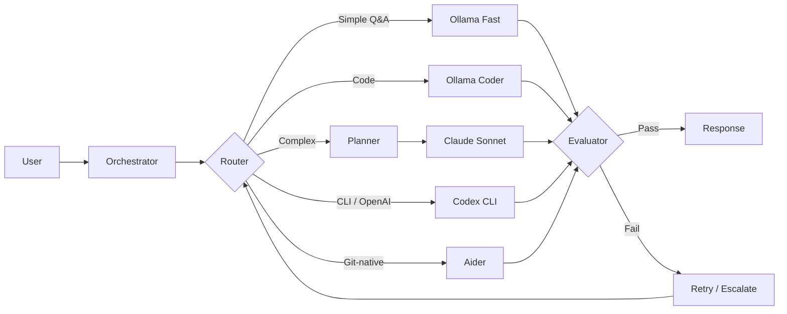

# Mahoraga — Agent-Agnostic Upgrade Implementation Plan

> **For agentic workers:** REQUIRED SUB-SKILL: Use superpowers:subagent-driven-development (recommended) or superpowers:executing-plans to implement this plan task-by-task. Steps use checkbox (`- [ ]`) syntax for tracking.

**Goal:** Fix the broken demo (Phase 1) then build the AgentAdapter abstraction layer that unifies Ollama, Claude, Codex CLI, and Aider through a single interface (Phase 2).

**Architecture:** Phase 1 patches the response assembler in `gateway.py` and ships a complete README. Phase 2 creates `backend/orchestrator/adapters/` as a new package — `AgentAdapter` ABC for routing/health/cost, `AdapterRegistry` for capability-based selection, four concrete adapters, two new subprocess-based `WorkerAdapter` implementations (Codex, Aider), and a frontend agent-status panel.

**Tech Stack:** Python 3.12, FastAPI, aiosqlite, anthropic SDK, httpx, asyncio subprocess, vanilla JS

---

## File Map

### Phase 1 — Modify
| File | Change |
|------|--------|
| `backend/orchestrator/gateway.py` | Fix response assembler: `attempt.output or attempt.summary` |
| `.env.example` | Add `OLLAMA_BASE_URL` |
| `README.md` | Full overhaul |

### Phase 2 — Create
| File | Purpose |
|------|---------|
| `backend/orchestrator/adapters/__init__.py` | Package init |
| `backend/orchestrator/adapters/base.py` | `AgentAdapter` ABC, `CostEstimate`, `AgentStatus`, `AgentCapability` |
| `backend/orchestrator/adapters/registry.py` | `AdapterRegistry` with capability-based routing |
| `backend/orchestrator/adapters/ollama_adapter.py` | `OllamaAdapter` wrapping `OllamaWorker` |
| `backend/orchestrator/adapters/claude_adapter.py` | `ClaudeAdapter` wrapping `ClaudeWorker` |
| `backend/orchestrator/adapters/codex_adapter.py` | `CodexAdapter` (AgentAdapter pointing to CodexWorker) |
| `backend/orchestrator/adapters/aider_adapter.py` | `AiderAdapter` (AgentAdapter pointing to AiderWorker) |
| `backend/orchestrator/workers/codex.py` | `CodexWorker` — subprocess WorkerAdapter |
| `backend/orchestrator/workers/aider.py` | `AiderWorker` — subprocess WorkerAdapter |
| `tests/orchestrator_v2/test_adapters.py` | Tests for all adapters and registry |

### Phase 2 — Modify
| File | Change |
|------|---------|
| `backend/orchestrator/service/app.py` | Init `AdapterRegistry`, register 4 adapters, add `GET /api/agents/status` |
| `backend/orchestrator/gateway.py` | Use `AdapterRegistry` for capability-based routing |
| `static/sidebar.js` | Add agent status panel |
| `static/style.css` | Style agent status indicators |

---

## Phase 1: Critical Fixes + README

---

### Task 1: Fix Response Assembler

**Files:**
- Modify: `backend/orchestrator/gateway.py:153-161`
- Test: `tests/orchestrator_v2/test_gateway.py`

The assembler at line 158-161 reads `completed[-1].output`. If the `output` column was empty for historical reasons (migration added it after-the-fact with `DEFAULT ''`), the `if output:` guard silently swallows the result. The `summary` field holds the same text and is always populated. Fix: fall back to `summary`.

- [ ] **Step 1: Write the failing test**

Add to `tests/orchestrator_v2/test_gateway.py`. Find the existing test for gateway message handling (likely `test_handle_message` or similar), then add:

```python
@pytest.mark.asyncio
async def test_response_assembler_uses_summary_fallback(mock_store, mock_registry, mock_verifier):
    """Gateway must yield worker output even when attempt.output is empty (legacy DB rows)."""
    from backend.orchestrator.domain.models import TaskAttempt, AttemptStatus
    import time

    # Simulate a completed attempt where output is empty but summary has content
    attempt = TaskAttempt(
        id="a1", task_id="t1", worker_id="ollama:fast",
        status=AttemptStatus.completed,
        error_code="", blocking_reason="",
        started_at=time.time(), ended_at=time.time(),
        summary="4",   # summary has the value
        output="",     # output is empty (legacy DB state)
        artifact_refs=[], validator_refs=[],
    )
    mock_store.tasks.list_attempts.return_value = [attempt]

    gateway = Gateway(store=mock_store, registry=mock_registry, verifier=mock_verifier)
    chunks = []
    async for chunk in gateway.handle_message(ChannelMessage.new("u1", "web", "whats 2+2")):
        chunks.append(chunk)

    assert "4" in chunks, f"Expected '4' in output chunks, got: {chunks}"
```

- [ ] **Step 2: Run test to verify it fails**

```bash
cd ~/Projects/Mahoraga
python -m pytest tests/orchestrator_v2/test_gateway.py::test_response_assembler_uses_summary_fallback -v
```

Expected: FAIL — `AssertionError: Expected '4' in output chunks`

- [ ] **Step 3: Apply the fix in gateway.py**

Open `backend/orchestrator/gateway.py`. Find lines 157-161 (the completed-attempt block):

```python
            if completed:
                output = completed[-1].output
                if output:
                    response_chunks.append(output)
                    yield output
```

Replace with:

```python
            if completed:
                attempt = completed[-1]
                output = attempt.output or attempt.summary
                if output:
                    response_chunks.append(output)
                    yield output
```

- [ ] **Step 4: Run test to verify it passes**

```bash
python -m pytest tests/orchestrator_v2/test_gateway.py::test_response_assembler_uses_summary_fallback -v
```

Expected: PASS

- [ ] **Step 5: Run full test suite to check for regressions**

```bash
python -m pytest tests/ -x -q
```

Expected: all passing (or same failures as before this change)

- [ ] **Step 6: Manual smoke test**

```bash
python -m backend.orchestrator.service.app
```

Open `http://localhost:8000`. Send "whats 2+2" — verify chat shows "4", not a task description. Send "write a function for mean, median, mode" — verify chat shows Python code.

- [ ] **Step 7: Commit**

```bash
cd ~/Projects/Mahoraga
git add backend/orchestrator/gateway.py tests/orchestrator_v2/test_gateway.py
git commit -m "fix: response assembler falls back to attempt.summary when output is empty"
```

---

### Task 2: Update .env.example

**Files:**
- Modify: `.env.example`

- [ ] **Step 1: Update .env.example**

Current content:
```
ANTHROPIC_API_KEY=
TELEGRAM_BOT_TOKEN=
BRAVE_API_KEY=
```

Replace the entire file with:

```
# ── Required for Ollama backend (default) ────────────────────────────────────
# Ollama must be running: https://ollama.ai
# Pull the model: ollama pull qwen3:4b
OLLAMA_BASE_URL=http://localhost:11434

# ── Optional: Claude backend ──────────────────────────────────────────────────
# Add your Anthropic API key to enable the Claude backend toggle in the UI
ANTHROPIC_API_KEY=

# ── Optional: Telegram channel ────────────────────────────────────────────────
TELEGRAM_BOT_TOKEN=

# ── Optional: Web search tool ─────────────────────────────────────────────────
BRAVE_API_KEY=
```

- [ ] **Step 2: Commit**

```bash
git add .env.example
git commit -m "docs: add OLLAMA_BASE_URL to .env.example with setup comments"
```

---

### Task 3: README Overhaul

**Files:**
- Modify: `README.md`

- [ ] **Step 1: Write new README.md**

Replace the entire file content:

```markdown
# Mahoraga

> Agent-agnostic LLM orchestration framework. Unifies any AI coding agent — local or cloud — into an intelligent workflow with quality evaluation, cost-aware routing, and real-time visual feedback.

*Named after the adaptive deity from Buddhist mythology — Mahoraga analyzes, adapts, and overcomes.*

<!-- Demo GIF: record after fixes are done and replace this comment -->

## What It Does

Mahoraga is not an agent. It orchestrates agents.

When you give Mahoraga a task, it:
1. Classifies complexity (simple → complex)
2. Routes to the best available agent based on capability and cost
3. Streams the response in real time
4. Evaluates output quality
5. Retries or escalates to a more capable agent on failure

Any agent plugs in through the `AgentAdapter` interface: local models (Ollama), cloud APIs (Claude), CLI tools (Codex CLI, Aider), or autonomous platforms.

## Architecture



## Supported Agents

| Agent | Type | Cost | Status |
|-------|------|------|--------|
| Ollama (Qwen3 4B) | Local inference | Free | ✅ Active |
| Claude (Haiku/Sonnet/Opus) | Cloud API | Per-token | ✅ Active |
| Codex CLI | CLI (OpenAI) | Free tier / ChatGPT Plus | 🔧 Planned |
| Aider | CLI (model-agnostic) | Free + LLM cost | 🔧 Planned |

## Benchmarks

Tested on MacBook Pro M-series (16 GB), Ollama backend:

| Model | Easy Task | Medium Task | Hard Task |
|-------|-----------|-------------|-----------|
| Qwen2.5 7B Q4 (baseline) | 14.3 t/s · 23s | 12.0 t/s · 39s | 13.0 t/s · 40s |
| **Qwen3 4B Q4 (current)** | **23.6 t/s · 12s** | **21.8 t/s · 36s** | **18.8 t/s · 48s** |
| Qwen3 8B Q4 | 12.7 t/s · 27s | 12.1 t/s · 58s | — |

## Quick Start

### Prerequisites

- Python 3.10+
- [Ollama](https://ollama.ai) installed and running
- Model pulled: `ollama pull qwen3:4b`

### Setup

```bash
git clone https://github.com/pockanoodles/Mahoraga.git
cd Mahoraga
cp .env.example .env
pip install -r requirements.txt
python -m backend.orchestrator.service.app
```

Open [http://localhost:8000](http://localhost:8000).

### Optional: Claude Backend

Add your Anthropic API key to `.env`:

```
ANTHROPIC_API_KEY=sk-ant-...
```

Toggle between Ollama and Claude from the UI header chip.

## Adapter Interface

New agents plug in by implementing `AgentAdapter`:

```python
from backend.orchestrator.adapters.base import AgentAdapter, AgentCapability, CostEstimate, AgentStatus

class MyAdapter(AgentAdapter):
    @property
    def name(self) -> str:
        return "my-agent"

    @property
    def worker_id(self) -> str:
        return "my-agent:default"   # matches a WorkerRegistry entry

    @property
    def capabilities(self) -> list[AgentCapability]:
        return [AgentCapability("code", confidence=0.9)]

    def estimate_cost(self, task) -> CostEstimate:
        return CostEstimate(estimated_cost_usd=0.0, model="local")

    async def health_check(self) -> AgentStatus:
        return AgentStatus(name=self.name, available=True)
```

See `backend/orchestrator/adapters/` for full implementations.

## Roadmap

- [x] Ollama local inference with quality scoring
- [x] Claude API escalation chain
- [x] Real-time web UI with worktree visualization
- [x] Cost tracking per agent
- [x] Response assembler bug fixed
- [ ] `AgentAdapter` interface (in progress)
- [ ] Codex CLI adapter
- [ ] Aider adapter
- [ ] Capability-based routing
- [ ] MCP server
- [ ] Native macOS dashboard ([Noctis](https://github.com/pockanoodles/Noctis))

## License

MIT
```

- [ ] **Step 2: Commit**

```bash
git add README.md
git commit -m "docs: overhaul README with architecture diagram, benchmarks, adapter interface"
```

---

### Task 4: Wire Reset Button in Sidebar

**Files:**
- Modify: `static/sidebar.js`

The backend endpoint `POST /runs/reset` already exists (app.py:337). Check if the sidebar has a reset button; if not, add one.

- [ ] **Step 1: Check if reset button exists**

```bash
grep -n "reset" ~/Projects/Mahoraga/static/sidebar.js
```

If a reset button and its handler are already present, skip to Step 3.

- [ ] **Step 2: Add reset button to sidebar**

Find the WORKFLOW section header in `static/sidebar.js`. After the section header render, add a reset button. Locate the section where the workflow header is built (search for `WORKFLOW` in sidebar.js) and add after it:

```javascript
// After the workflow header element is created, add a reset button:
const resetBtn = document.createElement('button');
resetBtn.id = 'workflow-reset-btn';
resetBtn.textContent = 'Reset';
resetBtn.title = 'Cancel all active runs and clear stale tasks';
resetBtn.addEventListener('click', async () => {
  resetBtn.disabled = true;
  resetBtn.textContent = '…';
  try {
    await fetch('/runs/reset', { method: 'POST' });
    // Refresh sidebar state
    if (window.sidebarRefresh) window.sidebarRefresh();
  } catch (_) {}
  resetBtn.disabled = false;
  resetBtn.textContent = 'Reset';
});
// Append to sidebar header or workflow section container
workflowHeader.appendChild(resetBtn);
```

- [ ] **Step 3: Add CSS for reset button**

In `static/style.css`, add:

```css
#workflow-reset-btn {
  font-size: 10px;
  padding: 2px 8px;
  border: 1px solid #555;
  border-radius: 3px;
  background: transparent;
  color: #888;
  cursor: pointer;
  margin-left: auto;
}
#workflow-reset-btn:hover {
  color: #ccc;
  border-color: #888;
}
```

- [ ] **Step 4: Commit**

```bash
git add static/sidebar.js static/style.css
git commit -m "feat: add reset button to sidebar wired to POST /runs/reset"
```

---

## Phase 2: Agent-Agnostic Adapter Layer

---

### Task 5: AgentAdapter ABC and Supporting Types

**Files:**
- Create: `backend/orchestrator/adapters/__init__.py`
- Create: `backend/orchestrator/adapters/base.py`
- Test: `tests/orchestrator_v2/test_adapters.py`

- [ ] **Step 1: Create package init**

Create `backend/orchestrator/adapters/__init__.py` with empty content:

```python
```

- [ ] **Step 2: Write the failing test**

Create `tests/orchestrator_v2/test_adapters.py`:

```python
"""Tests for AgentAdapter interface and AdapterRegistry."""
from __future__ import annotations
import pytest
from unittest.mock import AsyncMock
from backend.orchestrator.adapters.base import (
    AgentAdapter, AgentCapability, CostEstimate, AgentStatus,
)
from backend.orchestrator.domain.models import Task


class _ConcreteAdapter(AgentAdapter):
    """Minimal concrete implementation for testing the ABC contract."""

    @property
    def name(self) -> str:
        return "test-adapter"

    @property
    def worker_id(self) -> str:
        return "test:worker"

    @property
    def capabilities(self) -> list[AgentCapability]:
        return [AgentCapability("code", confidence=0.9), AgentCapability("general", confidence=0.7)]

    def estimate_cost(self, task: Task) -> CostEstimate:
        return CostEstimate(estimated_tokens=100, estimated_cost_usd=0.001, model="test")

    async def health_check(self) -> AgentStatus:
        return AgentStatus(name=self.name, available=True, latency_ms=10.0)


def test_agent_adapter_instantiation():
    adapter = _ConcreteAdapter()
    assert adapter.name == "test-adapter"
    assert adapter.worker_id == "test:worker"
    assert len(adapter.capabilities) == 2


def test_capability_confidence_range():
    cap = AgentCapability("code", confidence=0.9)
    assert cap.name == "code"
    assert 0.0 <= cap.confidence <= 1.0


def test_cost_estimate_defaults():
    est = CostEstimate()
    assert est.estimated_cost_usd == 0.0
    assert est.estimated_tokens == 0


@pytest.mark.asyncio
async def test_health_check_returns_agent_status():
    adapter = _ConcreteAdapter()
    status = await adapter.health_check()
    assert isinstance(status, AgentStatus)
    assert status.available is True
    assert status.name == "test-adapter"


def test_estimate_cost_receives_task():
    adapter = _ConcreteAdapter()
    task = Task.new(run_id="r1", title="Test", goal="write hello world")
    est = adapter.estimate_cost(task)
    assert isinstance(est, CostEstimate)
```

- [ ] **Step 3: Run test to verify it fails**

```bash
python -m pytest tests/orchestrator_v2/test_adapters.py -v
```

Expected: FAIL — `ModuleNotFoundError: No module named 'backend.orchestrator.adapters'`

- [ ] **Step 4: Implement adapters/base.py**

Create `backend/orchestrator/adapters/base.py`:

```python
"""AgentAdapter — the unified interface for all agents in Mahoraga.

Every agent (Ollama, Claude, Codex CLI, Aider, or any future agent) implements
this interface to plug into the orchestration layer. The interface covers:
- Identity (name, worker_id)
- Capability declaration (what the agent is good at)
- Cost estimation (for routing decisions)
- Health checking (availability before dispatch)

Note: Execution still goes through WorkerAdapter/executor.py for Phase 2.
The `worker_id` property maps this adapter to a WorkerRegistry entry.
"""
from __future__ import annotations
from abc import ABC, abstractmethod
from dataclasses import dataclass, field
from typing import TYPE_CHECKING

if TYPE_CHECKING:
    from ..domain.models import Task


@dataclass
class AgentCapability:
    """A capability this agent has, and how confident it is."""
    name: str                   # "code", "refactor", "explain", "test", "plan", "general"
    confidence: float = 1.0     # 0.0–1.0, higher = better at this capability


@dataclass
class CostEstimate:
    """Estimated cost for executing a task through this adapter."""
    estimated_tokens: int = 0
    estimated_cost_usd: float = 0.0
    model: str = ""
    notes: str = ""


@dataclass
class AgentStatus:
    """Current health and availability of an agent."""
    name: str
    available: bool
    detail: str = ""
    latency_ms: float | None = None
    rate_limited: bool = False
    error: str | None = None


class AgentAdapter(ABC):
    """
    Base class for all agent adapters.

    Implement this to add a new agent to Mahoraga. The router uses
    `capabilities` and `estimate_cost` to select the best agent.
    `health_check` is called at startup and periodically to verify availability.

    The `worker_id` property maps this adapter to a `WorkerAdapter` entry in
    `WorkerRegistry` — the executor uses that entry for actual task execution.
    """

    @property
    @abstractmethod
    def name(self) -> str:
        """Short human-readable name: 'ollama', 'claude', 'codex-cli', 'aider'."""
        ...

    @property
    @abstractmethod
    def worker_id(self) -> str:
        """The WorkerRegistry key to use when this adapter is selected for routing.

        Example: 'ollama:coder', 'claude:sonnet', 'codex:cli', 'aider:default'
        """
        ...

    @property
    @abstractmethod
    def capabilities(self) -> list[AgentCapability]:
        """Declare what this agent can do and how well."""
        ...

    @abstractmethod
    def estimate_cost(self, task: "Task") -> CostEstimate:
        """Estimate cost before execution. Used by router to compare agents.

        For free agents (Ollama, Aider+Ollama): return CostEstimate(estimated_cost_usd=0.0).
        For API agents: estimate from task length and model pricing.
        """
        ...

    @abstractmethod
    async def health_check(self) -> AgentStatus:
        """Check if the agent is available and ready to accept tasks.

        Called at startup and by /api/agents/status.
        Must not raise — return AgentStatus(available=False, error=str(exc)) on failure.
        """
        ...
```

- [ ] **Step 5: Run tests to verify they pass**

```bash
python -m pytest tests/orchestrator_v2/test_adapters.py -v
```

Expected: all 5 tests PASS

- [ ] **Step 6: Commit**

```bash
git add backend/orchestrator/adapters/ tests/orchestrator_v2/test_adapters.py
git commit -m "feat: add AgentAdapter ABC with CostEstimate, AgentCapability, AgentStatus"
```

---

### Task 6: AdapterRegistry

**Files:**
- Create: `backend/orchestrator/adapters/registry.py`
- Test: `tests/orchestrator_v2/test_adapters.py` (extend)

- [ ] **Step 1: Write failing tests — add to test_adapters.py**

Append to `tests/orchestrator_v2/test_adapters.py`:

```python
from backend.orchestrator.adapters.registry import AdapterRegistry


def _make_adapter(name: str, worker_id: str, capabilities: list[AgentCapability], cost: float = 0.0) -> AgentAdapter:
    class _A(AgentAdapter):
        @property
        def name(self): return name
        @property
        def worker_id(self): return worker_id
        @property
        def capabilities(self): return capabilities
        def estimate_cost(self, task): return CostEstimate(estimated_cost_usd=cost)
        async def health_check(self): return AgentStatus(name=name, available=True)
    return _A()


def test_registry_register_and_get():
    reg = AdapterRegistry()
    adapter = _make_adapter("ollama", "ollama:fast", [AgentCapability("general")])
    reg.register(adapter)
    assert reg.get("ollama") is adapter


def test_registry_all():
    reg = AdapterRegistry()
    reg.register(_make_adapter("a", "a:1", []))
    reg.register(_make_adapter("b", "b:1", []))
    assert len(reg.all()) == 2


def test_find_capable_returns_sorted_by_confidence():
    reg = AdapterRegistry()
    reg.register(_make_adapter("fast",  "f:1", [AgentCapability("code", confidence=0.7)]))
    reg.register(_make_adapter("smart", "s:1", [AgentCapability("code", confidence=0.95)]))
    results = reg.find_capable("code")
    assert results[0][0].name == "smart"   # higher confidence first
    assert results[1][0].name == "fast"


@pytest.mark.asyncio
async def test_route_picks_highest_scoring_available():
    reg = AdapterRegistry()
    reg.register(_make_adapter("cheap",     "c:1", [AgentCapability("code", 0.7)], cost=0.0))
    reg.register(_make_adapter("expensive", "e:1", [AgentCapability("code", 0.9)], cost=0.05))
    task = Task.new(run_id="r1", title="test", goal="write a hello world function")
    # cheap has lower capability confidence but also lower cost — routing should resolve
    result = await reg.route(task, required_capability="code")
    assert result is not None


@pytest.mark.asyncio
async def test_route_skips_unavailable_adapters():
    class _Unavailable(AgentAdapter):
        @property
        def name(self): return "down"
        @property
        def worker_id(self): return "down:1"
        @property
        def capabilities(self): return [AgentCapability("code", 1.0)]
        def estimate_cost(self, task): return CostEstimate()
        async def health_check(self): return AgentStatus(name="down", available=False, error="not running")

    reg = AdapterRegistry()
    reg.register(_Unavailable())
    task = Task.new(run_id="r1", title="test", goal="write code")
    result = await reg.route(task, required_capability="code")
    assert result is None
```

- [ ] **Step 2: Run tests to verify they fail**

```bash
python -m pytest tests/orchestrator_v2/test_adapters.py -k "registry" -v
```

Expected: FAIL — `ModuleNotFoundError` for registry

- [ ] **Step 3: Implement registry.py**

Create `backend/orchestrator/adapters/registry.py`:

```python
"""AdapterRegistry — central registry of all available agent adapters.

The router queries this registry to select the best adapter for a task.
"""
from __future__ import annotations
import logging
from typing import TYPE_CHECKING

from .base import AgentAdapter, AgentCapability, AgentStatus

if TYPE_CHECKING:
    from ..domain.models import Task

logger = logging.getLogger(__name__)


class AdapterRegistry:
    def __init__(self) -> None:
        self._adapters: dict[str, AgentAdapter] = {}

    def register(self, adapter: AgentAdapter) -> None:
        self._adapters[adapter.name] = adapter
        logger.info("adapter registered: %s → worker_id=%s", adapter.name, adapter.worker_id)

    def get(self, name: str) -> AgentAdapter | None:
        return self._adapters.get(name)

    def all(self) -> list[AgentAdapter]:
        return list(self._adapters.values())

    def find_capable(self, capability: str) -> list[tuple[AgentAdapter, float]]:
        """Return adapters that declare this capability, sorted by confidence descending."""
        matches = []
        for adapter in self._adapters.values():
            for cap in adapter.capabilities:
                if cap.name == capability:
                    matches.append((adapter, cap.confidence))
                    break
        return sorted(matches, key=lambda x: x[1], reverse=True)

    async def route(self, task: "Task", required_capability: str) -> AgentAdapter | None:
        """Select the best available adapter for a task.

        Scoring: capability_confidence × (1 / (1 + cost_usd))
        Returns None if no capable, healthy adapter exists.
        """
        candidates = self.find_capable(required_capability)
        if not candidates:
            return None

        scored: list[tuple[AgentAdapter, float]] = []
        for adapter, confidence in candidates:
            try:
                status = await adapter.health_check()
            except Exception as exc:
                logger.warning("health_check failed for %s: %s", adapter.name, exc)
                continue
            if not status.available:
                continue
            cost = adapter.estimate_cost(task).estimated_cost_usd
            score = confidence * (1.0 / (1.0 + cost))
            scored.append((adapter, score))

        if not scored:
            return None

        scored.sort(key=lambda x: x[1], reverse=True)
        best = scored[0][0]
        logger.info("adapter routed: %s (capability=%s)", best.name, required_capability)
        return best

    async def all_statuses(self) -> list[dict]:
        """Return health status for all registered adapters. Used by /api/agents/status."""
        results = []
        for adapter in self._adapters.values():
            try:
                status = await adapter.health_check()
            except Exception as exc:
                status = AgentStatus(name=adapter.name, available=False, error=str(exc))
            results.append({
                "name": adapter.name,
                "worker_id": adapter.worker_id,
                "available": status.available,
                "detail": status.detail,
                "latency_ms": status.latency_ms,
                "rate_limited": status.rate_limited,
                "error": status.error,
                "capabilities": [
                    {"name": c.name, "confidence": c.confidence}
                    for c in adapter.capabilities
                ],
            })
        return results
```

- [ ] **Step 4: Run tests to verify they pass**

```bash
python -m pytest tests/orchestrator_v2/test_adapters.py -v
```

Expected: all tests PASS

- [ ] **Step 5: Commit**

```bash
git add backend/orchestrator/adapters/registry.py tests/orchestrator_v2/test_adapters.py
git commit -m "feat: add AdapterRegistry with capability-based routing and all_statuses"
```

---

### Task 7: OllamaAdapter

**Files:**
- Create: `backend/orchestrator/adapters/ollama_adapter.py`
- Test: `tests/orchestrator_v2/test_adapters.py` (extend)

- [ ] **Step 1: Write failing test — append to test_adapters.py**

```python
@pytest.mark.asyncio
async def test_ollama_adapter_health_check_when_ollama_down():
    """OllamaAdapter must return available=False (not raise) when Ollama is unreachable."""
    from backend.orchestrator.adapters.ollama_adapter import OllamaAdapter
    adapter = OllamaAdapter(
        model="qwen3:4b-q4_K_M",
        ollama_base_url="http://localhost:19999",  # nothing running here
    )
    status = await adapter.health_check()
    assert status.available is False
    assert status.error is not None


def test_ollama_adapter_cost_is_zero():
    from backend.orchestrator.adapters.ollama_adapter import OllamaAdapter
    adapter = OllamaAdapter(model="qwen3:4b-q4_K_M")
    task = Task.new(run_id="r1", title="t", goal="write code")
    est = adapter.estimate_cost(task)
    assert est.estimated_cost_usd == 0.0


def test_ollama_adapter_declares_capabilities():
    from backend.orchestrator.adapters.ollama_adapter import OllamaAdapter
    adapter = OllamaAdapter(model="qwen3:4b-q4_K_M")
    cap_names = {c.name for c in adapter.capabilities}
    assert "code" in cap_names
    assert "general" in cap_names
```

- [ ] **Step 2: Run test to verify it fails**

```bash
python -m pytest tests/orchestrator_v2/test_adapters.py -k "ollama_adapter" -v
```

Expected: FAIL — `ModuleNotFoundError`

- [ ] **Step 3: Implement ollama_adapter.py**

Create `backend/orchestrator/adapters/ollama_adapter.py`:

```python
"""OllamaAdapter — wraps OllamaWorker for the AgentAdapter routing interface."""
from __future__ import annotations
import logging
from typing import TYPE_CHECKING

import httpx

from .base import AgentAdapter, AgentCapability, AgentStatus, CostEstimate

if TYPE_CHECKING:
    from ..domain.models import Task

logger = logging.getLogger(__name__)

_DEFAULT_CAPABILITIES = [
    AgentCapability("code",    confidence=0.80),
    AgentCapability("general", confidence=0.85),
    AgentCapability("plan",    confidence=0.70),
    AgentCapability("explain", confidence=0.75),
]


class OllamaAdapter(AgentAdapter):
    """Routes tasks to the OllamaWorker pool (ollama:coder / ollama:fast / ollama:general)."""

    def __init__(
        self,
        model: str = "qwen3:4b-q4_K_M",
        ollama_base_url: str = "http://localhost:11434",
    ) -> None:
        self._model = model
        self._base_url = ollama_base_url.rstrip("/")

    @property
    def name(self) -> str:
        return "ollama"

    @property
    def worker_id(self) -> str:
        # Default worker; the gateway's TaskRouter selects the specific sub-worker
        # (ollama:fast / ollama:coder / ollama:general) based on task content.
        return "ollama:general"

    @property
    def capabilities(self) -> list[AgentCapability]:
        return _DEFAULT_CAPABILITIES

    def estimate_cost(self, task: "Task") -> CostEstimate:
        return CostEstimate(
            estimated_cost_usd=0.0,
            model=self._model,
            notes="Local inference — free",
        )

    async def health_check(self) -> AgentStatus:
        try:
            async with httpx.AsyncClient(timeout=5.0) as client:
                response = await client.get(f"{self._base_url}/api/tags")
            if response.status_code != 200:
                return AgentStatus(
                    name=self.name, available=False,
                    detail="Ollama /api/tags returned non-200",
                )
            model_names = [m["name"] for m in response.json().get("models", [])]
            model_base = self._model.split(":")[0]
            if not any(m.startswith(model_base) for m in model_names):
                return AgentStatus(
                    name=self.name, available=False,
                    detail=f"Model {self._model!r} not pulled. Run: ollama pull {self._model}",
                )
            return AgentStatus(name=self.name, available=True, detail=f"model={self._model}")
        except (httpx.ConnectError, httpx.TimeoutException) as exc:
            return AgentStatus(
                name=self.name, available=False,
                error=f"Ollama unreachable at {self._base_url}: {exc}",
            )
        except Exception as exc:
            return AgentStatus(name=self.name, available=False, error=str(exc))
```

- [ ] **Step 4: Run tests to verify they pass**

```bash
python -m pytest tests/orchestrator_v2/test_adapters.py -k "ollama_adapter" -v
```

Expected: all 3 PASS

- [ ] **Step 5: Commit**

```bash
git add backend/orchestrator/adapters/ollama_adapter.py tests/orchestrator_v2/test_adapters.py
git commit -m "feat: add OllamaAdapter wrapping OllamaWorker with health check + zero cost"
```

---

### Task 8: ClaudeAdapter

**Files:**
- Create: `backend/orchestrator/adapters/claude_adapter.py`
- Test: `tests/orchestrator_v2/test_adapters.py` (extend)

- [ ] **Step 1: Write failing tests — append to test_adapters.py**

```python
def test_claude_adapter_cost_estimate_scales_with_task_length():
    from backend.orchestrator.adapters.claude_adapter import ClaudeAdapter
    adapter = ClaudeAdapter(api_key="sk-test", model="claude-haiku-4-5-20251001")
    short_task = Task.new(run_id="r1", title="t", goal="hi")
    long_task  = Task.new(run_id="r1", title="t", goal="x " * 500)
    short_est = adapter.estimate_cost(short_task)
    long_est  = adapter.estimate_cost(long_task)
    assert long_est.estimated_cost_usd > short_est.estimated_cost_usd


def test_claude_adapter_declares_high_confidence_capabilities():
    from backend.orchestrator.adapters.claude_adapter import ClaudeAdapter
    adapter = ClaudeAdapter(api_key="sk-test")
    caps = {c.name: c.confidence for c in adapter.capabilities}
    assert caps.get("code", 0) >= 0.9
    assert caps.get("general", 0) >= 0.9


@pytest.mark.asyncio
async def test_claude_adapter_health_check_no_key():
    from backend.orchestrator.adapters.claude_adapter import ClaudeAdapter
    adapter = ClaudeAdapter(api_key=None)
    status = await adapter.health_check()
    assert status.available is False
    assert "ANTHROPIC_API_KEY" in (status.detail or status.error or "")
```

- [ ] **Step 2: Run tests to verify they fail**

```bash
python -m pytest tests/orchestrator_v2/test_adapters.py -k "claude_adapter" -v
```

Expected: FAIL

- [ ] **Step 3: Implement claude_adapter.py**

Create `backend/orchestrator/adapters/claude_adapter.py`:

```python
"""ClaudeAdapter — wraps ClaudeWorker for the AgentAdapter routing interface."""
from __future__ import annotations
import logging
from typing import TYPE_CHECKING

from .base import AgentAdapter, AgentCapability, AgentStatus, CostEstimate

if TYPE_CHECKING:
    from ..domain.models import Task

logger = logging.getLogger(__name__)

# Haiku input/output pricing per million tokens (USD) — update as pricing changes
_HAIKU_INPUT_PER_M  = 0.80
_HAIKU_OUTPUT_PER_M = 4.00
_SONNET_INPUT_PER_M = 3.00
_SONNET_OUTPUT_PER_M = 15.00

_CAPABILITIES = [
    AgentCapability("code",    confidence=0.95),
    AgentCapability("general", confidence=0.95),
    AgentCapability("plan",    confidence=0.95),
    AgentCapability("explain", confidence=0.95),
    AgentCapability("refactor",confidence=0.90),
    AgentCapability("test",    confidence=0.90),
]


class ClaudeAdapter(AgentAdapter):
    """Routes tasks to ClaudeWorker (Haiku/Sonnet/Opus depending on config)."""

    def __init__(
        self,
        api_key: str | None = None,
        model: str = "claude-sonnet-4-6",
        worker_id: str = "claude:sonnet",
    ) -> None:
        self._api_key = api_key
        self._model = model
        self._worker_id = worker_id

    @property
    def name(self) -> str:
        return "claude"

    @property
    def worker_id(self) -> str:
        return self._worker_id

    @property
    def capabilities(self) -> list[AgentCapability]:
        return _CAPABILITIES

    def estimate_cost(self, task: "Task") -> CostEstimate:
        # Rough estimate: ~4 chars per token, output ~= 2× input
        text = f"{task.title} {task.goal}"
        input_tokens  = max(100, len(text) // 4)
        output_tokens = input_tokens * 2

        is_haiku = "haiku" in self._model.lower()
        input_per_m  = _HAIKU_INPUT_PER_M  if is_haiku else _SONNET_INPUT_PER_M
        output_per_m = _HAIKU_OUTPUT_PER_M if is_haiku else _SONNET_OUTPUT_PER_M

        cost = (input_tokens * input_per_m + output_tokens * output_per_m) / 1_000_000
        return CostEstimate(
            estimated_tokens=input_tokens + output_tokens,
            estimated_cost_usd=round(cost, 6),
            model=self._model,
        )

    async def health_check(self) -> AgentStatus:
        if not self._api_key:
            return AgentStatus(
                name=self.name, available=False,
                detail="ANTHROPIC_API_KEY not set — Claude backend disabled",
            )
        # Key is present — assume available (lightweight; avoid burning API credits on health checks)
        return AgentStatus(
            name=self.name, available=True,
            detail=f"model={self._model}",
        )
```

- [ ] **Step 4: Run tests to verify they pass**

```bash
python -m pytest tests/orchestrator_v2/test_adapters.py -k "claude_adapter" -v
```

Expected: all 3 PASS

- [ ] **Step 5: Commit**

```bash
git add backend/orchestrator/adapters/claude_adapter.py tests/orchestrator_v2/test_adapters.py
git commit -m "feat: add ClaudeAdapter with token-based cost estimation and key-presence health check"
```

---

### Task 9: CodexWorker + CodexAdapter

**Files:**
- Create: `backend/orchestrator/workers/codex.py`
- Create: `backend/orchestrator/adapters/codex_adapter.py`
- Test: `tests/orchestrator_v2/test_adapters.py` (extend)

- [ ] **Step 1: Write failing tests — append to test_adapters.py**

```python
@pytest.mark.asyncio
async def test_codex_adapter_health_check_not_installed():
    """CodexAdapter returns available=False when `codex` binary is missing."""
    from backend.orchestrator.adapters.codex_adapter import CodexAdapter
    adapter = CodexAdapter(binary_path="/nonexistent/codex")
    status = await adapter.health_check()
    assert status.available is False


def test_codex_adapter_worker_id():
    from backend.orchestrator.adapters.codex_adapter import CodexAdapter
    adapter = CodexAdapter()
    assert adapter.worker_id == "codex:cli"


def test_codex_adapter_low_cost():
    from backend.orchestrator.adapters.codex_adapter import CodexAdapter
    adapter = CodexAdapter()
    task = Task.new(run_id="r1", title="t", goal="write a sort function")
    est = adapter.estimate_cost(task)
    assert est.estimated_cost_usd <= 0.01
```

- [ ] **Step 2: Run tests to verify they fail**

```bash
python -m pytest tests/orchestrator_v2/test_adapters.py -k "codex" -v
```

Expected: FAIL

- [ ] **Step 3: Implement workers/codex.py**

Create `backend/orchestrator/workers/codex.py`:

```python
"""CodexWorker — subprocess-based WorkerAdapter for OpenAI Codex CLI.

Requirements: npm install -g @openai/codex (or ChatGPT Plus auth).
Spawns `codex` as a subprocess, streams stdout as token events.
"""
from __future__ import annotations
import asyncio
import logging
import shutil
from typing import AsyncGenerator

from .base import WorkerAdapter, WorkerEvent, WorkerHealth
from ..domain.models import Task, TaskAttempt

logger = logging.getLogger(__name__)

_DEFAULT_TIMEOUT = 180  # seconds


class CodexWorker(WorkerAdapter):
    def __init__(
        self,
        worker_id: str = "codex:cli",
        binary_path: str = "codex",
        timeout: int = _DEFAULT_TIMEOUT,
    ) -> None:
        self._worker_id = worker_id
        self._binary = binary_path
        self._timeout = timeout

    @property
    def id(self) -> str:
        return self._worker_id

    @property
    def capabilities(self) -> list[str]:
        return ["code", "refactor", "test", "explain"]

    async def execute(
        self,
        attempt: TaskAttempt,
        task: Task,
        feedback: str | None = None,
    ) -> AsyncGenerator[WorkerEvent, None]:
        binary = shutil.which(self._binary) or self._binary
        prompt = f"{task.title}\n\n{task.goal}"
        if task.done_criteria:
            prompt += f"\n\nDone when: {task.done_criteria}"
        if feedback:
            prompt += f"\n\nPrevious attempt feedback: {feedback}"

        cmd = [binary, "--approval-mode", "full-auto", "--quiet", prompt]

        try:
            proc = await asyncio.create_subprocess_exec(
                *cmd,
                stdout=asyncio.subprocess.PIPE,
                stderr=asyncio.subprocess.PIPE,
            )
        except FileNotFoundError:
            yield WorkerEvent(
                type="attempt.failed",
                payload={"error_code": "binary_not_found", "error": f"codex binary not found at {self._binary!r}. Install: npm install -g @openai/codex"},
            )
            return

        collected: list[str] = []
        try:
            async with asyncio.timeout(self._timeout):
                assert proc.stdout is not None
                async for line in proc.stdout:
                    text = line.decode("utf-8", errors="replace")
                    collected.append(text)
                await proc.wait()
        except TimeoutError:
            proc.kill()
            yield WorkerEvent(
                type="attempt.failed",
                payload={"error_code": "timeout", "error": f"codex timed out after {self._timeout}s"},
            )
            return
        except Exception as exc:
            yield WorkerEvent(
                type="attempt.failed",
                payload={"error_code": "stream_error", "error": str(exc)},
            )
            return

        if proc.returncode != 0:
            stderr = b""
            if proc.stderr:
                stderr = await proc.stderr.read()
            yield WorkerEvent(
                type="attempt.failed",
                payload={
                    "error_code": "nonzero_exit",
                    "error": f"codex exited {proc.returncode}: {stderr.decode(errors='replace')[:200]}",
                },
            )
            return

        summary = "".join(collected).strip()
        if not summary:
            yield WorkerEvent(
                type="attempt.failed",
                payload={"error_code": "empty_response", "error": "codex produced no output"},
            )
            return

        yield WorkerEvent(type="attempt.completed", payload={"summary": summary})

    async def cancel(self, attempt_id: str) -> None:
        pass

    async def health(self) -> WorkerHealth:
        binary = shutil.which(self._binary)
        if not binary:
            return WorkerHealth(
                worker_id=self._worker_id,
                healthy=False,
                detail=f"codex not found in PATH. Install: npm install -g @openai/codex",
            )
        return WorkerHealth(worker_id=self._worker_id, healthy=True, detail=f"binary={binary}")
```

- [ ] **Step 4: Implement adapters/codex_adapter.py**

Create `backend/orchestrator/adapters/codex_adapter.py`:

```python
"""CodexAdapter — AgentAdapter interface for the Codex CLI worker."""
from __future__ import annotations
import shutil
import logging
from typing import TYPE_CHECKING

from .base import AgentAdapter, AgentCapability, AgentStatus, CostEstimate

if TYPE_CHECKING:
    from ..domain.models import Task

logger = logging.getLogger(__name__)

_CAPABILITIES = [
    AgentCapability("code",    confidence=0.90),
    AgentCapability("refactor",confidence=0.85),
    AgentCapability("test",    confidence=0.80),
    AgentCapability("explain", confidence=0.70),
]


class CodexAdapter(AgentAdapter):
    """Routes tasks to CodexWorker (subprocess-based OpenAI Codex CLI)."""

    def __init__(self, binary_path: str = "codex") -> None:
        self._binary = binary_path

    @property
    def name(self) -> str:
        return "codex-cli"

    @property
    def worker_id(self) -> str:
        return "codex:cli"

    @property
    def capabilities(self) -> list[AgentCapability]:
        return _CAPABILITIES

    def estimate_cost(self, task: "Task") -> CostEstimate:
        # Free tier (ChatGPT Plus auth) or minimal OpenAI API cost
        return CostEstimate(
            estimated_cost_usd=0.001,
            model="codex-cli",
            notes="Free tier with ChatGPT Plus; otherwise OpenAI API rates apply",
        )

    async def health_check(self) -> AgentStatus:
        binary = shutil.which(self._binary) or (self._binary if self._binary != "codex" else None)
        if not binary:
            return AgentStatus(
                name=self.name, available=False,
                detail="codex not found. Install: npm install -g @openai/codex",
            )
        return AgentStatus(name=self.name, available=True, detail=f"binary={binary}")
```

- [ ] **Step 5: Run tests to verify they pass**

```bash
python -m pytest tests/orchestrator_v2/test_adapters.py -k "codex" -v
```

Expected: all 3 PASS

- [ ] **Step 6: Commit**

```bash
git add backend/orchestrator/workers/codex.py backend/orchestrator/adapters/codex_adapter.py tests/orchestrator_v2/test_adapters.py
git commit -m "feat: add CodexWorker (subprocess) and CodexAdapter"
```

---

### Task 10: AiderWorker + AiderAdapter

**Files:**
- Create: `backend/orchestrator/workers/aider.py`
- Create: `backend/orchestrator/adapters/aider_adapter.py`
- Test: `tests/orchestrator_v2/test_adapters.py` (extend)

- [ ] **Step 1: Write failing tests — append to test_adapters.py**

```python
@pytest.mark.asyncio
async def test_aider_adapter_health_check_not_installed():
    from backend.orchestrator.adapters.aider_adapter import AiderAdapter
    adapter = AiderAdapter(binary_path="/nonexistent/aider")
    status = await adapter.health_check()
    assert status.available is False


def test_aider_adapter_worker_id():
    from backend.orchestrator.adapters.aider_adapter import AiderAdapter
    adapter = AiderAdapter()
    assert adapter.worker_id == "aider:default"


def test_aider_free_when_using_ollama():
    from backend.orchestrator.adapters.aider_adapter import AiderAdapter
    adapter = AiderAdapter(model="ollama_chat/qwen3:4b")
    task = Task.new(run_id="r1", title="t", goal="refactor this function")
    est = adapter.estimate_cost(task)
    assert est.estimated_cost_usd == 0.0
```

- [ ] **Step 2: Run tests to verify they fail**

```bash
python -m pytest tests/orchestrator_v2/test_adapters.py -k "aider" -v
```

Expected: FAIL

- [ ] **Step 3: Implement workers/aider.py**

Create `backend/orchestrator/workers/aider.py`:

```python
"""AiderWorker — subprocess-based WorkerAdapter for Aider CLI.

Requirements: pip install aider-install && aider-install
Spawns `aider` with --yes-always for non-interactive execution.
Can use Ollama for free local inference: model="ollama_chat/qwen3:4b"
"""
from __future__ import annotations
import asyncio
import logging
import shutil
from typing import AsyncGenerator

from .base import WorkerAdapter, WorkerEvent, WorkerHealth
from ..domain.models import Task, TaskAttempt

logger = logging.getLogger(__name__)

_DEFAULT_TIMEOUT = 180


class AiderWorker(WorkerAdapter):
    def __init__(
        self,
        worker_id: str = "aider:default",
        binary_path: str = "aider",
        model: str = "ollama_chat/qwen3:4b",
        timeout: int = _DEFAULT_TIMEOUT,
    ) -> None:
        self._worker_id = worker_id
        self._binary = binary_path
        self._model = model
        self._timeout = timeout

    @property
    def id(self) -> str:
        return self._worker_id

    @property
    def capabilities(self) -> list[str]:
        return ["code", "refactor", "test", "explain"]

    async def execute(
        self,
        attempt: TaskAttempt,
        task: Task,
        feedback: str | None = None,
    ) -> AsyncGenerator[WorkerEvent, None]:
        binary = shutil.which(self._binary) or self._binary
        message = f"{task.title}\n\n{task.goal}"
        if task.done_criteria:
            message += f"\n\nDone when: {task.done_criteria}"
        if feedback:
            message += f"\n\nFeedback: {feedback}"

        cmd = [
            binary,
            "--yes-always",          # non-interactive: auto-accept all changes
            "--no-git",              # don't auto-commit (orchestrator handles output)
            "--model", self._model,
            "--message", message,
        ]

        try:
            proc = await asyncio.create_subprocess_exec(
                *cmd,
                stdout=asyncio.subprocess.PIPE,
                stderr=asyncio.subprocess.PIPE,
            )
        except FileNotFoundError:
            yield WorkerEvent(
                type="attempt.failed",
                payload={"error_code": "binary_not_found", "error": f"aider binary not found. Install: pip install aider-install && aider-install"},
            )
            return

        collected: list[str] = []
        try:
            async with asyncio.timeout(self._timeout):
                assert proc.stdout is not None
                async for line in proc.stdout:
                    text = line.decode("utf-8", errors="replace")
                    # Filter aider's own UI chrome (lines starting with aider prefix)
                    if not text.startswith("Aider") and not text.strip().startswith(">"):
                        collected.append(text)
                await proc.wait()
        except TimeoutError:
            proc.kill()
            yield WorkerEvent(
                type="attempt.failed",
                payload={"error_code": "timeout", "error": f"aider timed out after {self._timeout}s"},
            )
            return
        except Exception as exc:
            yield WorkerEvent(
                type="attempt.failed",
                payload={"error_code": "stream_error", "error": str(exc)},
            )
            return

        summary = "".join(collected).strip()
        if not summary:
            # Aider may have produced output on stderr (errors, model issues)
            stderr_text = ""
            if proc.stderr:
                stderr_bytes = await proc.stderr.read()
                stderr_text = stderr_bytes.decode(errors="replace")[:300]
            yield WorkerEvent(
                type="attempt.failed",
                payload={"error_code": "empty_response", "error": f"aider produced no output. stderr: {stderr_text}"},
            )
            return

        yield WorkerEvent(type="attempt.completed", payload={"summary": summary})

    async def cancel(self, attempt_id: str) -> None:
        pass

    async def health(self) -> WorkerHealth:
        binary = shutil.which(self._binary)
        if not binary:
            return WorkerHealth(
                worker_id=self._worker_id,
                healthy=False,
                detail="aider not found in PATH. Install: pip install aider-install && aider-install",
            )
        return WorkerHealth(worker_id=self._worker_id, healthy=True, detail=f"binary={binary}, model={self._model}")
```

- [ ] **Step 4: Implement adapters/aider_adapter.py**

Create `backend/orchestrator/adapters/aider_adapter.py`:

```python
"""AiderAdapter — AgentAdapter interface for the Aider CLI worker."""
from __future__ import annotations
import shutil
import logging
from typing import TYPE_CHECKING

from .base import AgentAdapter, AgentCapability, AgentStatus, CostEstimate

if TYPE_CHECKING:
    from ..domain.models import Task

logger = logging.getLogger(__name__)

_CAPABILITIES = [
    AgentCapability("refactor", confidence=0.90),  # Aider excels at code edits
    AgentCapability("code",     confidence=0.85),
    AgentCapability("test",     confidence=0.80),
    AgentCapability("explain",  confidence=0.65),
]


class AiderAdapter(AgentAdapter):
    """Routes tasks to AiderWorker (subprocess-based, supports Ollama for free inference)."""

    def __init__(
        self,
        binary_path: str = "aider",
        model: str = "ollama_chat/qwen3:4b",
    ) -> None:
        self._binary = binary_path
        self._model = model

    @property
    def name(self) -> str:
        return "aider"

    @property
    def worker_id(self) -> str:
        return "aider:default"

    @property
    def capabilities(self) -> list[AgentCapability]:
        return _CAPABILITIES

    def estimate_cost(self, task: "Task") -> CostEstimate:
        if "ollama" in self._model.lower():
            return CostEstimate(
                estimated_cost_usd=0.0,
                model=self._model,
                notes="Local Ollama model — free",
            )
        # Non-Ollama model — rough estimate
        return CostEstimate(
            estimated_cost_usd=0.005,
            model=self._model,
            notes="API cost varies by provider",
        )

    async def health_check(self) -> AgentStatus:
        binary = shutil.which(self._binary) or (self._binary if self._binary != "aider" else None)
        if not binary:
            return AgentStatus(
                name=self.name, available=False,
                detail="aider not found. Install: pip install aider-install && aider-install",
            )
        return AgentStatus(name=self.name, available=True, detail=f"binary={binary}, model={self._model}")
```

- [ ] **Step 5: Run tests to verify they pass**

```bash
python -m pytest tests/orchestrator_v2/test_adapters.py -k "aider" -v
```

Expected: all 3 PASS

- [ ] **Step 6: Run full adapter test suite**

```bash
python -m pytest tests/orchestrator_v2/test_adapters.py -v
```

Expected: all tests PASS

- [ ] **Step 7: Commit**

```bash
git add backend/orchestrator/workers/aider.py backend/orchestrator/adapters/aider_adapter.py tests/orchestrator_v2/test_adapters.py
git commit -m "feat: add AiderWorker (subprocess) and AiderAdapter supporting Ollama backend"
```

---

### Task 11: Wire Gateway with Capability-Based Routing

**Files:**
- Modify: `backend/orchestrator/gateway.py`
- Modify: `backend/orchestrator/service/app.py`
- Test: `tests/orchestrator_v2/test_gateway.py` (extend)

The gateway currently runs keyword-based routing via `TaskRouter`. Replace this with a call to `AdapterRegistry.route()`. The TaskRouter's capability classification is kept for determining WHAT capability is needed; the AdapterRegistry selects WHO handles it.

- [ ] **Step 1: Write failing test — append to test_gateway.py**

```python
@pytest.mark.asyncio
async def test_gateway_uses_adapter_registry_for_routing(mock_store, mock_registry, mock_verifier):
    """When an AdapterRegistry is provided, gateway routes via capability matching."""
    from backend.orchestrator.adapters.registry import AdapterRegistry
    from backend.orchestrator.adapters.base import AgentAdapter, AgentCapability, AgentStatus, CostEstimate

    class _MockOllamaAdapter(AgentAdapter):
        @property
        def name(self): return "ollama"
        @property
        def worker_id(self): return "ollama:coder"
        @property
        def capabilities(self): return [AgentCapability("code", 0.9)]
        def estimate_cost(self, task): return CostEstimate()
        async def health_check(self): return AgentStatus(name="ollama", available=True)

    registry = AdapterRegistry()
    registry.register(_MockOllamaAdapter())

    gateway = Gateway(
        store=mock_store,
        registry=mock_registry,
        verifier=mock_verifier,
        adapter_registry=registry,
    )
    # Gateway should not raise — routing call succeeds
    # (actual execution is mocked via mock_registry)
    chunks = []
    async for chunk in gateway.handle_message(
        ChannelMessage.new("u1", "web", "write a hello world function")
    ):
        chunks.append(chunk)
    # No assertion on content — just verify no exception raised
```

- [ ] **Step 2: Run test to verify it fails**

```bash
python -m pytest tests/orchestrator_v2/test_gateway.py::test_gateway_uses_adapter_registry_for_routing -v
```

Expected: FAIL — `Gateway.__init__` doesn't accept `adapter_registry`

- [ ] **Step 3: Update gateway.py**

In `backend/orchestrator/gateway.py`, make these changes:

**Add import at the top (after existing imports):**

```python
from .adapters.registry import AdapterRegistry
from .workers.router import TaskRouter, _CODE_KEYWORDS, _PLANNING_KEYWORDS
```

**Update `__init__` signature** — add `adapter_registry` parameter:

```python
def __init__(
    self,
    store: Store,
    registry: WorkerRegistry,
    verifier: Verifier,
    adaptive_store=None,
    cost_ledger=None,
    config: MahoragaConfig | None = None,
    adapter_registry: AdapterRegistry | None = None,   # NEW
) -> None:
    self._store = store
    self._registry = registry
    self._verifier = verifier
    self._adaptive = adaptive_store
    self._cost_ledger = cost_ledger
    self._learner = Learner()
    self._config = config or MahoragaConfig()
    self._router = TaskRouter()
    self._adapter_registry = adapter_registry           # NEW
```

**Replace the routing block** (currently lines 104-110, the `preferred_worker_type` setting):

Find:
```python
        # ── Route tasks to Ollama workers if ollama backend ───────────────
        active_backend = self._config.get("active_backend")
        if active_backend == "ollama" or "claude" not in ENABLED_BACKENDS:
            tasks = [
                dataclasses.replace(t, preferred_worker_type=self._router.route(t, "ollama"))
                for t in tasks
            ]
```

Replace with:

```python
        # ── Route tasks: use AdapterRegistry if available, else keyword fallback ──
        active_backend = self._config.get("active_backend")
        routed_tasks = []
        for t in tasks:
            worker_id = await self._route_task(t, active_backend)
            routed_tasks.append(dataclasses.replace(t, preferred_worker_type=worker_id))
        tasks = routed_tasks
```

**Add `_route_task` method** at the end of the `Gateway` class:

```python
    async def _route_task(self, task: Task, active_backend: str) -> str | None:
        """Determine preferred_worker_type for a task.

        Uses AdapterRegistry capability-based routing if available,
        falls back to TaskRouter keyword matching for Ollama-only mode.
        """
        if self._adapter_registry is not None:
            # Classify capability from task content
            text = f"{task.title} {task.goal}".lower()
            words = set(text.split())
            if any(kw in words for kw in _CODE_KEYWORDS):
                capability = "code"
            elif any(kw in words for kw in _PLANNING_KEYWORDS):
                capability = "plan"
            else:
                capability = "general"

            adapter = await self._adapter_registry.route(task, required_capability=capability)
            if adapter is not None:
                return adapter.worker_id

        # Fallback: keyword-based Ollama routing
        if active_backend == "ollama" or "claude" not in ENABLED_BACKENDS:
            return self._router.route(task, "ollama")

        return None
```

- [ ] **Step 4: Run test to verify it passes**

```bash
python -m pytest tests/orchestrator_v2/test_gateway.py::test_gateway_uses_adapter_registry_for_routing -v
```

Expected: PASS

- [ ] **Step 5: Run full gateway tests**

```bash
python -m pytest tests/orchestrator_v2/test_gateway.py -v
```

Expected: all passing (or same failures as before)

- [ ] **Step 6: Commit**

```bash
git add backend/orchestrator/gateway.py tests/orchestrator_v2/test_gateway.py
git commit -m "feat: gateway accepts AdapterRegistry and routes via capability matching with keyword fallback"
```

---

### Task 12: Register Adapters + New Workers in app.py

**Files:**
- Modify: `backend/orchestrator/service/app.py`

Register Codex and Aider workers in WorkerRegistry. Initialize AdapterRegistry with all 4 adapters. Pass to Gateway.

- [ ] **Step 1: Add imports to app.py**

At the top of `backend/orchestrator/service/app.py`, add after existing worker imports:

```python
from ..workers.codex import CodexWorker
from ..workers.aider import AiderWorker
from ..adapters.registry import AdapterRegistry
from ..adapters.ollama_adapter import OllamaAdapter
from ..adapters.claude_adapter import ClaudeAdapter
from ..adapters.codex_adapter import CodexAdapter
from ..adapters.aider_adapter import AiderAdapter
```

Add to the global singletons block:

```python
_adapter_registry: AdapterRegistry | None = None
```

Add getter:

```python
def get_adapter_registry() -> AdapterRegistry:
    assert _adapter_registry is not None, "AdapterRegistry not initialised"
    return _adapter_registry

AdapterRegistryDep = Annotated[AdapterRegistry, Depends(get_adapter_registry)]
```

- [ ] **Step 2: Register new workers and adapters in lifespan**

In the `lifespan` function, after the Ollama worker registration block (after `_asyncio.ensure_future(_ollama_workers[0].warm())`), add:

```python
    # ── Register Codex CLI worker (if installed) ──────────────────────────────
    _codex_worker = CodexWorker()
    _registry.register(_codex_worker)

    # ── Register Aider worker ─────────────────────────────────────────────────
    _aider_model = os.getenv("AIDER_MODEL", "ollama_chat/qwen3:4b")
    _aider_worker = AiderWorker(model=_aider_model)
    _registry.register(_aider_worker)

    # ── Build AdapterRegistry ─────────────────────────────────────────────────
    global _adapter_registry
    _adapter_registry = AdapterRegistry()
    _adapter_registry.register(OllamaAdapter(
        model=_MODEL, ollama_base_url=ollama_url or "http://localhost:11434"
    ))
    if "claude" in ENABLED_BACKENDS and os.getenv("ANTHROPIC_API_KEY"):
        _adapter_registry.register(ClaudeAdapter(
            api_key=os.getenv("ANTHROPIC_API_KEY"),
            model="claude-sonnet-4-6",
            worker_id="claude:sonnet",
        ))
    _adapter_registry.register(CodexAdapter())
    _adapter_registry.register(AiderAdapter(model=_aider_model))

    # Log active adapters
    for adapter in _adapter_registry.all():
        logger.info("adapter registered: %s", adapter.name)
```

- [ ] **Step 3: Pass adapter_registry to Gateway**

Find the `_gateway = Gateway(...)` call in lifespan and add `adapter_registry=_adapter_registry`:

```python
    _gateway = Gateway(
        store=_store,
        registry=_registry,
        verifier=_verifier,
        adaptive_store=_adaptive_store,
        cost_ledger=_cost_ledger,
        config=_config,
        adapter_registry=_adapter_registry,    # NEW
    )
```

- [ ] **Step 4: Verify app still starts**

```bash
cd ~/Projects/Mahoraga
python -m backend.orchestrator.service.app &
sleep 3
curl -s http://localhost:8000/ | head -5
kill %1
```

Expected: HTML response from the root endpoint, no startup errors in logs.

- [ ] **Step 5: Run existing tests**

```bash
python -m pytest tests/ -x -q
```

Expected: same pass/fail ratio as before (no regressions from new registrations)

- [ ] **Step 6: Commit**

```bash
git add backend/orchestrator/service/app.py
git commit -m "feat: register CodexWorker, AiderWorker, and all 4 AdapterRegistry adapters in app lifespan"
```

---

### Task 13: /api/agents/status Endpoint + Frontend Panel

**Files:**
- Modify: `backend/orchestrator/service/app.py`
- Modify: `static/sidebar.js`
- Modify: `static/style.css`

- [ ] **Step 1: Add /api/agents/status endpoint in app.py**

Add after the `/workers/health` endpoint (around line 304):

```python
@app.get("/api/agents/status")
async def agents_status(registry: AdapterRegistryDep):
    """Return health status for all registered AgentAdapters."""
    return await registry.all_statuses()
```

- [ ] **Step 2: Verify endpoint works**

```bash
python -m backend.orchestrator.service.app &
sleep 3
curl -s http://localhost:8000/api/agents/status | python3 -m json.tool
kill %1
```

Expected: JSON array with 4 entries (ollama, claude, codex-cli, aider), each with `available` boolean.

- [ ] **Step 3: Add agent status panel to sidebar.js**

In `static/sidebar.js`, find the section that renders the sidebar (look for the main render function or the section that builds the DOM). Add an `AGENTS` section that polls `/api/agents/status`.

Add this function near the top of the IIFE:

```javascript
  // ── Agent status panel ───────────────────────────────────────────────────

  async function renderAgentStatus() {
    const container = document.getElementById('agent-status-panel');
    if (!container) return;
    try {
      const res = await fetch('/api/agents/status');
      if (!res.ok) return;
      const agents = await res.json();
      container.innerHTML = agents.map(agent => {
        const dot = agent.available ? '●' : '○';
        const cls = agent.available ? 'agent-dot-active' : 'agent-dot-inactive';
        const label = agent.name;
        const detail = agent.detail || agent.error || '';
        return `<div class="agent-row" title="${esc(detail)}">
          <span class="agent-dot ${cls}">${dot}</span>
          <span class="agent-label">${esc(label)}</span>
          <span class="agent-detail">${esc(detail.split('model=')[1] || (agent.available ? 'ready' : 'unavailable'))}</span>
        </div>`;
      }).join('');
    } catch (_) {}
  }

  // Poll agent status every 30 seconds
  renderAgentStatus();
  setInterval(renderAgentStatus, 30_000);
  window.sidebarRefresh = renderAgentStatus;
```

- [ ] **Step 4: Add AGENTS section to index.html**

In `static/index.html`, find the sidebar element and add an agents section. Locate the sidebar `<div>` and add before the WORKFLOW section:

```html
<section class="sidebar-section">
  <div class="sidebar-section-header">AGENTS</div>
  <div id="agent-status-panel" class="agent-status-panel"></div>
</section>
```

- [ ] **Step 5: Add CSS for agent status panel in style.css**

Append to `static/style.css`:

```css
/* ── Agent status panel ─────────────────────────────────────────────── */
.agent-status-panel {
  padding: 4px 0 8px 0;
}

.agent-row {
  display: flex;
  align-items: center;
  gap: 6px;
  padding: 3px 12px;
  font-size: 11px;
  cursor: default;
}

.agent-dot {
  font-size: 9px;
  width: 12px;
  text-align: center;
  flex-shrink: 0;
}

.agent-dot-active  { color: #50C878; }
.agent-dot-inactive { color: #555; }

.agent-label {
  color: #ccc;
  min-width: 70px;
}

.agent-detail {
  color: #666;
  font-size: 10px;
  overflow: hidden;
  text-overflow: ellipsis;
  white-space: nowrap;
}
```

- [ ] **Step 6: Manual verification**

```bash
python -m backend.orchestrator.service.app
```

Open `http://localhost:8000`. Check:
- AGENTS section appears in sidebar above WORKFLOW
- Ollama shows green dot (active) if Ollama is running
- Claude shows green/gray based on whether ANTHROPIC_API_KEY is set
- Codex CLI and Aider show gray (not installed by default)
- Hover tooltip shows detail text

- [ ] **Step 7: Run full test suite**

```bash
python -m pytest tests/ -x -q
```

Expected: all passing

- [ ] **Step 8: Commit**

```bash
git add backend/orchestrator/service/app.py static/sidebar.js static/index.html static/style.css
git commit -m "feat: add /api/agents/status endpoint and agent status panel in sidebar"
```

---

## Definition of Done

**Phase 1:**
- [ ] "whats 2+2" returns "4" in chat (not a task description)
- [ ] "write a function for mean, median, mode" returns Python code
- [ ] Clean clone → `pip install -r requirements.txt` → `python -m backend.orchestrator.service.app` works
- [ ] README has: one-liner, Mermaid diagram, benchmark table, setup instructions
- [ ] Reset button clears stale runs from worktree

**Phase 2:**
- [ ] `AgentAdapter` ABC with full type definitions exists in `adapters/base.py`
- [ ] All 4 adapters pass their unit tests
- [ ] `AdapterRegistry.route()` returns capability-matched adapter
- [ ] `POST /api/agents/status` returns health of all 4 adapters
- [ ] Sidebar shows AGENTS panel with live green/gray indicators
- [ ] No regressions in existing test suite (`pytest tests/ -x -q` passes)
