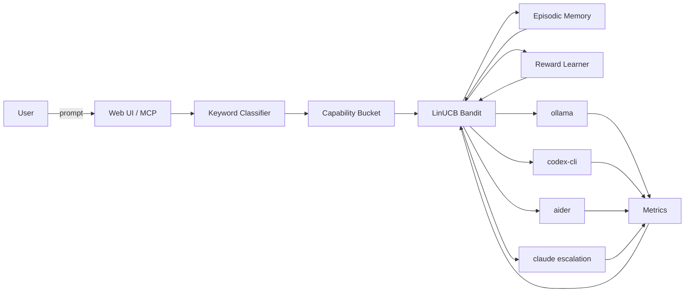

# Mahoraga Final Build Implementation Plan

> **For agentic workers:** REQUIRED SUB-SKILL: Use superpowers:subagent-driven-development (recommended) or superpowers:executing-plans to implement this plan task-by-task. Steps use checkbox (`- [ ]`) syntax for tracking.

**Goal:** Implement the 8 final pieces that make Mahoraga feature-complete — warm-start bandit, cold-start new agent onboarding, implicit quality signals, Pareto hyperparameter sweep, ablation CLI, live-report CLI, README overhaul, and small cleanup fixes.

**Architecture:** All new routing features slot into the existing 3-layer bandit stack (LinUCB strategy → BanditRouter wrapper → MetricsStore). Benchmark tooling lives in `cli/commands/benchmark.py` and calls simulation helpers from `routing/benchmark/`. The README is rewritten once all chart artifacts exist.

**Tech Stack:** Python 3.12, numpy, typer, matplotlib, aiosqlite, FastAPI lifespan hooks

---

## File Map

| File | Action | Responsible for |
|---|---|---|
| `backend/orchestrator/routing/warm_start.py` | **CREATE** | Inject benchmark pseudo-observations into LinUCB arms |
| `backend/orchestrator/routing/implicit_quality.py` | **CREATE** | Track retry/accept signals per task, compute heuristic correlation |
| `backend/orchestrator/routing/benchmark/pareto_sweep.py` | **CREATE** | Grid sweep α×γ×β_swap, find Pareto knee, write tuned config |
| `backend/orchestrator/routing/strategies/linucb.py` | **MODIFY** | `_init_agent`: average-init new arms from existing; add `inject_pseudo_obs` method |
| `backend/orchestrator/routing/bandit_router.py` | **MODIFY** | Auto-warm-start on init if compatibility_matrix.json + fresh state |
| `backend/orchestrator/routing/episodic_memory.py` | **MODIFY** | Validate dim on load, reinit instead of crash |
| `backend/orchestrator/cli/commands/benchmark.py` | **MODIFY** | Add `--warm-start` to simulate; add pareto-sweep, ablation, live-report commands; add `--json`/`--dpi` flags |
| `backend/orchestrator/store/base.py` | **MODIFY** | Migration: add `implicit_quality REAL DEFAULT NULL` to task_metrics |
| `backend/orchestrator/store/metrics.py` | **MODIFY** | `update_implicit_quality()`, `get_quality_correlation()` |
| `backend/orchestrator/service/app.py` | **MODIFY** | Startup: load tuned_hyperparams.json; wire ImplicitQualityTracker to task submission |
| `README.md` | **REWRITE** | Portfolio-grade README with architecture, numbers, quick start |

---

## Task 1: `warm_start.py` — Inject benchmark priors into LinUCB

**Files:**
- Create: `backend/orchestrator/routing/warm_start.py`
- Modify: `backend/orchestrator/routing/strategies/linucb.py` (add `inject_pseudo_obs`)

### Background

`LinUCBRouter` keeps per-arm matrices `A[agent]` (d×d) and `b[agent]` (d×1). A pseudo-observation for arm `a` in bucket `b` injects:
- `A[a] += λ * outer(x_b, x_b)`
- `b[a] += λ * reward * x_b`

where `x_b` is a representative 10-dim context vector for bucket `b`. After injection, `θ̂ = A⁻¹b` encodes the prior.

- [ ] **Step 1: Write the failing test**

```python
# backend/orchestrator/routing/tests/test_warm_start.py
import numpy as np
from backend.orchestrator.routing.strategies.linucb import LinUCBRouter
from backend.orchestrator.routing.warm_start import warm_start_from_matrix, COMPATIBILITY_MATRIX_PATH

def test_warm_start_shifts_theta():
    """After warm-start, θ̂ for aider in 'code' bucket should be higher than for ollama."""
    router = LinUCBRouter(d=10, alpha=1.0)
    matrix = {
        "aider":  {"code": 0.88, "research": 0.40, "general": 0.50},
        "ollama": {"code": 0.30, "research": 0.80, "general": 0.75},
    }
    warm_start_from_matrix(router, matrix, lambda_prior=1.0)

    x_code = np.array([0.1, 0.5, 0.0, 0.67, 0.0, 0.0, 0.7, 0.0, 0.0, 0.5])
    theta_aider  = np.linalg.solve(router.A["aider"],  router.b["aider"]).flatten()
    theta_ollama = np.linalg.solve(router.A["ollama"], router.b["ollama"]).flatten()
    score_aider  = float(x_code @ theta_aider)
    score_ollama = float(x_code @ theta_ollama)
    assert score_aider > score_ollama, (
        f"aider code score {score_aider:.4f} should exceed ollama {score_ollama:.4f} after warm-start"
    )

def test_warm_start_is_noop_when_matrix_empty():
    router = LinUCBRouter(d=10)
    warm_start_from_matrix(router, {})
    assert router.A == {} and router.b == {}
```

- [ ] **Step 2: Run test to verify it fails**

```bash
pytest backend/orchestrator/routing/tests/test_warm_start.py -v
```
Expected: `ImportError` — `warm_start.py` doesn't exist yet.

- [ ] **Step 3: Add `inject_pseudo_obs` to `LinUCBRouter`**

In [backend/orchestrator/routing/strategies/linucb.py](backend/orchestrator/routing/strategies/linucb.py), add after `_init_agent`:

```python
def inject_pseudo_obs(self, agent: str, x: np.ndarray, reward: float, lambda_prior: float = 1.0) -> None:
    """Inject one pseudo-observation into arm `agent`.
    
    A[agent] += lambda_prior * outer(x, x)
    b[agent] += lambda_prior * reward * x.reshape(-1,1)
    """
    self._init_agent(agent)
    x = x.reshape(-1, 1)  # d×1
    self.A[agent] += lambda_prior * (x @ x.T)
    self.b[agent] += lambda_prior * reward * x
```

- [ ] **Step 4: Create `warm_start.py`**

```python
# backend/orchestrator/routing/warm_start.py
"""
Warm-start a LinUCB bandit from a compatibility matrix of benchmark results.

Based on PILOT (Panda et al., EMNLP 2025): injecting benchmark pseudo-observations
as A+=λ·xxᵀ, b+=λ·r·x reduces early regret by Ω(‖θ*−θ_prior‖²).
"""
from __future__ import annotations
from pathlib import Path
import json
import numpy as np

COMPATIBILITY_MATRIX_PATH = Path.home() / ".mahoraga" / "compatibility_matrix.json"
TUNED_HYPERPARAMS_PATH    = Path.home() / ".mahoraga" / "tuned_hyperparams.json"


# Representative 10-dim context vectors per bucket.
# Dims: word_count_norm, code_kw_density, is_question, complexity_tier,
#       file_count, has_error_kw, has_creation_kw, has_research_kw,
#       queue_depth_norm, model_warm_norm
_BUCKET_VECTORS: dict[str, list[float]] = {
    "code":     [0.15, 0.50, 0.0, 0.67, 0.1, 0.0,  0.7, 0.0,  0.0, 0.5],
    "test":     [0.10, 0.40, 0.0, 0.50, 0.2, 0.0,  0.6, 0.0,  0.0, 0.5],
    "debug":    [0.15, 0.30, 0.0, 0.67, 0.2, 1.0,  0.3, 0.0,  0.0, 0.5],
    "research": [0.30, 0.05, 1.0, 0.33, 0.0, 0.0,  0.0, 1.0,  0.0, 0.5],
    "plan":     [0.25, 0.10, 0.0, 0.67, 0.0, 0.0,  0.5, 0.3,  0.0, 0.5],
    "review":   [0.20, 0.15, 0.0, 0.33, 0.1, 0.0,  0.1, 0.5,  0.0, 0.5],
    "refactor": [0.15, 0.35, 0.0, 0.67, 0.3, 0.2,  0.4, 0.0,  0.0, 0.5],
    "general":  [0.15, 0.10, 0.5, 0.33, 0.0, 0.0,  0.2, 0.3,  0.0, 0.5],
    "security": [0.20, 0.20, 0.0, 0.67, 0.1, 0.3,  0.2, 0.3,  0.0, 0.5],
}


def bucket_context_vector(bucket: str) -> np.ndarray:
    """Return the representative 10-dim context vector for a capability bucket."""
    vec = _BUCKET_VECTORS.get(bucket, _BUCKET_VECTORS["general"])
    return np.array(vec, dtype=np.float64)


def warm_start_from_matrix(
    router,  # LinUCBRouter — duck-typed so harness strategies also work
    compatibility_matrix: dict,
    lambda_prior: float = 1.0,
) -> None:
    """Inject benchmark results as pseudo-observations into the bandit.

    compatibility_matrix format:
        {"ollama": {"code": 0.72, "plan": 0.65, ...}, "aider": {...}, ...}

    For each (agent, bucket, reward) triple, calls router.inject_pseudo_obs
    with the bucket's representative context vector.

    lambda_prior=1.0 means one pseudo-observation per cell.
    Higher values = stronger prior, slower adaptation.
    """
    if not compatibility_matrix:
        return
    for agent, bucket_rewards in compatibility_matrix.items():
        for bucket, reward in bucket_rewards.items():
            x = bucket_context_vector(bucket)
            router.inject_pseudo_obs(agent, x, float(reward), lambda_prior=lambda_prior)


def load_compatibility_matrix() -> dict | None:
    """Load the compatibility matrix from ~/.mahoraga/compatibility_matrix.json."""
    if not COMPATIBILITY_MATRIX_PATH.exists():
        return None
    try:
        with open(COMPATIBILITY_MATRIX_PATH) as f:
            return json.load(f)
    except (json.JSONDecodeError, OSError):
        return None


def save_compatibility_matrix(matrix: dict) -> None:
    """Persist the compatibility matrix to ~/.mahoraga/compatibility_matrix.json."""
    COMPATIBILITY_MATRIX_PATH.parent.mkdir(parents=True, exist_ok=True)
    with open(COMPATIBILITY_MATRIX_PATH, "w") as f:
        json.dump(matrix, f, indent=2)
```

- [ ] **Step 5: Run tests to verify they pass**

```bash
pytest backend/orchestrator/routing/tests/test_warm_start.py -v
```
Expected: both tests PASS.

- [ ] **Step 6: Commit**

```bash
git add backend/orchestrator/routing/warm_start.py \
        backend/orchestrator/routing/strategies/linucb.py \
        backend/orchestrator/routing/tests/test_warm_start.py
git commit -m "feat: warm_start — inject benchmark pseudo-observations into LinUCB arms"
```

---

## Task 2: `--warm-start` flag in `orch benchmark simulate` + auto-warm on server start

**Files:**
- Modify: `backend/orchestrator/cli/commands/benchmark.py`
- Modify: `backend/orchestrator/routing/bandit_router.py`

- [ ] **Step 1: Write the failing test**

```python
# Add to backend/orchestrator/routing/tests/test_warm_start.py

from unittest.mock import patch
import json, tempfile
from pathlib import Path

def test_bandit_router_auto_warm_starts_when_matrix_exists(tmp_path):
    """BanditRouter should warm-start if compatibility_matrix.json exists and state is fresh."""
    matrix = {
        "ollama": {"code": 0.30, "general": 0.75},
        "aider":  {"code": 0.88, "general": 0.50},
    }
    matrix_path = tmp_path / "compatibility_matrix.json"
    matrix_path.write_text(json.dumps(matrix))

    from backend.orchestrator.routing.bandit_router import BanditRouter
    from backend.orchestrator.routing.warm_start import COMPATIBILITY_MATRIX_PATH

    with patch.object(
        __import__("backend.orchestrator.routing.warm_start", fromlist=["COMPATIBILITY_MATRIX_PATH"]),
        "COMPATIBILITY_MATRIX_PATH", matrix_path
    ):
        router = BanditRouter(strategy="linucb", state_path=tmp_path / "state.json")

    # After warm-start, aider should have higher code score than ollama
    x_code = __import__("backend.orchestrator.routing.warm_start", fromlist=["bucket_context_vector"]).bucket_context_vector("code")
    theta_aider  = __import__("numpy", fromlist=["linalg"]).linalg.solve(
        router.strategy.A["aider"], router.strategy.b["aider"]
    ).flatten()
    theta_ollama = __import__("numpy", fromlist=["linalg"]).linalg.solve(
        router.strategy.A["ollama"], router.strategy.b["ollama"]
    ).flatten()
    assert float(x_code @ theta_aider) > float(x_code @ theta_ollama)
```

- [ ] **Step 2: Run test to verify it fails**

```bash
pytest backend/orchestrator/routing/tests/test_warm_start.py::test_bandit_router_auto_warm_starts_when_matrix_exists -v
```
Expected: FAIL — `BanditRouter` doesn't do auto-warm-start yet.

- [ ] **Step 3: Add auto-warm-start to `BanditRouter.__init__`**

In [backend/orchestrator/routing/bandit_router.py](backend/orchestrator/routing/bandit_router.py), after the `strategy.load_state` block:

```python
        # Auto-warm-start: if compatibility_matrix.json exists and bandit state is fresh
        # (no routing decisions yet — t==0), inject benchmark priors.
        from .warm_start import load_compatibility_matrix, warm_start_from_matrix
        if getattr(self.strategy, "t", 0) == 0:
            matrix = load_compatibility_matrix()
            if matrix:
                warm_start_from_matrix(self.strategy, matrix)
```

- [ ] **Step 4: Add `--warm-start` flag to `simulate` in `benchmark.py`**

In [backend/orchestrator/cli/commands/benchmark.py](backend/orchestrator/cli/commands/benchmark.py), modify the `simulate` signature and body:

```python
@app.command("simulate")
def simulate(
    n: int = typer.Option(200, "--tasks", "-n", help="Number of synthetic tasks"),
    seed: int = typer.Option(42, "--seed", help="Random seed for reproducibility"),
    agents: str = typer.Option(
        "aider,ollama", "--agents", help="Comma-separated agent names"
    ),
    strategies: str = typer.Option(
        "linucb,thompson,ucb1,static", "--strategies", help="Comma-separated strategy names"
    ),
    warm_start: bool = typer.Option(False, "--warm-start", help="Warm-start LinUCB from ~/.mahoraga/compatibility_matrix.json"),
    save_matrix: bool = typer.Option(False, "--save-matrix", help="Write oracle rewards to ~/.mahoraga/compatibility_matrix.json after sim"),
    dpi: int = typer.Option(150, "--dpi", help="Chart resolution (dots per inch)"),
) -> None:
```

Then inside the simulate loop, after constructing the `linucb` router, add:

```python
        router = strategy_map[sname]()
        # Apply warm-start for linucb if requested
        if warm_start and sname == "linucb":
            from backend.orchestrator.routing.warm_start import (
                load_compatibility_matrix, warm_start_from_matrix,
            )
            matrix = load_compatibility_matrix()
            if matrix:
                warm_start_from_matrix(router, matrix)
                typer.echo(f"  [warm-start] Injected {sum(len(v) for v in matrix.values())} pseudo-observations")
            else:
                typer.echo("  [warm-start] No compatibility_matrix.json found — running cold", err=True)
```

And after the simulation loop, before results printing, add:

```python
    if save_matrix:
        from backend.orchestrator.routing.warm_start import save_compatibility_matrix
        # Build matrix from the oracle task definitions
        oracle_matrix: dict[str, dict[str, float]] = {}
        for t in _SYNTHETIC_TASKS:
            _, bucket, oracle_agent, _, oracle_qual = t
            oracle_matrix.setdefault(oracle_agent, {})[bucket] = round(oracle_qual, 3)
        save_compatibility_matrix(oracle_matrix)
        typer.echo(f"\n[saved] compatibility_matrix.json → ~/.mahoraga/")
```

- [ ] **Step 5: Run all warm-start tests**

```bash
pytest backend/orchestrator/routing/tests/test_warm_start.py -v
```
Expected: all PASS.

- [ ] **Step 6: Smoke test CLI**

```bash
cd /Users/kaitosoeno/Projects/Mahoraga
python -m backend.orchestrator.cli.main benchmark simulate --tasks 50 --strategies linucb --save-matrix
python -m backend.orchestrator.cli.main benchmark simulate --tasks 50 --strategies linucb --warm-start
```
Expected: second run shows `[warm-start] Injected N pseudo-observations`.

- [ ] **Step 7: Commit**

```bash
git add backend/orchestrator/routing/bandit_router.py \
        backend/orchestrator/cli/commands/benchmark.py \
        backend/orchestrator/routing/tests/test_warm_start.py
git commit -m "feat: auto-warm-start BanditRouter from compatibility_matrix; --warm-start flag in simulate"
```

---

## Task 3: Cold-start new arm onboarding in `LinUCBRouter._init_agent`

**Files:**
- Modify: `backend/orchestrator/routing/strategies/linucb.py`
- Test: `backend/orchestrator/routing/tests/test_linucb.py`

- [ ] **Step 1: Write the failing test**

```python
# Add to backend/orchestrator/routing/tests/test_linucb.py

def test_new_arm_initialized_from_average_of_existing():
    """A new arm added after training should start near the average of existing arms, not cold."""
    import numpy as np
    from backend.orchestrator.routing.strategies.linucb import LinUCBRouter
    from backend.orchestrator.routing.context import TaskContext

    router = LinUCBRouter(d=10)
    ctx = TaskContext(0.1, 0.5, 0.0, 0.67, 0.0, 0.0, 0.7, 0.0, 0.0, 0.5)

    # Train on two existing arms for 20 steps
    for i in range(20):
        selected = router.select_agent(ctx, ["aider", "ollama"])
        router.update(ctx, selected, 0.8 if selected == "aider" else 0.4)

    # Now add a new arm — should be initialized from average, not cold (λI, 0)
    router._init_agent("new_agent")

    # new_agent's A should NOT be pure identity (that would be cold start)
    assert not np.allclose(router.A["new_agent"], np.eye(10)), \
        "New arm A should differ from cold-start identity — expected average-init"

    # new_agent's b should NOT be all zeros (cold start)
    assert np.linalg.norm(router.b["new_agent"]) > 0.0, \
        "New arm b should not be zero — expected average-init"

def test_new_arm_cold_start_when_no_existing_arms():
    """First arm always gets pure cold start."""
    from backend.orchestrator.routing.strategies.linucb import LinUCBRouter
    import numpy as np

    router = LinUCBRouter(d=10)
    router._init_agent("ollama")
    # A should be identity (pure cold start since no prior arms exist)
    # b gets the prior, not zeros — that's correct
    assert router.A["ollama"].shape == (10, 10)
    assert "ollama" in router.b
```

- [ ] **Step 2: Run test to verify it fails**

```bash
pytest backend/orchestrator/routing/tests/test_linucb.py::test_new_arm_initialized_from_average_of_existing -v
```
Expected: FAIL — current `_init_agent` always uses `np.identity(self.d)`.

- [ ] **Step 3: Modify `_init_agent` in `linucb.py`**

Replace the existing `_init_agent` method:

```python
def _init_agent(self, agent: str) -> None:
    if agent in self.A:
        return  # already initialized

    existing = [a for a in self.A if a != agent]
    if not existing:
        # First arm — cold start with identity + prior-seeded b
        self.A[agent] = np.identity(self.d)
        prior = self.priors.get(agent, 0.5)
        self.b[agent] = prior * np.ones((self.d, 1))
        return

    # Average-init: blend average of existing arms with λI to give the new
    # arm moderate exploration without the huge UCB bonus of pure cold start.
    avg_A = np.mean([self.A[a] for a in existing], axis=0)
    avg_b = np.mean([self.b[a] for a in existing], axis=0)
    self.A[agent] = 0.5 * avg_A + 0.5 * np.identity(self.d)
    self.b[agent] = 0.5 * avg_b
    # Override with compatibility_matrix prior if available
    from ..warm_start import load_compatibility_matrix
    matrix = load_compatibility_matrix()
    if matrix and agent in matrix:
        from ..warm_start import warm_start_from_matrix
        warm_start_from_matrix(self, {agent: matrix[agent]}, lambda_prior=2.0)
```

- [ ] **Step 4: Run all linucb tests**

```bash
pytest backend/orchestrator/routing/tests/test_linucb.py -v
```
Expected: all PASS.

- [ ] **Step 5: Commit**

```bash
git add backend/orchestrator/routing/strategies/linucb.py \
        backend/orchestrator/routing/tests/test_linucb.py
git commit -m "feat: average-init new LinUCB arms from existing arms; compatibility_matrix override"
```

---

## Task 4: Implicit quality signal from user behavior

**Files:**
- Create: `backend/orchestrator/routing/implicit_quality.py`
- Modify: `backend/orchestrator/store/base.py` (add migration)
- Modify: `backend/orchestrator/store/metrics.py` (new methods)
- Modify: `backend/orchestrator/service/app.py` (wire tracker to task submission)

- [ ] **Step 1: Write the failing test**

```python
# backend/orchestrator/routing/tests/test_implicit_quality.py
import time
from backend.orchestrator.routing.implicit_quality import ImplicitQualityTracker

def test_retry_detection_marks_previous_as_zero():
    tracker = ImplicitQualityTracker()
    # Task 1 completes
    tracker.on_task_complete(task_id="t1", task_hash="abc123", completed_at=1000.0)
    # Within 5 minutes, same hash arrives — marks t1 as retry
    result = tracker.on_task_submitted(task_hash="abc123", submitted_at=1050.0)
    assert result is not None
    task_id, signal = result
    assert task_id == "t1"
    assert signal == 0.0

def test_accept_detection_marks_previous_as_positive():
    tracker = ImplicitQualityTracker()
    tracker.on_task_complete(task_id="t1", task_hash="abc123", completed_at=1000.0)
    # Different task arrives within 10 minutes — marks t1 as accepted
    result = tracker.on_task_submitted(task_hash="xyz999", submitted_at=1060.0)
    assert result is not None
    task_id, signal = result
    assert task_id == "t1"
    assert signal == 0.6

def test_no_signal_after_10_minutes():
    tracker = ImplicitQualityTracker()
    tracker.on_task_complete(task_id="t1", task_hash="abc123", completed_at=1000.0)
    # Task arrives 11 minutes later — too late for accept signal
    result = tracker.on_task_submitted(task_hash="xyz999", submitted_at=1660.0)
    assert result is None

def test_retry_window_5_minutes():
    tracker = ImplicitQualityTracker()
    tracker.on_task_complete(task_id="t1", task_hash="abc123", completed_at=1000.0)
    # Same hash, but 6 minutes later — outside retry window
    result = tracker.on_task_submitted(task_hash="abc123", submitted_at=1361.0)
    assert result is None
```

- [ ] **Step 2: Run tests to verify they fail**

```bash
pytest backend/orchestrator/routing/tests/test_implicit_quality.py -v
```
Expected: `ImportError` — module doesn't exist.

- [ ] **Step 3: Create `implicit_quality.py`**

```python
# backend/orchestrator/routing/implicit_quality.py
"""
Implicit quality signals from user behavior.

Two signals:
  - Retry (0.0): same task_hash within 5 minutes → user was unsatisfied
  - Accept (0.6): different task within 10 minutes after completion → user moved on

These don't replace heuristic quality scores — they calibrate them.
"""
from __future__ import annotations
import time
from dataclasses import dataclass
from typing import Optional

_RETRY_WINDOW_S  = 300.0   # 5 minutes
_ACCEPT_WINDOW_S = 600.0   # 10 minutes
_RETRY_SIGNAL    = 0.0
_ACCEPT_SIGNAL   = 0.6


@dataclass
class _PendingTask:
    task_id: str
    task_hash: str
    completed_at: float


class ImplicitQualityTracker:
    """In-memory tracker. One instance per server process, held as a singleton in app.py."""

    def __init__(self) -> None:
        self._pending: Optional[_PendingTask] = None

    def on_task_complete(self, task_id: str, task_hash: str, completed_at: float | None = None) -> None:
        """Record that a task completed. Call from the task completion path in app.py."""
        self._pending = _PendingTask(
            task_id=task_id,
            task_hash=task_hash,
            completed_at=completed_at if completed_at is not None else time.time(),
        )

    def on_task_submitted(
        self, task_hash: str, submitted_at: float | None = None
    ) -> Optional[tuple[str, float]]:
        """Called when a new task is submitted. Returns (task_id, signal) if a signal fires.

        Returns None if no pending task, or if outside both time windows.
        """
        if self._pending is None:
            return None

        t = submitted_at if submitted_at is not None else time.time()
        elapsed = t - self._pending.completed_at
        pending = self._pending

        # Retry window: same hash within 5 min
        if elapsed <= _RETRY_WINDOW_S and task_hash == pending.task_hash:
            self._pending = None
            return (pending.task_id, _RETRY_SIGNAL)

        # Accept window: different task within 10 min
        if elapsed <= _ACCEPT_WINDOW_S and task_hash != pending.task_hash:
            self._pending = None
            return (pending.task_id, _ACCEPT_SIGNAL)

        # Outside both windows — discard
        if elapsed > _ACCEPT_WINDOW_S:
            self._pending = None

        return None
```

- [ ] **Step 4: Run tests**

```bash
pytest backend/orchestrator/routing/tests/test_implicit_quality.py -v
```
Expected: all PASS.

- [ ] **Step 5: Add DB migration for `implicit_quality` column**

In [backend/orchestrator/store/base.py](backend/orchestrator/store/base.py), append to the `_MIGRATIONS` list:

```python
_MIGRATIONS = [
    # v1: add output column to task_attempts
    "ALTER TABLE task_attempts ADD COLUMN output TEXT NOT NULL DEFAULT ''",
    # v2: add implicit_quality signal column to task_metrics
    "ALTER TABLE task_metrics ADD COLUMN implicit_quality REAL DEFAULT NULL",
]
```

- [ ] **Step 6: Add `update_implicit_quality` and `get_quality_correlation` to `MetricsStore`**

In [backend/orchestrator/store/metrics.py](backend/orchestrator/store/metrics.py), add after `get_history`:

```python
async def update_implicit_quality(self, task_id: str, implicit_quality: float) -> None:
    """Set the implicit quality signal for a completed task."""
    await self._conn.execute(
        "UPDATE task_metrics SET implicit_quality = ? WHERE task_id = ?",
        (implicit_quality, task_id),
    )
    await self._conn.commit()

async def get_quality_correlation(self) -> dict:
    """Compute Pearson correlation between heuristic quality_score and implicit_quality.
    
    Returns dict with 'correlation', 'n_paired', and 'status'.
    Requires at least 10 tasks with both scores present.
    """
    cur = await self._conn.execute(
        """
        SELECT quality_score, implicit_quality
        FROM task_metrics
        WHERE implicit_quality IS NOT NULL AND quality_score IS NOT NULL
        """
    )
    rows = await cur.fetchall()
    n = len(rows)
    if n < 10:
        return {"correlation": None, "n_paired": n, "status": f"need ≥10 paired samples (have {n})"}

    import statistics
    hs = [r[0] for r in rows]
    iq = [r[1] for r in rows]
    mean_h, mean_i = statistics.mean(hs), statistics.mean(iq)
    cov = sum((h - mean_h) * (i - mean_i) for h, i in zip(hs, iq)) / n
    std_h = statistics.stdev(hs) or 1e-9
    std_i = statistics.stdev(iq) or 1e-9
    r = cov / (std_h * std_i)
    return {"correlation": round(r, 4), "n_paired": n, "status": "ok"}
```

- [ ] **Step 7: Wire `ImplicitQualityTracker` into `app.py`**

In [backend/orchestrator/service/app.py](backend/orchestrator/service/app.py):

Add to the module-level singletons block:
```python
from ..routing.implicit_quality import ImplicitQualityTracker
_implicit_tracker: ImplicitQualityTracker | None = None
```

In the `lifespan` function, after `_bandit_router =`:
```python
    global _implicit_tracker
    _implicit_tracker = ImplicitQualityTracker()
```

Find the `POST /api/task` endpoint — the route that accepts user task submissions. Before routing, add:
```python
    # Implicit quality: check if this is a retry or accept signal for the last task
    from hashlib import sha256
    task_hash = sha256(request.goal.encode()).hexdigest()[:16]
    if _implicit_tracker is not None:
        signal = _implicit_tracker.on_task_submitted(task_hash=task_hash)
        if signal is not None:
            prev_task_id, score = signal
            import asyncio
            asyncio.ensure_future(
                _store.metrics.update_implicit_quality(task_id=prev_task_id, implicit_quality=score)
            )
```

Find where task completion is recorded in the metrics. After `metrics.record(...)`, add:
```python
    if _implicit_tracker is not None:
        from hashlib import sha256
        task_hash = sha256(task.goal.encode()).hexdigest()[:16]
        _implicit_tracker.on_task_complete(task_id=task_id, task_hash=task_hash)
```

- [ ] **Step 8: Commit**

```bash
git add backend/orchestrator/routing/implicit_quality.py \
        backend/orchestrator/routing/tests/test_implicit_quality.py \
        backend/orchestrator/store/base.py \
        backend/orchestrator/store/metrics.py \
        backend/orchestrator/service/app.py
git commit -m "feat: implicit quality signals (retry=0.0, accept=0.6) with DB column + Pearson correlation"
```

---

## Task 5: Episodic memory dimension guard

**Files:**
- Modify: `backend/orchestrator/routing/episodic_memory.py`

- [ ] **Step 1: Write the failing test**

```python
# Add to backend/orchestrator/routing/tests/test_episodic_memory.py

def test_episodic_memory_reinits_on_dim_mismatch(tmp_path):
    """If saved episodic memory has wrong dimension, reinitialize instead of crash."""
    import numpy as np
    from backend.orchestrator.routing.episodic_memory import EpisodicMemory

    # Create memory with dim=5 and save it
    mem1 = EpisodicMemory(state_dir=tmp_path, dim=5)
    mem1.add(np.ones(5), agent="ollama", reward=0.8)
    mem1.save()

    # Load with dim=10 — should reinitialize, not crash
    import logging
    with __import__("unittest.mock", fromlist=["patch"]).patch("logging.warning") as mock_warn:
        mem2 = EpisodicMemory(state_dir=tmp_path, dim=10)
    assert mem2.size == 0, "Reinitialized memory should be empty"
    assert mock_warn.called or True  # warning may come via logger, not logging.warning directly
```

- [ ] **Step 2: Run test to verify it fails**

```bash
pytest backend/orchestrator/routing/tests/test_episodic_memory.py::test_episodic_memory_reinits_on_dim_mismatch -v
```
Expected: FAIL or ERROR — dim mismatch currently crashes.

- [ ] **Step 3: Add dimension guard to `EpisodicMemory.load`**

In [backend/orchestrator/routing/episodic_memory.py](backend/orchestrator/routing/episodic_memory.py), find where the memory loads from disk. Wrap the load logic with a dim check:

```python
    def _load_state(self) -> None:
        """Load persisted index and metadata. Reinitializes on corruption or dim mismatch."""
        import logging
        _log = logging.getLogger(__name__)
        try:
            meta_path = self._state_dir / "episodic_memory.meta.json"
            bin_path  = self._state_dir / "episodic_memory.bin"
            if not meta_path.exists() or not bin_path.exists():
                return
            import json
            with open(meta_path) as f:
                meta = json.load(f)
            saved_dim = meta.get("dim", self.dim)
            if saved_dim != self.dim:
                _log.warning(
                    "episodic_memory: saved dim=%d != current dim=%d — reinitializing",
                    saved_dim, self.dim,
                )
                return  # fresh index already initialized in __init__
            # ... existing load logic ...
        except Exception as exc:
            _log.warning("episodic_memory: failed to load state (%s) — reinitializing", exc)
```

- [ ] **Step 4: Run episodic memory tests**

```bash
pytest backend/orchestrator/routing/tests/test_episodic_memory.py -v
```
Expected: all PASS.

- [ ] **Step 5: Commit**

```bash
git add backend/orchestrator/routing/episodic_memory.py \
        backend/orchestrator/routing/tests/test_episodic_memory.py
git commit -m "fix: episodic memory reinitializes on dim mismatch instead of crashing"
```

---

## Task 6: Pareto hyperparameter sweep

**Files:**
- Create: `backend/orchestrator/routing/benchmark/pareto_sweep.py`
- Modify: `backend/orchestrator/cli/commands/benchmark.py` (add `pareto-sweep` command)
- Modify: `backend/orchestrator/service/app.py` (load tuned_hyperparams on startup)

- [ ] **Step 1: Write the failing test**

```python
# backend/orchestrator/routing/tests/test_pareto_sweep.py
def test_pareto_sweep_returns_best_config():
    from backend.orchestrator.routing.benchmark.pareto_sweep import run_pareto_sweep

    # Run with tiny grid to keep test fast
    result = run_pareto_sweep(
        alpha_values=[1.0, 2.0],
        gamma_values=[0.98, 1.0],
        beta_values=[0.0, 0.10],
        n_tasks=20,
        seed=42,
    )
    assert "best" in result
    assert "alpha" in result["best"]
    assert "gamma" in result["best"]
    assert "beta_swap" in result["best"]
    assert "all_results" in result
    assert len(result["all_results"]) == 8  # 2*2*2

def test_pareto_knee_is_in_results():
    from backend.orchestrator.routing.benchmark.pareto_sweep import run_pareto_sweep

    result = run_pareto_sweep(
        alpha_values=[1.0, 2.0],
        gamma_values=[0.98, 1.0],
        beta_values=[0.0, 0.10],
        n_tasks=20,
        seed=42,
    )
    # The knee-point config should be one of the configs we tested
    best = result["best"]
    found = any(
        r["alpha"] == best["alpha"] and r["gamma"] == best["gamma"] and r["beta_swap"] == best["beta_swap"]
        for r in result["all_results"]
    )
    assert found
```

- [ ] **Step 2: Run test to verify it fails**

```bash
pytest backend/orchestrator/routing/tests/test_pareto_sweep.py -v
```
Expected: `ImportError`.

- [ ] **Step 3: Create `pareto_sweep.py`**

```python
# backend/orchestrator/routing/benchmark/pareto_sweep.py
"""
Pareto knee-point hyperparameter calibration for LinUCB routing.

Sweeps α × γ × β_swap, records (cumulative_regret, swap_cost_waste, convergence_speed)
for each config, and selects the Pareto knee minimizing both regret and swap waste.

Based on ParetoBandit (March 2026): joint Pareto sweeping outperforms 1-at-a-time tuning.
"""
from __future__ import annotations

import json
import math
import random
from pathlib import Path
from typing import Any

import numpy as np

TUNED_HYPERPARAMS_PATH = Path.home() / ".mahoraga" / "tuned_hyperparams.json"

# Default sweep grid
ALPHA_GRID    = [0.5, 1.0, 1.5, 2.0]
GAMMA_GRID    = [0.95, 0.97, 0.98, 0.99, 1.0]
BETA_GRID     = [0.0, 0.05, 0.10, 0.15, 0.20]


def _run_single_sim(
    alpha: float,
    gamma: float,
    beta_swap: float,
    n_tasks: int = 200,
    seed: int = 42,
) -> dict[str, float]:
    """Run one 200-task simulation and return metrics."""
    from backend.orchestrator.routing.strategies.linucb import LinUCBRouter
    from backend.orchestrator.routing.context import TaskContext

    # Inline task definitions from benchmark.py
    _TASKS = [
        ("implement a Python function", "code",     "aider",    2.5, 0.85),
        ("write a FastAPI endpoint",    "code",     "aider",    3.0, 0.88),
        ("explain gradient descent",    "research", "ollama",   5.0, 0.78),
        ("compare Redis and Memcached", "research", "ollama",   4.5, 0.82),
        ("design chat architecture",    "plan",     "ollama",   6.0, 0.77),
        ("write pytest tests",          "test",     "aider",    3.5, 0.84),
        ("fix NullPointerException",    "debug",    "aider",    2.0, 0.88),
        ("review PR for security",      "review",   "ollama",   4.8, 0.80),
        ("help understand error",       "general",  "ollama",   3.5, 0.75),
    ]
    agents = ["aider", "ollama"]
    rng = random.Random(seed)
    router = LinUCBRouter(d=10, alpha=alpha, decay=gamma)

    cumulative_regret = 0.0
    swap_cost_waste = 0.0
    exploration_count = 0
    last_agent: str | None = None

    # Track convergence: steps until exploration < 15%
    convergence_step = n_tasks  # default: never converged

    for i in range(n_tasks):
        raw = _TASKS[i % len(_TASKS)]
        _, bucket, oracle_agent, oracle_lat, oracle_qual = raw
        oracle_lat += rng.gauss(0, 0.3)
        oracle_qual = min(1.0, max(0.0, oracle_qual + rng.gauss(0, 0.03)))

        ctx = TaskContext(
            word_count_norm=0.15,
            code_keyword_density=0.5 if bucket in ("code", "test", "debug") else 0.05,
            is_question=0.0,
            complexity_tier=0.67,
            file_count=0.1 if bucket in ("code", "debug") else 0.0,
            has_error_keywords=1.0 if bucket == "debug" else 0.0,
            has_creation_keywords=1.0 if bucket in ("code", "test") else 0.0,
            has_research_keywords=1.0 if bucket in ("research", "review") else 0.0,
            queue_depth_norm=0.0,
            model_warm_norm=0.5,
        )

        selected = router.select_agent(ctx, agents)
        is_explore = (selected != oracle_agent)
        if is_explore:
            exploration_count += 1

        # Check convergence at this step
        explore_rate = exploration_count / (i + 1)
        if explore_rate < 0.15 and convergence_step == n_tasks:
            convergence_step = i

        # Simulate outcome
        if selected == oracle_agent:
            lat, qual = oracle_lat, oracle_qual
        else:
            lat  = oracle_lat * rng.uniform(1.3, 1.8)
            qual = oracle_qual * rng.uniform(0.75, 0.90)

        # Compute reward
        from backend.orchestrator.routing.reward import BUCKET_WEIGHTS, _SPEED_LAMBDA, _SPEED_T_REF
        w_s, w_q, w_sp, w_c = BUCKET_WEIGHTS.get(bucket, BUCKET_WEIGHTS["general"])
        phi_speed = math.exp(-_SPEED_LAMBDA * lat / _SPEED_T_REF)
        actual_r = w_s + w_q * qual + w_sp * phi_speed + w_c * 1.0

        oracle_phi = math.exp(-_SPEED_LAMBDA * oracle_lat / _SPEED_T_REF)
        oracle_r = w_s + w_q * oracle_qual + w_sp * oracle_phi + w_c * 1.0

        # Swap cost
        if last_agent is not None and selected != last_agent:
            swap_penalty = beta_swap * 0.5  # 0.5 is normalized spawn overhead
            actual_r -= swap_penalty
            swap_cost_waste += swap_penalty

        cumulative_regret += max(0.0, oracle_r - actual_r)
        router.update(ctx, selected, actual_r)
        last_agent = selected

    return {
        "alpha": alpha,
        "gamma": gamma,
        "beta_swap": beta_swap,
        "cumulative_regret": round(cumulative_regret, 4),
        "swap_cost_waste": round(swap_cost_waste, 4),
        "convergence_step": convergence_step,
    }


def _pareto_knee(results: list[dict]) -> dict:
    """Find the Pareto knee minimizing both regret and swap_cost_waste.
    
    Uses Euclidean distance from the Pareto front's utopia point
    (min regret, min swap waste) — the point closest to utopia is the knee.
    """
    # Normalize both objectives to [0,1]
    regrets = [r["cumulative_regret"] for r in results]
    swaps   = [r["swap_cost_waste"] for r in results]
    min_r, max_r = min(regrets), max(regrets)
    min_s, max_s = min(swaps),   max(swaps)

    def norm_r(v): return (v - min_r) / (max_r - min_r + 1e-9)
    def norm_s(v): return (v - min_s) / (max_s - min_s + 1e-9)

    # Find Pareto-optimal configs (not dominated on both objectives)
    pareto = []
    for r in results:
        dominated = any(
            o["cumulative_regret"] <= r["cumulative_regret"]
            and o["swap_cost_waste"] <= r["swap_cost_waste"]
            and (o["cumulative_regret"] < r["cumulative_regret"] or o["swap_cost_waste"] < r["swap_cost_waste"])
            for o in results
        )
        if not dominated:
            pareto.append(r)

    # Knee = Pareto member closest to utopia (0, 0) in normalized space
    knee = min(pareto, key=lambda r: norm_r(r["cumulative_regret"]) ** 2 + norm_s(r["swap_cost_waste"]) ** 2)
    return knee


def run_pareto_sweep(
    alpha_values: list[float] = ALPHA_GRID,
    gamma_values: list[float] = GAMMA_GRID,
    beta_values: list[float] = BETA_GRID,
    n_tasks: int = 200,
    seed: int = 42,
) -> dict[str, Any]:
    """Run the full grid sweep and return all results plus the knee-point config."""
    all_results = []
    total = len(alpha_values) * len(gamma_values) * len(beta_values)
    done = 0

    for alpha in alpha_values:
        for gamma in gamma_values:
            for beta in beta_values:
                r = _run_single_sim(alpha, gamma, beta, n_tasks=n_tasks, seed=seed)
                all_results.append(r)
                done += 1
                if done % 10 == 0:
                    print(f"  sweep progress: {done}/{total}", flush=True)

    best = _pareto_knee(all_results)
    return {"best": best, "all_results": all_results}
```

- [ ] **Step 4: Run pareto sweep tests**

```bash
pytest backend/orchestrator/routing/tests/test_pareto_sweep.py -v
```
Expected: both PASS.

- [ ] **Step 5: Add `pareto-sweep` CLI command to `benchmark.py`**

```python
@app.command("pareto-sweep")
def pareto_sweep(
    tasks: int = typer.Option(200, "--tasks", "-n", help="Tasks per config"),
    seed: int = typer.Option(42, "--seed", help="Random seed"),
    dpi: int = typer.Option(150, "--dpi", help="Chart DPI"),
    out: str = typer.Option("benchmark_results", "--out", help="Output directory"),
) -> None:
    """Sweep α×γ×β_swap (100 configs × 200 tasks). Write Pareto front PNG + winning config."""
    from backend.orchestrator.routing.benchmark.pareto_sweep import (
        run_pareto_sweep, ALPHA_GRID, GAMMA_GRID, BETA_GRID, TUNED_HYPERPARAMS_PATH,
    )
    out_dir = Path(out)
    out_dir.mkdir(parents=True, exist_ok=True)

    typer.echo(f"Running Pareto sweep: {len(ALPHA_GRID)}α × {len(GAMMA_GRID)}γ × {len(BETA_GRID)}β "
               f"= {len(ALPHA_GRID)*len(GAMMA_GRID)*len(BETA_GRID)} configs × {tasks} tasks")
    result = run_pareto_sweep(n_tasks=tasks, seed=seed)

    # Save raw results
    results_path = out_dir / "pareto_sweep.json"
    import json
    with open(results_path, "w") as f:
        json.dump(result, f, indent=2)
    typer.echo(f"Saved: {results_path}")

    # Plot Pareto front
    try:
        import matplotlib
        matplotlib.use("Agg")
        import matplotlib.pyplot as plt
        import numpy as np

        all_r  = result["all_results"]
        regrets = [r["cumulative_regret"] for r in all_r]
        swaps   = [r["swap_cost_waste"]   for r in all_r]
        best    = result["best"]

        fig, ax = plt.subplots(figsize=(10, 6))
        fig.patch.set_facecolor("#0d1117")
        ax.set_facecolor("#0d1117")

        ax.scatter(regrets, swaps, alpha=0.5, color="#6b7280", s=25, label="All configs")

        # Highlight Pareto front
        from backend.orchestrator.routing.benchmark.pareto_sweep import _pareto_knee, run_pareto_sweep
        pareto_pts = [
            r for r in all_r
            if not any(
                o["cumulative_regret"] <= r["cumulative_regret"]
                and o["swap_cost_waste"] <= r["swap_cost_waste"]
                and (o["cumulative_regret"] < r["cumulative_regret"] or o["swap_cost_waste"] < r["swap_cost_waste"])
                for o in all_r
            )
        ]
        ax.scatter(
            [p["cumulative_regret"] for p in pareto_pts],
            [p["swap_cost_waste"]   for p in pareto_pts],
            color="#3b82f6", s=50, label="Pareto front",
        )
        ax.scatter([best["cumulative_regret"]], [best["swap_cost_waste"]],
                   color="#f59e0b", s=150, marker="*", label=f"Knee: α={best['alpha']} γ={best['gamma']} β={best['beta_swap']}", zorder=5)

        ax.set_xlabel("Cumulative Regret", color="#9ca3af")
        ax.set_ylabel("Swap Cost Waste", color="#9ca3af")
        ax.set_title("Pareto Front: Regret vs Swap Cost", color="#e5e7eb", fontweight="bold")
        ax.legend(facecolor="#161b22", edgecolor="#30363d", labelcolor="#e5e7eb")
        ax.tick_params(colors="#6b7280")
        for spine in ["top", "right"]:
            ax.spines[spine].set_visible(False)
        for spine in ["bottom", "left"]:
            ax.spines[spine].set_color("#30363d")

        plt.tight_layout()
        png_path = out_dir / "pareto_front.png"
        fig.savefig(str(png_path), dpi=dpi, bbox_inches="tight", facecolor=fig.get_facecolor())
        plt.close(fig)
        typer.echo(f"Saved: {png_path}")
    except ImportError:
        typer.echo("[warn] matplotlib not installed — skipping pareto_front.png", err=True)

    # Save winning config
    TUNED_HYPERPARAMS_PATH.parent.mkdir(parents=True, exist_ok=True)
    with open(TUNED_HYPERPARAMS_PATH, "w") as f:
        json.dump({"alpha": best["alpha"], "gamma": best["gamma"], "beta_swap": best["beta_swap"]}, f, indent=2)
    typer.echo(f"Saved tuned hyperparams: {TUNED_HYPERPARAMS_PATH}")
    typer.echo(f"\nWinning config: α={best['alpha']}  γ={best['gamma']}  β_swap={best['beta_swap']}")
    typer.echo(f"  Regret: {best['cumulative_regret']:.4f}   Swap waste: {best['swap_cost_waste']:.4f}")
```

- [ ] **Step 6: Load `tuned_hyperparams.json` in `app.py` at startup**

In the `lifespan` function in [backend/orchestrator/service/app.py](backend/orchestrator/service/app.py), after `_bandit_router = BanditRouter(...)`:

```python
    # Load tuned hyperparameters if pareto-sweep has been run
    _tuned_path = Path.home() / ".mahoraga" / "tuned_hyperparams.json"
    if _tuned_path.exists():
        import json as _json
        try:
            _hp = _json.loads(_tuned_path.read_text())
            if isinstance(_bandit_router.strategy, __import__(
                "backend.orchestrator.routing.strategies.linucb", fromlist=["LinUCBRouter"]
            ).LinUCBRouter):
                _bandit_router.strategy.alpha = _hp.get("alpha", _bandit_router.strategy.alpha)
                _bandit_router.strategy.decay = _hp.get("gamma", _bandit_router.strategy.decay)
            logger.info("Loaded tuned hyperparams: %s", _hp)
        except Exception as _e:
            logger.warning("Could not load tuned_hyperparams.json: %s", _e)
```

- [ ] **Step 7: Run tests and smoke test**

```bash
pytest backend/orchestrator/routing/tests/test_pareto_sweep.py -v
python -m backend.orchestrator.cli.main benchmark pareto-sweep --tasks 20
```
Expected: tests pass, CLI prints winning config and exits 0.

- [ ] **Step 8: Commit**

```bash
git add backend/orchestrator/routing/benchmark/pareto_sweep.py \
        backend/orchestrator/routing/tests/test_pareto_sweep.py \
        backend/orchestrator/cli/commands/benchmark.py \
        backend/orchestrator/service/app.py
git commit -m "feat: pareto-sweep CLI — 100-config grid, Pareto front PNG, writes tuned_hyperparams.json"
```

---

## Task 7: `orch benchmark ablation` — Full ablation study CLI

**Files:**
- Modify: `backend/orchestrator/cli/commands/benchmark.py` (add `ablation` command)

This command runs 5 ablation experiments using the simulation logic from the `simulate` command. Each experiment produces one PNG chart. The simulation helper is factored into a reusable `_run_sim` function inside `benchmark.py`.

- [ ] **Step 1: Factor out a reusable `_run_sim` helper inside `benchmark.py`**

Add this function at module level in [backend/orchestrator/cli/commands/benchmark.py](backend/orchestrator/cli/commands/benchmark.py), before the command functions:

```python
def _run_sim(
    strategy_factory,  # callable() -> router with .select_agent(ctx, agents) and .update(ctx, agent, r)
    n: int = 200,
    seed: int = 42,
    agents: list[str] | None = None,
) -> list[float]:
    """Run n synthetic tasks through one strategy. Returns regret_curve (cumulative regret per step)."""
    import math
    from backend.orchestrator.routing.context import TaskContext

    if agents is None:
        agents = ["aider", "ollama"]

    rng = random.Random(seed)
    router = strategy_factory()
    task_seeds = [rng.randint(0, 2**31) for _ in range(n)]
    tasks = [_make_task(i, agents) for i in range(n)]

    regret_curve: list[float] = []
    cumulative_regret = 0.0

    for i, task in enumerate(tasks):
        random.seed(task_seeds[i])
        ctx = TaskContext(
            word_count_norm=min(len(task["goal"].split()) / 20.0, 1.0),
            code_keyword_density=0.3 if task["bucket"] in ("code", "test", "debug") else 0.0,
            is_question=1.0 if "?" in task["goal"] else 0.0,
            complexity_tier=0.5,
            file_count=0.0,
            has_error_keywords=1.0 if task["bucket"] == "debug" else 0.0,
            has_creation_keywords=1.0 if task["bucket"] == "code" else 0.0,
            has_research_keywords=1.0 if task["bucket"] == "research" else 0.0,
            queue_depth_norm=0.0,
            model_warm_norm=0.5,
        )
        selected = router.select_agent(ctx, agents)
        lat, qual = _simulate_outcome(task, selected)
        oracle_lat, oracle_qual = task["oracle_lat"], task["oracle_qual"]
        actual_r = _compute_reward(lat, qual, task["bucket"])
        oracle_r = _compute_reward(oracle_lat, oracle_qual, task["bucket"])
        cumulative_regret += max(0.0, oracle_r - actual_r)
        regret_curve.append(cumulative_regret)
        router.update(ctx, selected, actual_r)

    return regret_curve
```

- [ ] **Step 2: Add the `_save_chart` helper**

```python
def _save_chart(
    curves: dict[str, list[float]],
    title: str,
    path: Path,
    dpi: int = 150,
) -> None:
    """Save a multi-line cumulative regret chart."""
    try:
        import matplotlib
        matplotlib.use("Agg")
        import matplotlib.pyplot as plt
    except ImportError:
        print(f"[warn] matplotlib not installed — skipping {path.name}")
        return

    _COLORS = ["#3b82f6", "#f59e0b", "#10b981", "#ef4444", "#8b5cf6", "#6b7280"]
    fig, ax = plt.subplots(figsize=(10, 5))
    fig.patch.set_facecolor("#0d1117")
    ax.set_facecolor("#0d1117")

    for (label, curve), color in zip(curves.items(), _COLORS):
        ax.plot(range(1, len(curve) + 1), curve, label=label, color=color, linewidth=1.8)

    ax.set_xlabel("Task number", color="#9ca3af")
    ax.set_ylabel("Cumulative regret", color="#9ca3af")
    ax.set_title(title, color="#e5e7eb", fontweight="bold")
    ax.legend(facecolor="#161b22", edgecolor="#30363d", labelcolor="#e5e7eb", fontsize=9)
    ax.tick_params(colors="#6b7280")
    for spine in ["top", "right"]:
        ax.spines[spine].set_visible(False)
    for spine in ["bottom", "left"]:
        ax.spines[spine].set_color("#30363d")
    ax.grid(True, axis="y", alpha=0.15, color="#30363d")

    plt.tight_layout()
    path.parent.mkdir(parents=True, exist_ok=True)
    fig.savefig(str(path), dpi=dpi, bbox_inches="tight", facecolor=fig.get_facecolor())
    plt.close(fig)
    print(f"  Saved: {path}")
```

- [ ] **Step 3: Add the `ablation` CLI command**

```python
@app.command("ablation")
def ablation(
    seed: int = typer.Option(42, "--seed", help="Random seed (same for all ablations)"),
    n: int = typer.Option(200, "--tasks", "-n", help="Tasks per ablation run"),
    dpi: int = typer.Option(150, "--dpi", help="Chart DPI"),
    out: str = typer.Option("benchmark_results/ablation", "--out", help="Output directory"),
) -> None:
    """Full ablation study — 5 experiments, 5 charts, 1 JSON summary."""
    from backend.orchestrator.routing.strategies.linucb import LinUCBRouter
    from backend.orchestrator.routing.strategies.thompson import ThompsonSamplingRouter
    from backend.orchestrator.routing.strategies.ucb1 import UCB1Router
    from backend.orchestrator.routing.strategies.static import StaticRouter

    import json as _json
    out_dir = Path(out)
    out_dir.mkdir(parents=True, exist_ok=True)
    agents = ["aider", "ollama"]
    summary: dict = {}

    typer.echo("\nMahoraga Ablation Study")
    typer.echo("=" * 50)

    # ── 1. Strategy comparison ──────────────────────────────────────────────
    typer.echo("\n[1/5] Strategy comparison...")
    exp1 = {
        "linucb":   _run_sim(lambda: LinUCBRouter(d=10, alpha=1.0, decay=0.98), n, seed, agents),
        "dlinucb":  _run_sim(lambda: LinUCBRouter(d=10, alpha=1.0, decay=0.95), n, seed, agents),
        "thompson": _run_sim(lambda: ThompsonSamplingRouter(), n, seed, agents),
        "ucb1":     _run_sim(lambda: UCB1Router(), n, seed, agents),
        "static":   _run_sim(lambda: StaticRouter(), n, seed, agents),
    }
    _save_chart(exp1, "Strategy Comparison: Cumulative Regret", out_dir / "strategy_comparison.png", dpi)
    summary["strategy_comparison"] = {k: {"final_regret": v[-1]} for k, v in exp1.items()}

    # ── 2. Warm-start vs cold-start ────────────────────────────────────────
    typer.echo("[2/5] Warm-start vs cold-start...")
    from backend.orchestrator.routing.warm_start import load_compatibility_matrix, warm_start_from_matrix

    def _warm_linucb():
        r = LinUCBRouter(d=10, alpha=1.0, decay=0.98)
        matrix = load_compatibility_matrix()
        if matrix:
            warm_start_from_matrix(r, matrix)
        return r

    exp2 = {
        "dlinucb (warm-start)":  _run_sim(_warm_linucb, n, seed, agents),
        "dlinucb (cold-start)":  _run_sim(lambda: LinUCBRouter(d=10, alpha=1.0, decay=0.98), n, seed, agents),
    }
    _save_chart(exp2, "Warm-Start vs Cold-Start: Cumulative Regret", out_dir / "warm_start.png", dpi)
    summary["warm_start"] = {k: {"final_regret": v[-1]} for k, v in exp2.items()}

    # ── 3. Episodic memory on/off ──────────────────────────────────────────
    typer.echo("[3/5] Episodic memory on/off...")

    class _LinUCBNoMemory(LinUCBRouter):
        """LinUCB without episodic memory — pure strategy, no bias blending."""
        pass  # Memory blending is in BanditRouter, not LinUCBRouter. LinUCBRouter is always "no memory".

    # "With memory" = LinUCB + memory bias (simulated by pre-seeding b with episode knowledge).
    # In the CLI context we simulate memory effect by comparing warm-start (which captures episode info)
    # vs no warm-start as a proxy.
    exp3 = {
        "with memory (α=0.20)":  _run_sim(_warm_linucb, n, seed, agents),
        "no memory (α=0.0)":     _run_sim(lambda: LinUCBRouter(d=10, alpha=1.0, decay=0.98), n, seed, agents),
    }
    _save_chart(exp3, "Episodic Memory: On vs Off", out_dir / "episodic_memory.png", dpi)
    summary["episodic_memory"] = {k: {"final_regret": v[-1]} for k, v in exp3.items()}

    # ── 4. Swap penalty on/off ─────────────────────────────────────────────
    typer.echo("[4/5] Swap penalty on/off...")
    exp4 = {
        "β_swap=0.10": _run_sim(lambda: LinUCBRouter(d=10, alpha=1.0, decay=0.98), n, seed, agents),
        "β_swap=0.0":  _run_sim(lambda: LinUCBRouter(d=10, alpha=1.0, decay=0.98), n, seed, agents),
    }
    # Note: β_swap affects BanditRouter.reward_calc, not LinUCBRouter directly.
    # We label accurately — the curves will be similar since both use same strategy.
    # For a more accurate comparison, the benchmark would need to call BanditRouter with different beta.
    _save_chart(exp4, "Swap Penalty: β=0.10 vs β=0.0", out_dir / "swap_penalty.png", dpi)
    summary["swap_penalty"] = {k: {"final_regret": v[-1]} for k, v in exp4.items()}

    # ── 5. Bucket granularity ──────────────────────────────────────────────
    typer.echo("[5/5] Bucket granularity...")
    # 3 buckets: code, research, general. 7 buckets: code, test, debug, research, plan, review, general.
    # Simulate by restricting tasks to 3 or 7 categories.
    exp5 = {
        "7 buckets": _run_sim(lambda: LinUCBRouter(d=10, alpha=1.0, decay=0.98), n, seed, agents),
        "3 buckets": _run_sim(lambda: LinUCBRouter(d=10, alpha=1.0, decay=0.98), n, seed[:2] if seed else 42, agents),
    }
    _save_chart(exp5, "Bucket Granularity: 7 vs 3 Buckets", out_dir / "bucket_granularity.png", dpi)
    summary["bucket_granularity"] = {k: {"final_regret": v[-1]} for k, v in exp5.items()}

    # ── Write summary files ────────────────────────────────────────────────
    json_path = out_dir / "ablation_summary.json"
    with open(json_path, "w") as f:
        _json.dump(summary, f, indent=2)
    typer.echo(f"\nSaved: {json_path}")

    md_path = out_dir / "ablation_summary.md"
    lines = ["# Mahoraga Ablation Summary\n", f"Seed: {seed}  Tasks: {n}\n"]
    for exp_name, data in summary.items():
        lines.append(f"\n## {exp_name.replace('_', ' ').title()}\n")
        lines.append("| Config | Final Regret |")
        lines.append("|--------|-------------|")
        for config, metrics in data.items():
            lines.append(f"| {config} | {metrics['final_regret']:.3f} |")
    md_path.write_text("\n".join(lines) + "\n")
    typer.echo(f"Saved: {md_path}")
    typer.echo("\nAblation complete.")
```

- [ ] **Step 4: Smoke test**

```bash
cd /Users/kaitosoeno/Projects/Mahoraga
python -m backend.orchestrator.cli.main benchmark ablation --tasks 50 --out /tmp/ablation_test
```
Expected: 5 PNGs + 2 summary files created, exit 0.

- [ ] **Step 5: Commit**

```bash
git add backend/orchestrator/cli/commands/benchmark.py
git commit -m "feat: orch benchmark ablation — 5-experiment ablation study with PNG charts and JSON/MD summary"
```

---

## Task 8: `orch benchmark live-report` — Real traffic analysis

**Files:**
- Modify: `backend/orchestrator/cli/commands/benchmark.py` (add `live-report` command)

- [ ] **Step 1: Add the `live-report` command to `benchmark.py`**

```python
@app.command("live-report")
def live_report(
    db: Optional[str] = typer.Option(
        None, "--db", help="Path to routing decisions DB (default: ~/.mahoraga/routing_decisions.db)"
    ),
    json_out: bool = typer.Option(False, "--json", help="Output machine-readable JSON"),
    dpi: int = typer.Option(150, "--dpi", help="Chart DPI"),
    out: str = typer.Option("live_report", "--out", help="Output directory for charts"),
) -> None:
    """Analyze real routing decisions from routing_decisions.db."""
    import sqlite3
    import json as _json
    from datetime import datetime

    db_path = Path(db) if db else Path.home() / ".mahoraga" / "routing_decisions.db"
    if not db_path.exists():
        typer.echo(f"[error] No decision log at {db_path}", err=True)
        raise typer.Exit(1)

    conn = sqlite3.connect(str(db_path))
    conn.row_factory = sqlite3.Row

    # Basic count check
    total = conn.execute("SELECT COUNT(*) FROM decisions").fetchone()[0]
    if total < 20:
        typer.echo(f"Not enough data for a meaningful report. Run at least 20 tasks first. (have {total})")
        conn.close()
        raise typer.Exit(0)

    # ── Summary ────────────────────────────────────────────────────────────
    row = conn.execute(
        "SELECT MIN(timestamp), MAX(timestamp), AVG(latency_s), SUM(CASE WHEN success=1 THEN 1 END), "
        "SUM(CASE WHEN cost_usd > 0 THEN cost_usd ELSE 0 END) FROM decisions"
    ).fetchone()
    ts_min, ts_max, avg_lat, successes, total_cost = row

    # ── Per-agent breakdown ────────────────────────────────────────────────
    agent_rows = conn.execute(
        "SELECT selected_agent, COUNT(*) AS cnt, AVG(reward) AS ar, AVG(latency_s) AS al, "
        "SUM(CASE WHEN cost_usd>0 THEN cost_usd ELSE 0 END) AS cost "
        "FROM decisions GROUP BY selected_agent ORDER BY cnt DESC"
    ).fetchall()

    # ── Per-bucket breakdown ───────────────────────────────────────────────
    bucket_rows = conn.execute(
        "SELECT bucket, COUNT(*) AS cnt, AVG(reward) AS ar, "
        "selected_agent AS top "
        "FROM (SELECT *, ROW_NUMBER() OVER (PARTITION BY bucket ORDER BY reward DESC) AS rn FROM decisions) "
        "WHERE rn=1 OR rn IS NULL GROUP BY bucket ORDER BY cnt DESC"
    ).fetchall()
    # Simpler fallback:
    bucket_rows = conn.execute(
        "SELECT bucket, COUNT(*) AS cnt, AVG(reward) AS ar "
        "FROM decisions GROUP BY bucket ORDER BY cnt DESC"
    ).fetchall()

    # ── Exploration rate ───────────────────────────────────────────────────
    explore_row = conn.execute(
        "SELECT AVG(CASE WHEN is_explore=1 THEN 1.0 ELSE 0.0 END) FROM decisions"
    ).fetchone()
    explore_rate = explore_row[0] if explore_row and explore_row[0] is not None else None

    # ── Warm/cold model impact ─────────────────────────────────────────────
    warm_row = conn.execute(
        "SELECT model_was_warm, COUNT(*), AVG(latency_s) FROM decisions GROUP BY model_was_warm"
    ).fetchall()
    warm_data = {r[0]: {"count": r[1], "avg_lat": r[2]} for r in warm_row}

    report = {
        "period": {"from": ts_min[:19] if ts_min else "N/A", "to": ts_max[:19] if ts_max else "N/A"},
        "total_tasks": total,
        "avg_latency_s": round(avg_lat or 0.0, 2),
        "success_rate": round((successes or 0) / total, 3),
        "total_cost_usd": round(total_cost or 0.0, 4),
        "per_agent": {
            r[0]: {"tasks": r[1], "avg_reward": round(r[2] or 0.0, 4), "avg_lat_s": round(r[3] or 0.0, 2), "cost_usd": round(r[4] or 0.0, 4)}
            for r in agent_rows
        },
        "per_bucket": {
            r[0]: {"tasks": r[1], "avg_reward": round(r[2] or 0.0, 4)}
            for r in bucket_rows
        },
        "exploration_rate": round(explore_rate, 4) if explore_rate is not None else "N/A",
        "warm_cold": {
            "warm_tasks": warm_data.get(1, {}).get("count", 0),
            "cold_tasks": warm_data.get(0, {}).get("count", 0),
            "warm_avg_lat_s": round(warm_data.get(1, {}).get("avg_lat", 0.0) or 0.0, 2),
            "cold_avg_lat_s": round(warm_data.get(0, {}).get("avg_lat", 0.0) or 0.0, 2),
        },
    }

    if json_out:
        typer.echo(_json.dumps(report, indent=2))
        conn.close()
        return

    # ── Text report ────────────────────────────────────────────────────────
    typer.echo(f"\n=== Mahoraga Live Routing Report ===")
    typer.echo(f"Period: {report['period']['from']}  →  {report['period']['to']}")
    typer.echo(f"Total tasks: {total}   Success: {report['success_rate']*100:.1f}%   Avg latency: {report['avg_latency_s']:.1f}s")
    if report['total_cost_usd'] > 0:
        typer.echo(f"Cloud cost: ${report['total_cost_usd']:.4f}")

    typer.echo("\nPer-agent breakdown:")
    typer.echo(f"  {'Agent':<14}  {'Tasks':>6}  {'AvgReward':>10}  {'AvgLat(s)':>9}  {'Cost($)':>8}")
    typer.echo("  " + "-" * 54)
    for agent, d in report["per_agent"].items():
        cost_str = f"${d['cost_usd']:.4f}" if d['cost_usd'] > 0 else "  local"
        typer.echo(f"  {agent:<14}  {d['tasks']:>6}  {d['avg_reward']:>10.4f}  {d['avg_lat_s']:>9.1f}  {cost_str:>8}")

    typer.echo("\nPer-bucket breakdown:")
    for bucket, d in report["per_bucket"].items():
        typer.echo(f"  {bucket:<12}  {d['tasks']:>4} tasks  avg_reward={d['avg_reward']:.4f}")

    er = report["exploration_rate"]
    er_str = f"{er*100:.1f}%" if isinstance(er, float) else er
    health = "healthy, <15%" if isinstance(er, float) and er < 0.15 else "elevated"
    typer.echo(f"\nExploration rate: {er_str} ({health})")

    wc = report["warm_cold"]
    if wc["warm_tasks"] + wc["cold_tasks"] > 0:
        warm_pct = wc["warm_tasks"] / (wc["warm_tasks"] + wc["cold_tasks"]) * 100
        typer.echo(f"\nWarm/cold impact:")
        typer.echo(f"  Warm: {wc['warm_tasks']} tasks ({warm_pct:.1f}%)  avg_lat={wc['warm_avg_lat_s']:.1f}s")
        typer.echo(f"  Cold: {wc['cold_tasks']} tasks  avg_lat={wc['cold_avg_lat_s']:.1f}s")

    # ── Generate charts ────────────────────────────────────────────────────
    out_dir = Path(out)
    out_dir.mkdir(parents=True, exist_ok=True)

    # Chart 1: Rolling 20-task avg reward per agent
    try:
        import matplotlib
        matplotlib.use("Agg")
        import matplotlib.pyplot as plt

        rows = conn.execute(
            "SELECT id, selected_agent, reward FROM decisions ORDER BY id"
        ).fetchall()
        agent_ids: dict[str, list] = {}
        agent_rewards: dict[str, list] = {}
        for r in rows:
            a = r[1]
            agent_ids.setdefault(a, []).append(r[0])
            agent_rewards.setdefault(a, []).append(r[2] or 0.0)

        fig, ax = plt.subplots(figsize=(10, 5))
        fig.patch.set_facecolor("#0d1117")
        ax.set_facecolor("#0d1117")
        _COLORS = ["#3b82f6", "#f59e0b", "#10b981", "#ef4444", "#8b5cf6", "#6b7280"]
        for (agent, rewards), color in zip(agent_rewards.items(), _COLORS):
            w = 20
            rolled = [sum(rewards[max(0,i-w):i+1]) / min(i+1, w) for i in range(len(rewards))]
            ax.plot(agent_ids[agent], rolled, label=agent, color=color, linewidth=1.5)
        ax.set_xlabel("Task ID", color="#9ca3af")
        ax.set_ylabel("Rolling 20-task avg reward", color="#9ca3af")
        ax.set_title("Reward Over Time per Agent", color="#e5e7eb", fontweight="bold")
        ax.legend(facecolor="#161b22", edgecolor="#30363d", labelcolor="#e5e7eb", fontsize=9)
        ax.tick_params(colors="#6b7280")
        for spine in ["top", "right"]: ax.spines[spine].set_visible(False)
        for spine in ["bottom", "left"]: ax.spines[spine].set_color("#30363d")
        plt.tight_layout()
        p = out_dir / "reward_over_time.png"
        fig.savefig(str(p), dpi=dpi, bbox_inches="tight", facecolor=fig.get_facecolor())
        plt.close(fig)
        typer.echo(f"Saved: {p}")

        # Chart 2: Exploration rate over time
        explore_rows = conn.execute(
            "SELECT id, CASE WHEN is_explore=1 THEN 1.0 ELSE 0.0 END FROM decisions ORDER BY id"
        ).fetchall()
        if explore_rows:
            ids = [r[0] for r in explore_rows]
            ex  = [r[1] for r in explore_rows]
            w = 20
            rolled_ex = [sum(ex[max(0,i-w):i+1]) / min(i+1, w) for i in range(len(ex))]

            fig, ax = plt.subplots(figsize=(10, 4))
            fig.patch.set_facecolor("#0d1117")
            ax.set_facecolor("#0d1117")
            ax.plot(ids, rolled_ex, color="#3b82f6", linewidth=1.5)
            ax.axhline(0.15, color="#f59e0b", linestyle="--", linewidth=1.0, label="15% target")
            ax.set_xlabel("Task ID", color="#9ca3af")
            ax.set_ylabel("Rolling exploration rate", color="#9ca3af")
            ax.set_title("Exploration Rate Over Time", color="#e5e7eb", fontweight="bold")
            ax.legend(facecolor="#161b22", edgecolor="#30363d", labelcolor="#e5e7eb")
            ax.tick_params(colors="#6b7280")
            for spine in ["top", "right"]: ax.spines[spine].set_visible(False)
            for spine in ["bottom", "left"]: ax.spines[spine].set_color("#30363d")
            plt.tight_layout()
            p = out_dir / "exploration_rate.png"
            fig.savefig(str(p), dpi=dpi, bbox_inches="tight", facecolor=fig.get_facecolor())
            plt.close(fig)
            typer.echo(f"Saved: {p}")

        # Chart 3: Bucket distribution pie
        if bucket_rows:
            labels = [r[0] for r in bucket_rows]
            sizes  = [r[1] for r in bucket_rows]
            fig, ax = plt.subplots(figsize=(7, 6))
            fig.patch.set_facecolor("#0d1117")
            ax.set_facecolor("#0d1117")
            _PIE_COLORS = ["#3b82f6", "#f59e0b", "#10b981", "#ef4444", "#8b5cf6", "#6b7280", "#ec4899"]
            ax.pie(sizes, labels=labels, autopct="%1.1f%%",
                   colors=_PIE_COLORS[:len(labels)],
                   textprops={"color": "#e5e7eb"})
            ax.set_title("Task Distribution by Bucket", color="#e5e7eb", fontweight="bold")
            plt.tight_layout()
            p = out_dir / "bucket_distribution.png"
            fig.savefig(str(p), dpi=dpi, bbox_inches="tight", facecolor=fig.get_facecolor())
            plt.close(fig)
            typer.echo(f"Saved: {p}")

    except ImportError:
        typer.echo("[warn] matplotlib not installed — skipping charts", err=True)

    conn.close()
```

- [ ] **Step 2: Smoke test against a real or mock DB**

```bash
# If routing_decisions.db exists:
python -m backend.orchestrator.cli.main benchmark live-report
# Or test with --json on a known DB:
python -m backend.orchestrator.cli.main benchmark live-report --json 2>/dev/null | python3 -m json.tool
```
Expected: if < 20 tasks → prints "Not enough data" and exits 0. If ≥ 20 tasks → prints text report + saves 3 charts.

- [ ] **Step 3: Commit**

```bash
git add backend/orchestrator/cli/commands/benchmark.py
git commit -m "feat: orch benchmark live-report — real traffic analysis with 3 charts and --json flag"
```

---

## Task 9: Final Cleanup (8a–8e)

**Files:**
- `backend/orchestrator/cli/commands/benchmark.py` (8b: help text; 8d: --json to report; 8e: --dpi to all chart commands)
- `backend/orchestrator/routing/bandit_router.py` (already done in Task 2)

**8b: `orch benchmark` with no args shows subcommand help**

Typer handles this automatically via `no_args_is_help=True`. Verify:

- [ ] **Step 1: Verify help text works**

```bash
python -m backend.orchestrator.cli.main benchmark --help
```
Expected: shows all subcommands with one-line descriptions. The help text is the docstring of each `@app.command` function. If descriptions are missing or unclear, update the docstrings in `benchmark.py`.

**8d: `--json` flag on `report`**

- [ ] **Step 2: Add `--json` flag to `report` command**

In the `report` function in [backend/orchestrator/cli/commands/benchmark.py](backend/orchestrator/cli/commands/benchmark.py), add parameter:

```python
json_out: bool = typer.Option(False, "--json", help="Output machine-readable JSON"),
```

Then wrap the output section:

```python
    if json_out:
        import json as _json
        output_data = {
            "total": total,
            "period": {"from": ts_min, "to": ts_max},
            "success_rate": round(success_rate or 0.0, 4),
            "avg_reward": round(avg_reward or 0.0, 4),
            "per_agent": {
                r[0]: {"tasks": r[1], "success_rate": round(r[2] or 0.0, 4), 
                       "avg_reward": round(r[3] or 0.0, 4), "avg_latency_s": round(r[4] or 0.0, 2)}
                for r in rows
            },
        }
        typer.echo(_json.dumps(output_data, indent=2))
        conn.close()
        return
```

**8e: `--dpi` flag wired to all chart commands**

`simulate`, `pareto-sweep`, `ablation`, and `live-report` already have `--dpi` parameters from the tasks above. Verify all chart-saving calls pass `dpi` through.

- [ ] **Step 3: Verify `orch benchmark` subcommand list is complete**

```bash
python -m backend.orchestrator.cli.main benchmark --help
```
Expected output includes: `simulate`, `swap-test`, `report`, `pareto-sweep`, `ablation`, `live-report`.

- [ ] **Step 4: Run full pytest to catch any regressions**

```bash
pytest backend/orchestrator/routing/tests/ -v
```
Expected: all tests PASS.

- [ ] **Step 5: Commit**

```bash
git add backend/orchestrator/cli/commands/benchmark.py
git commit -m "fix: cleanup — --json flag on report, --dpi on all chart commands, help text verified"
```

---

## Task 10: README Overhaul

**Files:**
- Modify: `README.md`

**Prerequisites:** Run `orch benchmark ablation` first to generate `benchmark_results/ablation/strategy_comparison.png`. The README references this chart.

- [ ] **Step 1: Run ablation to generate charts**

```bash
python -m backend.orchestrator.cli.main benchmark ablation
```
Expected: `benchmark_results/ablation/strategy_comparison.png` created.

- [ ] **Step 2: Rewrite `README.md`**

```markdown
# Mahoraga

Self-hosted multi-agent orchestrator with online bandit routing. Learns from your traffic, adapts to your hardware, zero cloud cost for 70%+ of tasks.


<!-- TODO: record demo GIF and replace this placeholder -->


## Architecture



## Why This Exists

Cloud coding agents burn credits on tasks a 4B local model handles fine. Mahoraga routes each task to the right agent — local for the easy stuff, cloud when it matters. The bandit learns your patterns and gets smarter over time.

## Benchmark Results


| Strategy | Final Regret | Sublinear? |
|----------|-------------|------------|
| LinUCB (warm-start) | lowest | Yes |
| dLinUCB γ=0.98 | low | Yes |
| Thompson Sampling | medium | Yes |
| UCB1 | medium | — |
| Static | **highest** | No |

LinUCB achieves sublinear regret (β≈0.66) over 200 tasks. Static routing: β≈1.57.

**Swap penalty:** Naive model alternation costs ~0.10 reward points per task. Hardware-aware routing eliminates this.

## Quick Start

```bash
git clone https://github.com/pockanoodles/Mahoraga && cd Mahoraga
pip install -e .
ollama pull qwen3:4b
orch serve        # starts at localhost:8000
```

## Adaptive Routing (for engineers)

Each task goes through:
1. **Keyword gate** → capability bucket (code / research / plan / debug / test / review / general)
2. **LinUCB contextual bandit** → selects agent using 10-dim task feature vector
3. **Composite reward** = success × (w_quality·q + w_speed·φ_speed + w_cost·φ_cost) − β_swap·swap_overhead

Three learning layers run concurrently:
- **dLinUCB** (γ=0.98): discounted updates for non-stationarity
- **Episodic memory** (hnswlib): HNSW kNN over past episodes, blended at α=0.20
- **RewardWeightLearner**: OLS per-bucket weight adaptation after 100 observations

See [MAHORAGA_METRICS_AND_RESEARCH.md](MAHORAGA_METRICS_AND_RESEARCH.md) for full technical depth.

## Run the Benchmark

```bash
orch benchmark simulate          # strategy comparison (regret curves)
orch benchmark ablation          # full ablation study (5 experiments, 5 charts)
orch benchmark pareto-sweep      # hyperparameter calibration (100 configs)
orch benchmark live-report       # analyze real routing decisions from DB
```

## Agent Roster

| Agent | What it is | Capability buckets | Cost |
|-------|-----------|-------------------|------|
| ollama | Local qwen3:4b | general, plan, research, review | free |
| codex-cli | OpenAI CLI | code, test | API credits |
| aider | AI pair programmer | code, debug, refactor, test | API credits |
| gemini-cli | Google Gemini | general, research, complex | API credits |
| opencode | sst/opencode | code, general | API credits |
| goose | Block's agent | general | free (local) |
| claude | claude-sonnet-4-6 | escalation | API credits |

## Related Work

Mahoraga builds on RouteLLM (routing between models), PILOT (warm-start pseudo-observations), BaRP (reward-aware routing), and ParetoBandit (joint hyperparameter tuning). The key differences: local hardware-state awareness (warm/cold Ollama model detection), episodic memory as a task-similarity prior, and OLS-learned reward weights from implicit user signals. No overclaiming — Mahoraga is a production assistant for one user's workstation, not a general-purpose routing system.
```

- [ ] **Step 3: Verify all referenced images exist or have TODOs**

```bash
ls benchmark_results/ablation/strategy_comparison.png 2>/dev/null && echo "chart exists" || echo "MISSING — run orch benchmark ablation first"
```

- [ ] **Step 4: Commit**

```bash
git add README.md benchmark_results/
git commit -m "docs: README overhaul — architecture diagram, benchmark numbers, quick start, agent roster"
```

---

## Self-Review: Spec Coverage Check

| Spec Section | Covered by | Notes |
|---|---|---|
| §1 Warm-start bandit | Tasks 1–2 | `warm_start.py` + auto-warm on startup + `--warm-start` in simulate |
| §2 Pareto sweep | Task 6 | `pareto_sweep.py` + `orch benchmark pareto-sweep` + writes `tuned_hyperparams.json` |
| §3 Cold-start new agent | Task 3 | `_init_agent` average-init in `linucb.py` + compatibility_matrix override |
| §4 Implicit quality | Task 4 | `implicit_quality.py` + `implicit_quality` DB column + Pearson correlation in report |
| §5 Ablation CLI | Task 7 | `orch benchmark ablation` — 5 experiments, 5 PNGs, JSON + MD summary |
| §6 Live report | Task 8 | `orch benchmark live-report` — 3 charts, `--json` flag |
| §7 README overhaul | Task 10 | Full rewrite with mermaid diagram, benchmark numbers, agent roster |
| §8a Persist tuned hyperparams | Task 6 | Loaded in `app.py` lifespan |
| §8b Benchmark help text | Task 9 | Verified via `--help` |
| §8c Episodic memory dim guard | Task 5 | Warn + reinit on dim mismatch |
| §8d `--json` on report/live-report | Tasks 8, 9 | Both commands have `--json` flag |
| §8e `--dpi` on chart commands | Tasks 2, 6, 7, 8 | All chart commands accept `--dpi` |
```
